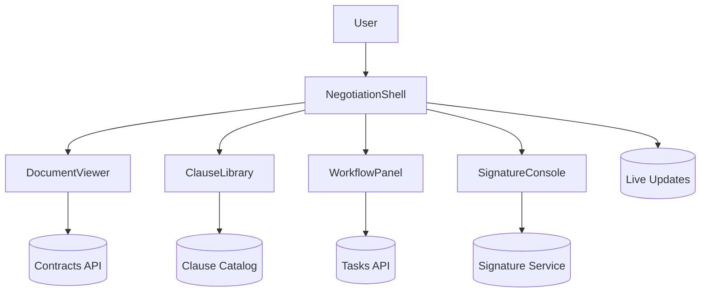

# B2B Contract Negotiation Workspace

## Overview
Secure collaboration portal for legal, sales, and procurement teams to negotiate contracts with tracked revisions, approvals, and integrated e-signatures.

## General Requirements
- Support simultaneous editing and redlining of large contracts with audit trails.
- Enforce granular permissions across legal, sales, finance, and external counterparties.
- Provide SOC 2 compliant storage with automatic versioning and retention policies.
- Integrate with CLM/CRM systems for contract metadata sync and lifecycle automation.

## Functional Requirements
- Document viewer with side-by-side diff, clause library insertions, and redline toggle.
- Timeline of negotiation events, approvals, and blocker tracking.
- Task assignments for reviewers with due dates, reminders, and escalation paths.
- Commenting with mention support, resolution workflow, and decision logging.
- Signature packet creation, tracking, and notarization integration.

## Component Architecture
- `NegotiationShell` manages global context, role-aware navigation, and toast system.
- `DocumentViewer` renders versions, highlights changes, and applies clause insertions.
- `ClauseLibrary` exposes searchable clauses/snippets with drag-in support.
- `WorkflowPanel` lists tasks, approvals, and outstanding decision gates.
- `SignatureConsole` prepares execution packets, monitors status, and handles fallback.

## Data Entries
- Contract: `id`, title, counterparty, status, governingLaw, effectiveDate, renewalTerms.
- Revision: `id`, contractId, version, authorId, diffSummary, createdAt, approvalState.
- Clause: `id`, category, text, fallbackLevel, lastReviewedAt.
- Task: `id`, contractId, assigneeId, description, dueAt, status.
- SignaturePacket: `id`, contractId, participants[], status, signedAt, auditLog.

## API Design
- `GET /contracts/{id}` returns contract metadata, active revision, and participant roles.
- `GET /contracts/{id}/revisions` streams revision list with diff metadata.
- `POST /contracts/{id}/clauses` inserts clause references with validation.
- `POST /contracts/{id}/tasks` creates review tasks; `PATCH /tasks/{id}` updates status.
- `POST /contracts/{id}/signature` initiates signing packet; `GET /signature/{id}` tracks progress.

## Store Design
- Use Redux Toolkit for contracts, revisions, tasks, and clause catalog; integrate RTK Query for API cache.
- Derived selectors compute approval readiness, outstanding blockers, and clause coverage.
- Persist user-specific preferences (diff mode, compare baseline) locally.
- WebSocket middleware dispatches actions for live revision notifications and task updates.

## Optimisation
- Lazy-load heavy PDF/Word rendering engines only when document viewer activates.
- Offload diff computation, clause similarity matching, and entity extraction to Web Workers.
- Batch WebSocket events and debounce UI updates to avoid thrashing during rapid edits.
- Prefetch likely clauses based on contract template and historical usage patterns.

## Accessibility
- Ensure document viewer supports keyboard navigation, screen readers, and high-contrast themes.
- Provide textual summaries for change sets and highlight colors with accessible contrast.
- Allow resizing of panels, adjustable editor font sizes, and focus management for dialogs.
- Announce workflow state changes and signature status updates via polite live regions.

## Frontend Folder Structure
```
src/
  app/
    routes/
      contracts/
      tasks/
      signatures/
    providers/
      auth-provider.tsx
      websocket-provider.tsx
  components/
    contracts/
    clauses/
    tasks/
    signatures/
    shared/
  hooks/
    use-revision-diff.ts
    use-approval-status.ts
  services/
    api/
    websocket/
    search/
  store/
    slices/
      contracts.ts
      revisions.ts
      tasks.ts
      clauses.ts
    middleware/
      websocket-middleware.ts
    selectors/
  styles/
    layout.css
    document.css
  utils/
    formatting.ts
    access-control.ts
  workers/
    diff-worker.ts
    clause-matcher-worker.ts
```

## Pseudocode Flow
```pseudo
function loadContract(contractId):
    [contract, revisions] = await Promise.all([
        fetch(`/contracts/${contractId}`),
        fetch(`/contracts/${contractId}/revisions`)
    ])
    dispatch(setContract(contract))
    dispatch(setRevisions(revisions))

function insertClause(contractId, clauseId, position):
    response = await post(`/contracts/${contractId}/clauses`, { clauseId, position })
    if (response.ok) {
        dispatch(applyClause(response.clause))
    } else {
        showClauseError(response.error)
    }

function finalizeSignature(contractId, participants):
    packet = await post(`/contracts/${contractId}/signature`, { participants })
    dispatch(trackSignature(packet))
    subscribe(`/signature/${packet.id}`, updateSignatureStatus)
```

## Component Interaction Diagram

