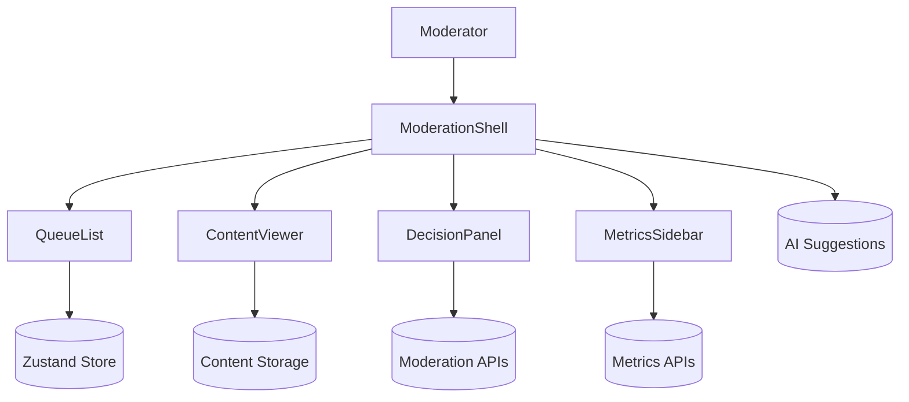

# Content Moderation Queue

## Overview
Moderator interface for triaging user-generated content with AI assistance, SLA tracking, and compliance-grade auditing.

## General Requirements
- Handle ingestion of 500 items per minute with prioritization and categorization.
- Provide SLA countdown timers and assignment workflows with full audit trail.
- Integrate AI pre-classification while guaranteeing human override and traceability.
- Support shift handoffs with saved state, escalation paths, and baton passing.

## Functional Requirements
- Queue of flagged items displaying severity, AI confidence, and policy tags.
- Media viewer handling images, video, text, and audio with redaction tooling.
- Decision panel enabling approve/reject/escalate actions with templated reasons.
- Bulk actions and keyboard-driven triage for high-throughput workflows.
- Metrics sidebar summarizing throughput, accuracy, and queue health.

## Component Architecture
- `ModerationShell` orchestrates queue list, viewer, decision panel, and metrics sidebar.
- `QueueList` virtualizes items, supports keyboard navigation, and infinite scroll.
- `ContentViewer` safely renders media types inside sandboxed frames and caches assets.
- `DecisionPanel` surfaces AI suggestions, policy references, and confirmation steps.
- `MetricsSidebar` streams queue KPIs and personal productivity metrics.

## Data Entries
- ModerationItem: `id`, contentType, payloadUrl, flags[], severity, aiScore, submittedAt.
- Decision: `id`, itemId, moderatorId, action, reasonCode, notes, createdAt.
- Policy: `id`, name, description, severity, escalationPath.
- ShiftState: moderatorId, queuePosition, claimedItemIds[], handoffNotes.
- MediaAsset: `id`, type, storageUrl, checksum, sensitive flag.

## API Design
- `GET /moderation/items?queue&cursor` returns prioritized batches with SLA metadata.
- `POST /moderation/items/{id}/claim` locks item to moderator for exclusive editing.
- `POST /moderation/items/{id}/decision` records action with audit logging.
- `GET /metrics/queue` streams KPI deltas; `GET /metrics/personal` returns agent stats.
- `POST /handoff` persists shift handoff notes and assignments.

## Store Design
- Zustand store for low-latency queue state and keyboard interactions.
- React Query handles metrics polling, historical reports, and policy catalogs.
- Persist shift state and UI preferences to encrypted localStorage.
- Derived selectors group AI confidence buckets and compute SLA deadlines.

## Optimisation
- Prefetch next item assets while moderator reviews current content.
- Use Web Workers for AI explanation rendering, redaction, and sensitive content blurring.
- Batch queue updates and schedule metrics refresh with `requestIdleCallback`.
- Stream video thumbnails at adaptive quality to minimize bandwidth without losing detail.

## Accessibility
- Provide keyboard shortcuts for decisions and navigation with visible focus outlines.
- Offer transcript or alt-text generation for multimedia content when feasible.
- Ensure severity indicators combine color, text, and iconography.
- Announce queue updates politely and allow operators to pause auto-advance.

## Frontend Folder Structure
```
src/
  app/
    routes/
      queue/
      metrics/
      settings/
    providers/
      auth-provider.tsx
      queue-provider.tsx
  components/
    queue/
    viewer/
    decisions/
    metrics/
    shared/
  hooks/
    use-queue-shortcuts.ts
    use-metrics-stream.ts
  services/
    api/
    websocket/
    ai/
  store/
    zustand/
      queue-store.ts
      preferences-store.ts
    query/
  styles/
    layout.css
    viewer.css
  utils/
    policies.ts
    timers.ts
  workers/
    redaction-worker.ts
    ai-explanation-worker.ts
```

## Pseudocode Flow
```pseudo
function loadQueue(queueId):
    items = fetch(`/moderation/items?queue=${queueId}`)
    queueStore.setItems(items)

function claimItem(itemId):
    response = post(`/moderation/items/${itemId}/claim`)
    if response.ok:
        queueStore.markClaimed(itemId)

function submitDecision(itemId, decision):
    optimisticUpdateDecision(itemId, decision)
    response = post(`/moderation/items/${itemId}/decision`, decision)
    if not response.ok:
        rollbackDecision(itemId)
        notifyError(response.error)
```

## Component Interaction Diagram

