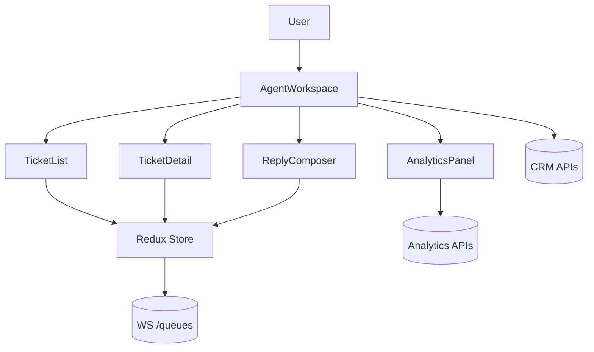

# Customer Support Ticketing UI

## Overview
Unified agent workspace for triaging, responding, and resolving multi-channel support tickets with SLA awareness and productivity tooling.

## General Requirements
- Support at least 10k concurrent agents with live updates and offline resilience for critical queues.
- Surface SLA breach warnings within 5 seconds of threshold crossing.
- Integrate with CRM identity services for contextual customer data while maintaining GDPR compliance.
- Provide granular permission controls for macros, bulk actions, and ticket visibility.

## Functional Requirements
- Unified inbox with channel tags, priority indicators, and quick filters.
- Ticket detail view combining conversation history, attachments, and internal notes.
- Macro management, canned responses, and AI-suggested replies with review workflow.
- Bulk actions for routing, tagging, and assigning tickets to agents.
- Queue health dashboard summarizing backlog, SLA, and agent productivity.

## Component Architecture
- `AgentWorkspace` orchestrates queue list, ticket view, composer, and productivity widgets.
- `TicketList` streams queue updates, uses virtualization, and supports keyboard triage.
- `TicketDetail` provides tabbed experience for conversation, customer profile, and case timeline.
- `ReplyComposer` integrates WYSIWYG editor, macro insertion, and AI suggestion panel.
- `AnalyticsPanel` surfaces queue metrics with auto-refresh and drill-down filters.

## Data Entries
- Ticket: `id`, channel, priority, status, assigneeId, slaDeadline, tags[], createdAt.
- Message: `id`, ticketId, senderType, bodyHtml, attachments[], sentAt.
- Macro: `id`, name, actions[], permissions[], updatedAt.
- Agent: `id`, name, roles[], skills[], onlineStatus.
- Queue: `id`, name, routingRules, backlogCount, slaTarget.

## API Design
- `GET /tickets?queue&cursor` returns paginated tickets with SLA metadata.
- `WS /queues/{id}` streams ticket events (`ticket.created`, `ticket.updated`, `sla.alert`).
- `POST /tickets/{id}/reply` sends agent responses with server-side macro expansion.
- `POST /tickets/{id}/actions` applies bulk updates with validation and audit logging.
- `GET /analytics/queues` aggregates backlog and SLA performance.

## Store Design
- Redux Toolkit manages queues, tickets, and macros with entity adapters for normalization.
- React Query handles analytics endpoints and auto-refetch on queue context changes.
- Local UI store (Zustand) tracks ephemeral state such as selected tickets and composer drafts.
- WebSocket middleware dispatches actions for incoming queue events and SLA alerts.

## Optimisation
- Virtualize ticket list rows and prefetch ticket detail data on hover.
- Batch WebSocket updates and schedule reconciliation during `requestIdleCallback`.
- Cache macro definitions locally and diff incremental updates to avoid full reloads.
- Run AI suggestion generation in Web Worker to prevent UI jank.

## Accessibility
- Queue list and ticket detail expose `listbox` and `tabpanel` semantics with keyboard support.
- Provide text alternatives for channel icons and color-coded priority badges.
- Announce new ticket events politely with option to pause live updates.
- Ensure composer toolbar and editor are fully operable via keyboard and screen readers.

## Frontend Folder Structure
```
src/
  app/
    routes/
      workspace/
      analytics/
    providers/
      websocket-provider.tsx
      permissions-provider.tsx
  components/
    tickets/
    macros/
    analytics/
    shared/
  hooks/
    use-queue-subscription.ts
    use-sla-alerts.ts
  services/
    api/
    websocket/
    crm/
  store/
    slices/
      tickets.ts
      macros.ts
      agents.ts
    middleware/
      websocket-middleware.ts
    selectors/
  styles/
    layout.css
    typography.css
  utils/
    formatting.ts
    accessibility.ts
  workers/
    ai-suggestions-worker.ts
```

## Pseudocode Flow
```pseudo
function subscribeToQueue(queueId):
    socket = openWebSocket(`/queues/${queueId}`)
    socket.onmessage = event => dispatch(handleQueueEvent(event))

function handleQueueEvent(event):
    switch event.type:
        case 'ticket.created':
            dispatch(addTicket(event.ticket))
        case 'ticket.updated':
            dispatch(updateTicket(event.ticket))
        case 'sla.alert':
            dispatch(showSlaBanner(event.ticketId, event.deadline))

function sendReply(ticketId, payload):
    pendingId = createLocalMessage(ticketId, payload)
    response = post(`/tickets/${ticketId}/reply`, payload)
    if response.ok:
        reconcileMessage(pendingId, response.message)
    else:
        markMessageFailed(pendingId, response.error)
```

## Component Interaction Diagram

