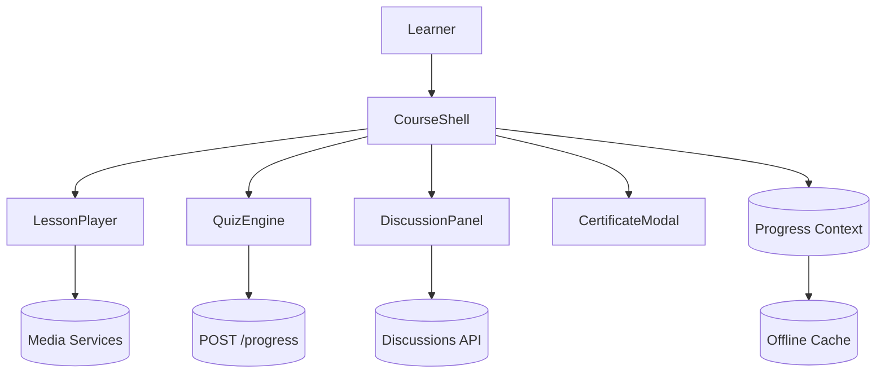

# Education LMS Course Player

## Overview
Comprehensive course player delivering SCORM-compliant lessons, quizzes, and social interactions with offline resilience.

## General Requirements
- Provide offline-first experience caching lessons and quizzes for low-connectivity environments.
- Track learner progress with SCORM/xAPI compliance and reliable resume points.
- Maintain 99.95% uptime with graceful degradation for embedded or external content.
- Localize UI for 10+ locales including RTL languages with dynamic resource loading.

## Functional Requirements
- Course navigation tree with progress indicators, prerequisites, and breadcrumbing.
- Responsive lesson player supporting video, slides, transcripts, and note taking.
- Interactive quizzes with adaptive feedback, remediation pathways, and attempt limits.
- Discussion threads and instructor announcements scoped per module.
- Certification issuance workflow with downloadable badge and verification link.

## Component Architecture
- `CourseShell` manages layout, breadcrumbs, and progress context shared across modules.
- `LessonPlayer` coordinates media playback, notes panel, and transcript search.
- `QuizEngine` dynamically renders question components based on schema metadata.
- `DiscussionPanel` fetches threads, supports moderation, and lazy-loads attachments.
- `CertificateModal` generates completion badge and handles share/download actions.

## Data Entries
- Course: `id`, title, locale, modules[], totalDuration, prerequisites[].
- Module: `id`, type (lesson/quiz), status, completionCriteria, assets[].
- Progress: userId, moduleId, status, score, lastPosition, attemptCount.
- DiscussionPost: `id`, moduleId, author, body, attachments[], createdAt.
- Certificate: `id`, courseId, issuedAt, expiry, verificationUrl.

## API Design
- `GET /courses/{id}` returns outline, localization strings, and feature flags.
- `GET /courses/{id}/modules/{moduleId}` streams lesson or quiz payloads.
- `POST /progress` records learner progress with idempotency token per attempt.
- `POST /discussions/{moduleId}` adds comments; `GET /discussions` paginates threads.
- `POST /certificate` triggers certification issuance and returns download link.

## Store Design
- Use Context + Reducer for progress management accessible across nested routes.
- Persist progress data to IndexedDB for offline mode with sync queue on reconnect.
- React Query caches module payloads and discussions with incremental pagination.
- Selectors compute completion percentages and gating logic for module unlocks.

## Optimisation
- Prefetch next lesson assets when learner reaches 80% of current module.
- Use Media Source Extensions for adaptive bitrate streaming and offline downloads.
- Offload transcript indexing and search operations to Web Worker.
- Virtualize discussion threads and chunk pagination to handle long histories.

## Accessibility
- Provide closed captions, transcripts, and keyboard controls for all media.
- Ensure quiz components expose labels, error messages, and ARIA relationships.
- Support RTL layouts, adjustable font sizing, and high-contrast themes.
- Announce progress updates and completion states via polite live regions.

## Frontend Folder Structure
```
src/
  app/
    routes/
      course/
      module/
      certificate/
    providers/
      progress-provider.tsx
      locale-provider.tsx
  components/
    navigation/
    lessons/
    quizzes/
    discussions/
    certificates/
  hooks/
    use-progress-sync.ts
    use-transcript-search.ts
  services/
    api/
    scorm/
    media/
  store/
    reducers/
      progress-reducer.ts
    context/
  styles/
    theme.css
    typography.css
  utils/
    localization.ts
    accessibility.ts
  workers/
    transcript-indexer.ts
    offline-sync-worker.ts
```

## Pseudocode Flow
```pseudo
function startCourse(courseId):
    course = fetchCourse(courseId)
    hydrateProgress(courseId)
    render(CourseShell, course)

function completeModule(moduleId, payload):
    localUpdateProgress(moduleId, payload)
    enqueueProgressSync({ moduleId, payload })

function syncProgressQueue():
    while queue.hasItems():
        item = queue.next()
        response = post('/progress', item)
        if not response.ok:
            queue.retry(item)
```

## Component Interaction Diagram

