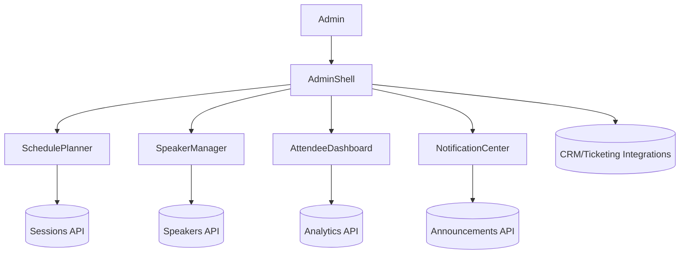

# Event Management Admin Console

## Overview
Admin console for organizing conferences and multi-track events, covering scheduling, speaker management, attendee analytics, and real-time updates.

## General Requirements
- Support multi-day, multi-track events with thousands of sessions and attendees.
- Provide role-based access for content managers, operations staff, and sponsors.
- Ensure real-time updates to schedules and notifications across web/mobile channels.
- Integrate with ticketing, CRM, and marketing automation systems.

## Functional Requirements
- Schedule builder with drag-and-drop session placement, conflict detection, and capacity checks.
- Speaker management module handling bios, assets, contracts, and travel logistics.
- Attendee analytics dashboard tracking registrations, engagement, and check-ins.
- Announcement center for push/email/in-app notifications with targeting.
- Sponsor inventory management for booths, sessions, and advertising slots.

## Component Architecture
- `AdminShell` coordinates navigation, permission gates, and global state providers.
- `SchedulePlanner` renders calendar/grid view with conflict detection overlays.
- `SpeakerManager` manages profile forms, asset uploads, and communication logs.
- `AttendeeDashboard` visualizes metrics with filters, cohorts, and export tools.
- `NotificationCenter` composes targeted messages and tracks delivery status.

## Data Entries
- Session: `id`, title, track, speakers[], startAt, endAt, roomId, capacity, status.
- Speaker: `id`, name, pronouns, bio, assets[], travelInfo, contractStatus.
- Attendee: `id`, ticketType, company, checkInStatus, interests[], engagementScore.
- Announcement: `id`, audienceFilters, message, channels[], scheduledAt, status.
- Sponsor: `id`, name, tier, entitlements[], assignedSessions[], invoices[].

## API Design
- `GET /events/{id}/schedule` returns sessions, rooms, constraints, and conflicts.
- `POST /events/{id}/sessions` creates/updates sessions with validation.
- `GET /events/{id}/speakers` returns speaker roster with metadata.
- `POST /events/{id}/announcements` schedules targeted notifications.
- `GET /events/{id}/analytics?range` provides attendee metrics and funnel data.

## Store Design
- Redux Toolkit slices for sessions, speakers, attendees, announcements, and sponsors.
- React Query caches analytics, ticketing data, and external integrations.
- Derived selectors compute conflict summaries, room utilization, and sponsor fulfillment.
- Persist user preferences (view mode, filters) locally for faster repeat access.

## Optimisation
- Use virtualization for large session grids and speaker lists.
- Batch conflict recalculations via Web Workers when schedule changes occur.
- Preload frequently used APIs (rooms, tracks) and cache metadata offline.
- Debounce announcement targeting queries to reduce load on CRM integration.

## Accessibility
- Provide keyboard navigable schedule editor with aria labels for time slots.
- Ensure forms include descriptive labels, validation hints, and error summaries.
- Offer high-contrast themes and support for screen readers in data tables and charts.
- Announce updates to schedule or notifications via polite live regions.

## Frontend Folder Structure
```
src/
  app/
    routes/
      schedule/
      speakers/
      attendees/
      notifications/
      sponsors/
    providers/
      auth-provider.tsx
      analytics-provider.tsx
  components/
    schedule/
    speakers/
    attendees/
    notifications/
    sponsors/
    shared/
  hooks/
    use-conflict-detector.ts
    use-announcement-targeting.ts
  services/
    api/
    integrations/
      ticketing/
      crm/
  store/
    slices/
      sessions.ts
      speakers.ts
      attendees.ts
      announcements.ts
      sponsors.ts
    selectors/
  styles/
    layout.css
    schedule.css
  utils/
    validation.ts
    permissions.ts
  workers/
    conflict-worker.ts
    analytics-worker.ts
```

## Pseudocode Flow
```pseudo
function loadEventAdmin(eventId):
    [schedule, speakers, analytics] = await Promise.all([
        fetch(`/events/${eventId}/schedule`),
        fetch(`/events/${eventId}/speakers`),
        fetch(`/events/${eventId}/analytics?range=today`)
    ])
    dispatch(setSchedule(schedule))
    dispatch(setSpeakers(speakers))
    dispatch(setAnalytics(analytics))

function updateSession(eventId, session):
    response = await post(`/events/${eventId}/sessions`, session)
    if (response.ok) {
        dispatch(upsertSession(response.session))
        runConflictDetection(response.session)
    } else {
        showSessionError(response.error)
    }

function sendAnnouncement(eventId, payload):
    response = await post(`/events/${eventId}/announcements`, payload)
    if (response.ok) {
        dispatch(addAnnouncement(response.announcement))
    }
```

## Component Interaction Diagram

