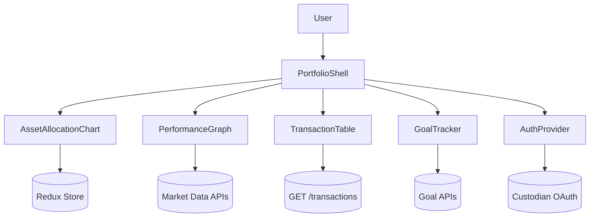

# Fintech Portfolio Tracker

## Overview
Secure financial dashboard aggregating investment accounts with real-time analytics, goal tracking, and alerting.

## General Requirements
- Aggregate data across custodians via OAuth connections with hourly refresh cadence.
- Render key balances and charts within 1.5 seconds leveraging SSR and caching.
- Encrypt PII at rest and require MFA with device fingerprinting for access.
- Provide regulatory disclosures and immutable audit trails for all surfaced data.

## Functional Requirements
- Portfolio summary showing asset allocation, performance over time, and risk metrics.
- Account linking wizard supporting aggregator APIs and manual CSV imports.
- Transaction ledger with filtering, categorization, and export capabilities.
- Goal tracking module comparing progress against targets with recommendation engine.
- Alerts for significant portfolio changes, threshold breaches, and rebalancing suggestions.

## Component Architecture
- `PortfolioShell` coordinates account overview, charts, alerts, and notifications.
- `AssetAllocationChart` renders donut/drill-down views across asset classes.
- `PerformanceGraph` streams time-series data with zoom and multi-benchmark comparison.
- `TransactionTable` virtualizes rows, supports column customization, and exports CSV.
- `GoalTracker` computes projections, surfaces insights, and integrates contribution planner.

## Data Entries
- Account: `id`, provider, type, balance, currency, lastSyncedAt.
- Holding: `id`, accountId, symbol, quantity, value, assetClass, costBasis.
- Transaction: `id`, accountId, symbol, amount, type, category, tradeDate.
- Goal: `id`, name, targetAmount, targetDate, contributions[], progress.
- Alert: `id`, triggerType, threshold, triggeredAt, acknowledgedAt.

## API Design
- `GET /portfolio` returns aggregated holdings, performance summary, and alerts.
- `GET /accounts` lists linked accounts with provider metadata and sync state.
- `POST /accounts/link` initiates OAuth linking; `DELETE /accounts/{id}` removes connection.
- `GET /transactions?accountId&range` paginates transaction history.
- `POST /goals` and `PATCH /goals/{id}` manage goal lifecycle.

## Store Design
- Redux Toolkit slices for accounts, holdings, transactions, goals, and alerts.
- Memoized selectors compute allocation percentages, risk indices, and recommendation sets.
- React Query manages background refresh of market data and alert evaluations.
- Minimal sensitive state stored client-side; rely on HttpOnly tokens for auth context.

## Optimisation
- Server-render summary page and hydrate charts progressively after initial paint.
- Use Web Workers for heavy calculations (risk metrics, rebalancing suggestions).
- Throttle transaction filtering and provide debounced search for large ledgers.
- Prefetch goal projections when user navigates toward planning or edit flows.

## Accessibility
- Provide screen reader friendly descriptions for charts and tabular data.
- Manage focus within modal flows (account linking, goal editing) with aria-live feedback.
- Offer high-contrast palette, dynamic text scaling, and accessible color coding for gains/losses.
- Announce alert triggers with severity-level cues via ARIA live regions.

## Frontend Folder Structure
```
src/
  app/
    routes/
      dashboard/
      transactions/
      goals/
      settings/
    providers/
      auth-provider.tsx
      analytics-provider.tsx
  components/
    portfolio/
    charts/
    tables/
    goals/
    shared/
  hooks/
    use-market-data.ts
    use-alerts.ts
  services/
    api/
    auth/
    analytics/
  store/
    slices/
      accounts.ts
      holdings.ts
      transactions.ts
      goals.ts
      alerts.ts
    selectors/
  styles/
    theme.css
    charts.css
  utils/
    currency.ts
    risk.ts
  workers/
    analytics-worker.ts
    export-worker.ts
```

## Pseudocode Flow
```pseudo
function loadPortfolio():
    portfolio = fetch('/portfolio')
    dispatch(setPortfolio(portfolio))
    scheduleMarketRefresh(portfolio.refreshInterval)

function scheduleMarketRefresh(interval):
    setInterval(async () => {
        data = await fetch('/portfolio')
        dispatch(updateMarketData(data))
    }, interval)

function linkAccount(provider):
    session = post('/accounts/link', { provider })
    openOAuthWindow(session.url)
    onOAuthSuccess(() => invalidateQuery(['accounts']))
```

## Component Interaction Diagram

