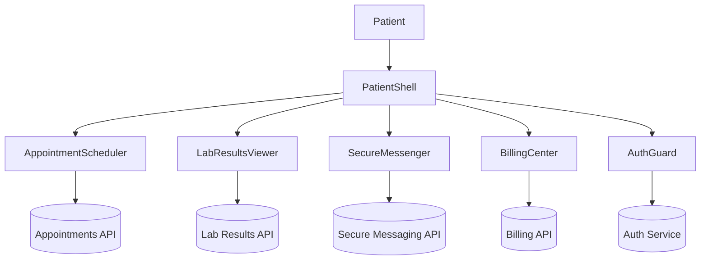

# Healthcare Patient Portal

## Overview
HIPAA-compliant patient portal for managing appointments, lab results, secure messaging, medications, and billing.

## General Requirements
- Ensure HIPAA compliance with encryption in transit, strict access controls, and audit logs.
- Deliver 24/7 availability with maintenance notifications and manual failover plans.
- Support multilingual experiences with high readability across diverse patient populations.
- Maintain audit trails for every data view, download, and message exchange.

## Functional Requirements
- Appointment scheduler with provider matching, insurance verification, and reminders.
- Lab results viewer with physician notes, graph trends, and explanatory ranges.
- Secure messaging with providers, attachment support, and triage routing.
- Medication management for refills, adherence reminders, and interaction warnings.
- Billing statements viewer with payment options and insurer coordination.

## Component Architecture
- `PatientShell` manages navigation, alerts, and session timeout warnings.
- `AppointmentScheduler` offers calendar view, provider filters, and eligibility checks.
- `LabResultsViewer` charts lab values, provides comparisons, and flag explanations.
- `SecureMessenger` integrates rich text editor, attachment uploads, and triage tagging.
- `BillingCenter` lists statements, payment history, and integrates PCI-compliant payment flow.

## Data Entries
- Appointment: `id`, providerId, specialty, location, time, status, visitType.
- LabResult: `id`, testName, value, unit, referenceRange, collectedAt, interpretation.
- Message: `id`, threadId, authorRole, body, attachments[], sentAt, readAt.
- Medication: `id`, name, dosage, frequency, prescribingProvider, refillStatus.
- BillingStatement: `id`, amount, status, dueDate, insurerPortion, paymentLink.

## API Design
- `GET /patients/me` returns profile, insurance, and notification preferences.
- `GET /appointments?range` fetches upcoming/past appointments; `POST /appointments` schedules new ones.
- `GET /lab-results/{id}` retrieves structured lab data with normal ranges and notes.
- `POST /messages/{threadId}` sends secure messages; `GET /messages` paginates threads.
- `GET /billing/statements` lists statements; `POST /billing/pay` processes payments via PCI gateway.

## Store Design
- Redux Toolkit organizes slices for appointments, labs, messaging, medications, and billing.
- React Query caches server data with background refetch respecting HIPAA caching rules.
- Encrypted IndexedDB storage holds offline summaries requiring biometric re-authentication.
- Selectors compute upcoming reminder lists, abnormal lab counts, and outstanding balance totals.

## Optimisation
- Server-render dashboard shell and stream hydration to meet performance budgets.
- Prefetch related data (provider info, lab explanations) when entering module routes.
- Use Web Workers for PDF generation, chart rendering, and large dataset filtering.
- Throttle typing indicators and message sends to reduce secure messaging load.

## Accessibility
- Provide large default font sizes, high contrast themes, and adjustable text scaling.
- Ensure ARIA labels, descriptive headings, and keyboard navigation across modules.
- Offer screen reader-friendly explanations for lab result ranges and statuses.
- Announce new messages and appointment reminders via polite live regions.

## Frontend Folder Structure
```
src/
  app/
    routes/
      dashboard/
      appointments/
      labs/
      messaging/
      billing/
    providers/
      auth-guard.tsx
      audit-provider.tsx
  components/
    appointments/
    labs/
    messaging/
    billing/
    shared/
  hooks/
    use-authenticated-fetch.ts
    use-session-timeout.ts
  services/
    api/
    auth/
    payment-gateway/
  store/
    slices/
      appointments.ts
      labs.ts
      messaging.ts
      medications.ts
      billing.ts
    selectors/
  styles/
    theme.css
    accessibility.css
  utils/
    formatting.ts
    localization.ts
  workers/
    pdf-generator.ts
    chart-worker.ts
```

## Pseudocode Flow
```pseudo
function loadPatientDashboard():
    patient = fetch('/patients/me')
    appointments = fetch('/appointments', { range: 'upcoming' })
    labs = fetch('/lab-results/recent')
    render(PatientShell, { patient, appointments, labs })

function scheduleAppointment(form):
    if not validate(form):
        return showErrors(form)
    response = post('/appointments', form)
    if response.ok:
        dispatch(addAppointment(response.appointment))
    else:
        showSchedulingError(response.error)

function sendSecureMessage(threadId, message):
    encrypted = encrypt(message)
    response = post(`/messages/${threadId}`, encrypted)
    if not response.ok:
        notifyFailure(response.error)
```

## Component Interaction Diagram

