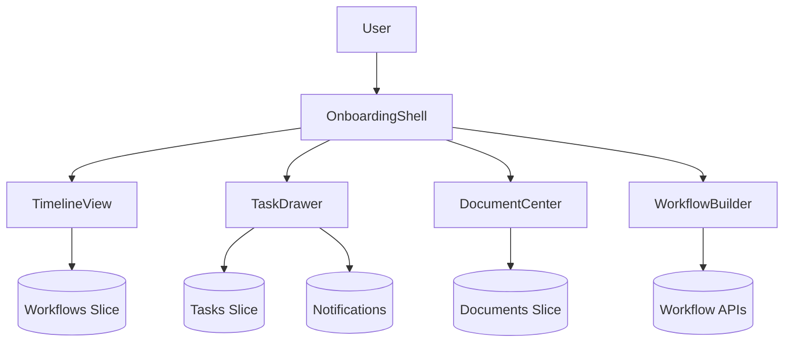

# HR Onboarding Workflow App

## Overview
Multi-role onboarding platform that coordinates tasks, document collection, and communication between new hires, managers, and HR partners.

## General Requirements
- Support parallel onboarding flows for multiple roles with SLA-driven task escalation.
- Ensure secure document storage with granular permissions and legal audit trails.
- Provide configurable workflows per department with reusable templates.
- Offer analytics on task completion, bottlenecks, and compliance checkpoints.

## Functional Requirements
- Onboarding timeline showing tasks, due dates, and responsible stakeholders.
- Task detail view with checklist items, attachments, and approval routing.
- Document center supporting uploads, e-signature status, and version history.
- Communication panel combining announcements, comments, and auto reminders.
- Admin builder for creating workflow templates, conditional rules, and automations.

## Component Architecture
- `OnboardingShell` manages navigation, role-based menu, and context providers.
- `TimelineView` renders grouped tasks with drag-and-drop reordering (if permitted).
- `TaskDrawer` exposes checklist, approvals, and file submissions in tabbed layout.
- `DocumentCenter` lists required forms, upload progress, and signature state.
- `WorkflowBuilder` offers visual editor for admins with palette of task blocks.

## Data Entries
- Workflow: `id`, name, department, stages[], rules[], active.
- Task: `id`, workflowId, assigneeId, dueAt, status, checklist[], approvals[].
- Document: `id`, taskId, type, storageUrl, signedAt, versionHistory.
- User: `id`, role, department, permissions, notificationPreferences.
- Comment: `id`, taskId, authorId, body, mentions[], createdAt.

## API Design
- `GET /workflows/{id}` returns workflow definition, stages, and task assignments.
- `POST /workflows/{id}/tasks/{taskId}/complete` updates status with validation.
- `POST /documents` uploads files with checksum validation; `GET /documents/{id}` streams file.
- `POST /tasks/{id}/comments` adds comment with mentions and notification fan-out.
- `POST /workflows` creates template; `PATCH /workflows/{id}` edits configuration.

## Store Design
- Use Redux Toolkit with slices for workflows, tasks, documents, and communications.
- React Query caches workflow templates and analytics with background refresh.
- Derived selectors compute task progress per stage, overdue counts, and approval states.
- Persist user preferences (view mode, sort order) locally respecting privacy.

## Optimisation
- Lazy-load workflow builder assets only for admin roles to reduce bundle size.
- Use virtualization for long task lists and document tables.
- Batch notification fetches and schedule reminder jobs via background worker.
- Prefetch task context and related documents when user opens timeline segment.

## Accessibility
- Provide keyboard navigation for timeline, task drawer tabs, and builder canvas.
- Ensure forms have clear labels, error messaging, and aria-live validation feedback.
- Offer accessible color palettes and icon+text indicators for status states.
- Announce task assignments and deadline changes via polite live regions.

## Frontend Folder Structure
```
src/
  app/
    routes/
      dashboard/
      tasks/
      documents/
      admin/
    providers/
      auth-provider.tsx
      workflow-provider.tsx
  components/
    timeline/
    tasks/
    documents/
    communications/
    admin/
    shared/
  hooks/
    use-workflow-progress.ts
    use-task-actions.ts
  services/
    api/
    notifications/
    storage/
  store/
    slices/
      workflows.ts
      tasks.ts
      documents.ts
      comments.ts
    selectors/
  styles/
    layout.css
    timeline.css
  utils/
    dates.ts
    permissions.ts
  workers/
    reminder-worker.ts
    document-processing-worker.ts
```

## Pseudocode Flow
```pseudo
function loadOnboarding(workflowId):
    workflow = fetch(`/workflows/${workflowId}`)
    dispatch(setWorkflow(workflow))
    preloadTaskDetails(workflow.tasks)

function completeTask(taskId, payload):
    response = post(`/workflows/${workflowId}/tasks/${taskId}/complete`, payload)
    if response.ok:
        dispatch(markTaskComplete(taskId, response.task))
        enqueueReminders(taskId)

function uploadDocument(taskId, file):
    signedUrl = getSignedUrl(file)
    uploadToStorage(signedUrl, file)
    post('/documents', { taskId, fileName: file.name, checksum: hash(file) })
```

## Component Interaction Diagram

