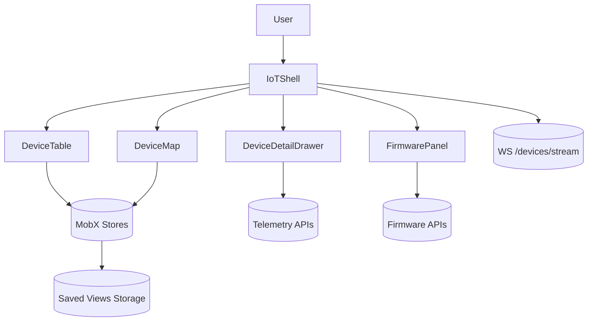

# IoT Device Management Console

## Overview
Operations dashboard for provisioning, monitoring, and updating large fleets of IoT devices with telemetry analytics and rollout controls.

## General Requirements
- Visualize 50k+ devices with filtering and map support while keeping time-to-interact under 2 seconds.
- Support firmware rollout workflows with staged cohorts, pause/resume, and safe rollback.
- Provide real-time telemetry monitoring with anomaly alerts and health dashboards.
- Enforce role-based access and audit trails for all device operations.

## Functional Requirements
- Device inventory table with search, saved views, and bulk selection capabilities.
- Live map view showing geospatial device distribution, clustering, and status badges.
- Device detail drawer containing telemetry charts, logs, and configuration controls.
- Bulk command execution (reboot, config update) with progress and failure handling.
- Firmware management panel for upload, cohort targeting, and rollout monitoring.

## Component Architecture
- `IoTShell` manages navigation, global filters, and telemetry subscriptions.
- `DeviceTable` virtualizes rows, supports sticky headers, and streams delta updates.
- `DeviceMap` renders clusters via WebGL and synchronizes selection with the table.
- `DeviceDetailDrawer` offers tabbed telemetry, logs, and settings editing.
- `FirmwarePanel` orchestrates rollout wizard, cohort management, and timeline visualization.

## Data Entries
- Device: `id`, model, firmwareVersion, location, status, lastSeenAt, tags[].
- Telemetry sample: deviceId, metricKey, value, timestamp, severity.
- Command job: `id`, commandType, targetIds[], progress, createdAt, createdBy.
- Firmware package: `id`, version, checksum, releaseNotes, rolloutStatus.
- Alert: `id`, type, deviceId, severity, message, acknowledgedBy.

## API Design
- `GET /devices?filter&cursor` returns paginated device list with summary metrics.
- `WS /devices/stream` emits telemetry deltas, alerts, and status changes.
- `POST /commands` creates bulk operations; `GET /commands/{id}` polls progress.
- `POST /firmware` uploads metadata; `POST /firmware/{id}/rollout` manages cohorts.
- `GET /devices/{id}/telemetry?metric&range` returns time series data.

## Store Design
- Use MobX stores for observable device collections enabling fine-grained reactions.
- Persist saved views and filters in localStorage; keep live telemetry ephemeral.
- Derived computed values aggregate counts, severity buckets, and map cluster data.
- React Query backs firmware operations and command job status polling.

## Optimisation
- Batch telemetry updates before applying to stores to prevent UI thrash.
- Run geospatial clustering and heatmap calculations in Web Workers.
- Lazy-load telemetry chart libraries only when detail drawer is opened.
- Implement incremental search indexing using worker-based search service.

## Accessibility
- Provide keyboard shortcuts for switching views and executing bulk actions.
- Ensure map data has textual summaries and device table exposes ARIA grid semantics.
- Announce alert changes and command completion via ARIA live regions.
- Support high-contrast themes and descriptive legends for status icons.

## Frontend Folder Structure
```
src/
  app/
    routes/
      devices/
      firmware/
      commands/
    providers/
      telemetry-provider.tsx
      theme-provider.tsx
  components/
    devices/
    map/
    telemetry/
    firmware/
    shared/
  hooks/
    use-telemetry-stream.ts
    use-device-filters.ts
  services/
    api/
    websocket/
    analytics/
  store/
    mobx/
      device-store.ts
      telemetry-store.ts
    query/
  styles/
    layout.css
    charts.css
  utils/
    geospatial.ts
    formatting.ts
  workers/
    clustering-worker.ts
    search-index-worker.ts
```

## Pseudocode Flow
```pseudo
function initDeviceConsole():
    loadInitialDevices()
    subscribeToTelemetry()
    render(IoTShell)

function subscribeToTelemetry():
    socket = openWebSocket('/devices/stream')
    socket.onmessage = batch(event => applyTelemetryDelta(event))

function startFirmwareRollout(packageId, cohorts):
    rollout = post(`/firmware/${packageId}/rollout`, { cohorts })
    trackRollout(rollout.id)

function trackRollout(rolloutId):
    poll(`/commands/${rolloutId}`, progress => updateRollout(progress))
    if progress.status == 'failed':
        notifyFailure(progress)
```

## Component Interaction Diagram

