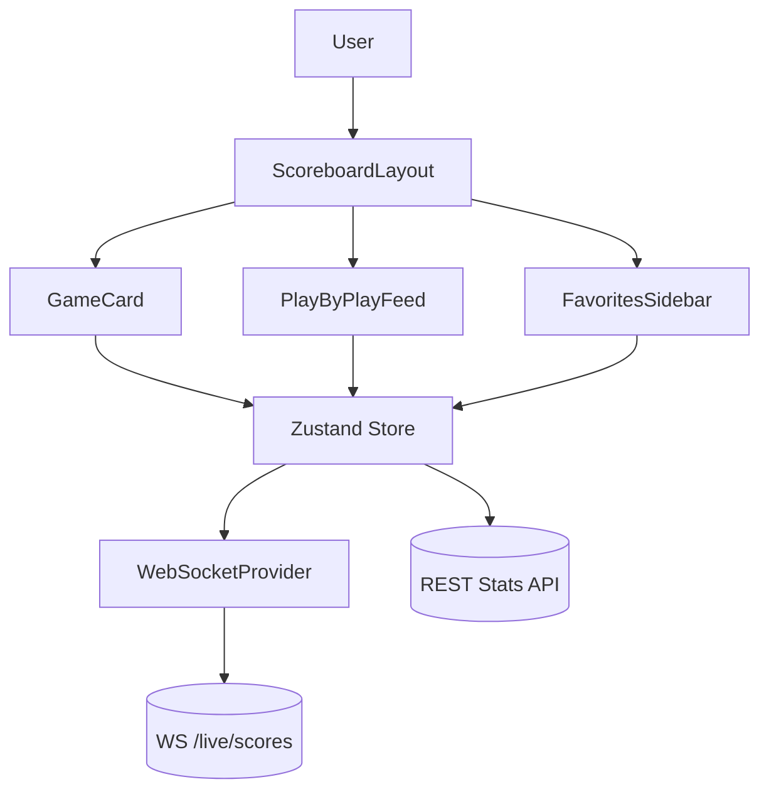

# Live Sports Scoreboard

## Overview
High-frequency scoreboard that surfaces live scores, analytics, and alerts for multiple leagues with broadcast-grade responsiveness.

## General Requirements
- Support at least 100k concurrent viewers with sub-second score propagation.
- Render top scoreboard elements within 1 second using CDN-edge cached assets.
- Provide responsive layouts optimized for stadium displays, tablets, and phones.
- Gracefully degrade to polling when live feeds or WebSocket connections fail.

## Functional Requirements
- Real-time score ticker, detailed game cards, and play-by-play event stream.
- User-selectable favorite teams triggering pinned placement and push-style notifications.
- Historical stats panels showing season aggregates, win probability, and player comparisons.
- Admin override console for manual corrections and feed health monitoring.

## Component Architecture
- `ScoreboardLayout` orchestrates header ticker, main grid, and insights sidebar via route-based code splitting.
- `GameCard` subscribes to store slice updates and animates score transitions with diff-aware hooks.
- `PlayByPlayFeed` virtualizes events, batching animations to avoid reflow storms.
- `FavoritesSidebar` lazy-loads personalization data and surfaces prioritized teams.
- `FeedHealthWidget` reflects WebSocket heartbeat, fallback polling status, and feed latency.

## Data Entries
- Game entity: `id`, league, teams, score, period, clock, status, feedLatencyMs.
- Play event: `id`, `gameId`, timestamp, description, participants, winProbabilityDelta.
- Team metadata: `id`, name, logoUrl, record, division, ranking.
- User preferences: favoriteTeamIds, notificationLevel, dataDensity mode.

## API Design
- `WS /live/scores` streams JSON patches for score and clock updates.
- `GET /games?date&league` returns schedule snapshots with caching headers.
- `GET /games/{id}/stats` supplies enriched box score, advanced metrics, and shot charts.
- `POST /users/{id}/favorites` updates personalization with optimistic acknowledgement.

## Store Design
- Use Zustand with immer middleware for low-latency, mutation-friendly updates.
- Maintain entity maps for games, teams, events keyed by id to enable O(1) lookups.
- Derived selectors compute leaderboards, win probability charts, and pinned favorites order.
- Persist lightweight user preferences locally; keep volatile live data in memory only.

## Optimisation
- Batch score animations within `requestAnimationFrame` to prevent layout thrash.
- Throttle WebSocket message handling via shared worker consolidating feed bursts.
- Lazy-load analytics modules (charts, heatmaps) when user expands details.
- Prefetch upcoming game assets during idle windows and leverage HTTP/3 for reliability.

## Accessibility
- Provide text equivalents for color-coded states and dynamic ARIA live announcements.
- Ensure keyboard navigation across ticker, grid, and modal dialogs with logical order.
- Expose pause/resume controls for auto-scrolling content per WCAG 2.2.2.
- Offer high-contrast and large-text modes for stadium visibility requirements.

## Frontend Folder Structure
```
src/
  app/
    routes/
      dashboard/
      admin/
    providers/
      websocket-provider.tsx
  components/
    scoreboard/
    games/
    shared/
  hooks/
    use-favorites.ts
    use-feed-health.ts
  services/
    api/
    websocket/
    analytics/
  store/
    index.ts
    selectors/
  styles/
    themes.css
    animations.css
  utils/
    formatters.ts
    accessibility.ts
  workers/
    feed-worker.ts
```

## Pseudocode Flow
```pseudo
function startLiveFeed():
    socket = openWebSocket('/live/scores')
    socket.onmessage = batch(handleScoreDelta)
    socket.onclose = () => startFallbackPolling(5000)

function handleScoreDelta(patch):
    updateStore(state => applyJsonPatch(state.games, patch))
    raf(() => animateScoreChanges())

function toggleFavorite(teamId):
    optimisticAddFavorite(teamId)
    response = post('/users/me/favorites', { teamId })
    if (!response.ok):
        rollbackFavorite(teamId)
```

## Component Interaction Diagram

