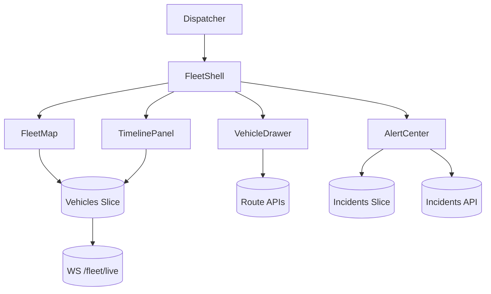

# Logistics Fleet Tracking Board

## Overview
Real-time logistics dashboard for dispatchers to monitor fleets, manage routes, and respond to delivery exceptions across regions.

## General Requirements
- Track thousands of vehicles with sub-second updates and interactive map visualization.
- Provide resilient data pipeline with automatic failover for telemetry ingestion.
- Support dispatch workflows for rerouting, escalation, and messaging drivers.
- Maintain audit logs for all route changes and dispatcher actions for compliance.

## Functional Requirements
- Fleet map showing live vehicle positions, clustering, and route overlays.
- Timeline view highlighting ETAs, delays, and completed stops with filters.
- Vehicle detail drawer with telemetry metrics, manifest, and communication history.
- Bulk route adjustment tools with simulation and conflict detection.
- Alert center for incidents, SLA breaches, and maintenance reminders.

## Component Architecture
- `FleetShell` orchestrates global filters, map, timeline, and alert components.
- `FleetMap` renders vector tiles, vehicle clusters, and route polylines using WebGL.
- `TimelinePanel` virtualizes stop data and surfaces delay statuses with color coding.
- `VehicleDrawer` provides tabbed telemetry, manifest, and messaging actions.
- `AlertCenter` aggregates incidents and integrates acknowledgment workflow.

## Data Entries
- Vehicle: `id`, callSign, location, status, capacity, driverId, lastUpdated.
- Stop: `id`, vehicleId, address, scheduledAt, eta, state, exceptionCodes[].
- Telemetry: vehicleId, metricKey, value, timestamp, thresholdState.
- RoutePlan: `id`, vehicleId, stops[], distanceKm, estimatedDuration.
- Incident: `id`, vehicleId, severity, message, triggeredAt, resolvedAt.

## API Design
- `GET /fleet/vehicles?region&cursor` returns paginated vehicle summaries.
- `WS /fleet/live` streams location updates, incidents, and route progress events.
- `POST /fleet/routes/{id}/adjust` updates stop order with validation and simulation.
- `POST /fleet/vehicles/{id}/message` sends dispatcher messages to driver app.
- `GET /fleet/incidents?status` lists alerts with acknowledgement metadata.

## Store Design
- Combine Redux Toolkit for normalized entities with RTK Query for server cache.
- Map-specific store (Zustand) holds viewport, clustering thresholds, and selection state.
- Memoized selectors compute ETA deltas, capacity utilization, and risk scoring.
- Persist dispatcher preferences (filters, map layers) to localStorage.

## Optimisation
- Batch telemetry updates and diff vehicle positions before updating map layers.
- Use Web Workers for route simulation, geofencing checks, and clustering.
- Progressive load of historical stops to avoid initial payload bloat.
- Prefetch nearby vehicles when dispatcher pans map or selects region.

## Accessibility
- Provide keyboard navigation for map markers, timeline rows, and drawers.
- Offer textual summaries of map data (counts, incidents) for screen readers.
- Ensure high-contrast color palettes for status indicators and alerts.
- Announce incident and SLA alerts via ARIA live regions with severity tagging.

## Frontend Folder Structure
```
src/
  app/
    routes/
      fleet/
      incidents/
    providers/
      telemetry-provider.tsx
      region-provider.tsx
  components/
    map/
    timeline/
    vehicles/
    alerts/
    shared/
  hooks/
    use-telemetry-channel.ts
    use-route-adjuster.ts
  services/
    api/
    websocket/
    messaging/
  store/
    slices/
      vehicles.ts
      stops.ts
      incidents.ts
      preferences.ts
    selectors/
  styles/
    layout.css
    map.css
  utils/
    geospatial.ts
    eta.ts
  workers/
    clustering-worker.ts
    route-simulation-worker.ts
```

## Pseudocode Flow
```pseudo
function bootstrapFleetBoard(region):
    dispatch(setRegion(region))
    preloadVehicles(region)
    openTelemetryStream(region)
    render(FleetShell)

function openTelemetryStream(region):
    socket = openWebSocket(`/fleet/live?region=${region}`)
    socket.onmessage = event => dispatch(handleFleetEvent(event))

function adjustRoute(routeId, adjustments):
    simulation = runRouteSimulation(adjustments)
    if simulation.hasConflicts:
        return showConflictDialog(simulation)
    response = post(`/fleet/routes/${routeId}/adjust`, adjustments)
    if response.ok:
        dispatch(updateRoute(response.route))
```

## Component Interaction Diagram

