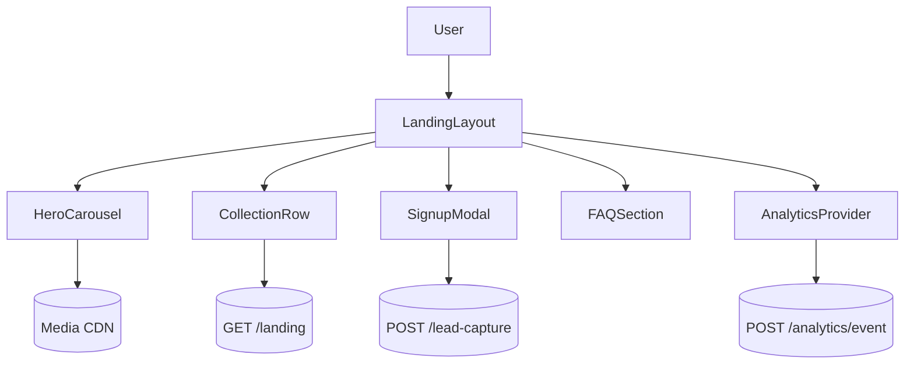

# Media Streaming Landing Page

## Overview
Conversion-focused streaming service homepage balancing personalization, rich media, and strict performance budgets.

## General Requirements
- Achieve Largest Contentful Paint under 1.5 seconds on mid-tier mobile devices.
- Support A/B experiments for hero variants with analytics instrumentation across the funnel.
- Gracefully degrade when JavaScript is disabled by relying on SSR-first rendering.
- Enforce regional content restrictions using geolocation-driven feature flags.

## Functional Requirements
- Personalized hero carousel with autoplay video previews and clear call-to-action buttons.
- Dynamic rows of curated collections, trending titles, and continue-watching rails.
- FAQ accordion, testimonial highlights, and device compatibility sections for trust building.
- Lead capture flow with email signup, social authentication entry points, and pricing comparison.

## Component Architecture
- `LandingLayout` orchestrates hero, content rows, and footer via streaming SSR.
- `HeroCarousel` lazy-loads background media using `IntersectionObserver` and priority hints.
- `CollectionRow` implements horizontal virtualization with gradient masks for scroll cues.
- `SignupModal` integrates analytics hooks and manages multi-step onboarding states.
- `FeatureHighlights` uses container queries to adapt grid layout per viewport width.

## Data Entries
- Title: `id`, name, synopsis, maturityRating, runtime, artworkUrls.
- Collection: `id`, title, algorithm, items[], experimentCohort.
- User context: anonymousId, geoRegion, abVariant, deviceCapabilities.
- FAQ item: `id`, question, answerMarkdown, displayOrder.

## API Design
- `GET /landing?region&variant` returns SSR payload containing hero and curated collections.
- `GET /titles/{id}` hydrates modal detail views when users expand a card.
- `POST /lead-capture` stores prospective user contact details with rate limiting.
- `POST /analytics/event` captures structured instrumentation for experiments.

## Store Design
- Lightweight React Context tracks AB variant, personalization flags, and consent state.
- SWR caches fetched title details with short TTL to support repeated modal opens.
- Derived selectors deduplicate rails and enforce experiment-driven ordering.
- Persist promo dismissal flags in localStorage only after obtaining consent.

## Optimisation
- Inline critical CSS, defer non-essential scripts, and use `<link rel="preload">` for hero media.
- Serve responsive images via `<picture>` with AVIF/WEBP fallbacks governed by client hints.
- Preconnect to media CDN and analytics endpoints to shrink handshake time.
- Lazy-load below-the-fold sections using IntersectionObserver and skeleton placeholders.

## Accessibility
- Provide visible controls to pause hero autoplay and ensure keyboard operability.
- Maintain semantic heading hierarchy for screen reader navigation.
- Offer transcripts or captions for hero videos and descriptive alt text for artwork.
- Manage focus when opening signup modals and trap focus until dismissal.

## Frontend Folder Structure
```
src/
  app/
    routes/
      index/
      privacy/
    components/
      hero/
      collections/
      marketing/
    providers/
      analytics-provider.tsx
      personalization-context.tsx
  hooks/
    use-intersection.ts
    use-variant.ts
  services/
    api/
    analytics/
  store/
    personalization-store.ts
  styles/
    globals.css
    hero.css
    collections.css
  utils/
    media.ts
    accessibility.ts
  assets/
    icons/
    illustrations/
```

## Pseudocode Flow
```pseudo
function renderLanding(request):
    context = resolveContext(request)
    data = fetch(`/landing?region=${context.region}&variant=${context.variant}`)
    return streamSSR(LandingLayout, { data, context })

function handleHeroIntersection(entry):
    if entry.isIntersecting and not heroVideoLoaded():
        loadHeroVideo()
        trackEvent('hero_autoplay_started')

function submitLead(form):
    if not validate(form):
        return showValidationErrors(form)
    response = post('/lead-capture', form)
    if response.ok:
        showSuccessState()
        trackEvent('lead_capture_success')
    else:
        showFailureState(response.error)
        trackEvent('lead_capture_failure', response.error)
```

## Component Interaction Diagram

