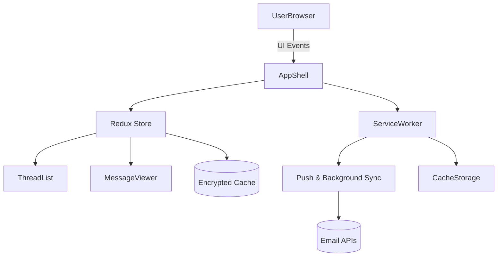

# Progressive Web Email Client

## Overview
Offline-capable email application delivering responsive UX with sync resilience and secure message handling.

## General Requirements
- Provide responsive layouts for desktop, tablet, and mobile with consistent interaction patterns.
- Render inbox hero state with meaningful content within 1.8 seconds on constrained 3G-like networks.
- Support offline access to previously synced mail and queue outbound messages until connectivity returns.
- Encrypt cached sensitive content at rest using Web Crypto-backed IndexedDB stores.

## Functional Requirements
- Infinite-scroll inbox with search, label filters, and multi-select bulk actions.
- Compose drawer supporting autosave drafts, attachment uploads, and recipient suggestions.
- Background sync channel broadcasting new mail, unread counts, and label updates.
- Settings area for account management, notification preferences, and cache controls.

## Component Architecture
- `AppShell` hosts header, navigation drawer, and route outlet with suspense fallbacks.
- `ThreadList` virtualizes message summaries, subscribing to memoized folder selectors.
- `MessageViewer` sanitizes HTML, isolates remote content inside secure iframes, and streams large bodies.
- `ComposeDrawer` mounts via portal, integrating autosave hooks and resumable attachment uploader.
- `SyncStatusBanner` listens to service-worker messages and surfaces connectivity feedback.

## Data Entries
- Thread entity: `id`, participants, snippet, labels, unread flag, `updatedAt`.
- Message entity: `id`, `threadId`, headers, sanitized HTML body, attachments metadata.
- Draft entity: `id`, recipients, subject, rich-text delta, attachment references, autosave timestamps.
- User preferences: density mode, notification level, cache quota, signature blocks.

## API Design
- `GET /v1/threads?label&cursor` returns paginated thread summaries with `ETag` validation.
- `GET /v1/threads/{id}` streams full message bodies via chunked transfer encoding.
- `POST /v1/messages` accepts multipart payload with attachments and `X-Idempotency-Key` header.
- `WS /v1/sync` emits delta events (`thread.updated`, `message.created`, `label.applied`).

## Store Design
- Use Redux Toolkit with RTK Query for request caching and entity adapters for threads/messages.
- Persist critical slices (threads, labels, drafts) to encrypted IndexedDB via `redux-persist`.
- Memoized selectors derive folder counts, unread badges, and search result subsets per route.
- Outbound queue slice tracks pending sends with retry metadata and exponential backoff strategy.

## Optimisation
- Preload core inbox bundle and defer heavy rich-text/attachment modules until first interaction.
- Service worker caches shell assets using stale-while-revalidate and schedules background sync tasks.
- Web workers parse large HTML bodies and preprocess attachment previews off the main thread.
- Throttle scroll handlers and schedule low-priority sync work with `requestIdleCallback`.

## Accessibility
- Provide keyboard shortcuts with focus-visible outlines and roving tabindex for list navigation.
- Announce new mail via polite ARIA live regions while respecting reduced-motion preferences.
- Label compose fields with `aria-describedby` to expose validation errors and helper text.
- Ensure contrast-compliant themes and expose semantic landmarks for screen readers.

## Frontend Folder Structure
```
src/
  app/
    index.tsx
    routes/
      inbox/
      thread/
      compose/
      settings/
    providers/
      error-boundary.tsx
      service-worker-provider.tsx
  components/
    layout/
    mail/
    shared/
  hooks/
    use-sync-channel.ts
    use-shortcuts.ts
  services/
    api/
    crypto/
    sync/
  store/
    slices/
    selectors/
  workers/
    html-sanitizer.ts
    attachment-processor.ts
  styles/
    tokens.css
    themes.css
  utils/
    formatting.ts
    accessibility.ts
```

## Pseudocode Flow
```pseudo
function bootstrapEmailApp():
    await loadUserPreferences()
    registerServiceWorker('/sw.js')
    hydrateStoreFromIndexedDB()
    prefetchLabelSummaries()
    render(AppShell)
    startSyncChannel(onDelta => dispatch(applyDelta(onDelta)))

function sendEmail(draft):
    enqueueOutboundMessage(draft)
    try:
        response = post('/v1/messages', draft)
        dispatch(markDraftAsSent(response.messageId))
    catch error:
        scheduleRetry(draft, backoffPolicy)
        dispatch(flagDraftError(draft.id, error))

function handleThreadScroll(cursor):
    if isFetchingThreads() or reachedEnd(cursor):
        return
    response = fetchThreads({ cursor, label: currentLabel(), limit: 50 })
    dispatch(appendThreads(normalize(response)))
```

## Component Interaction Diagram

