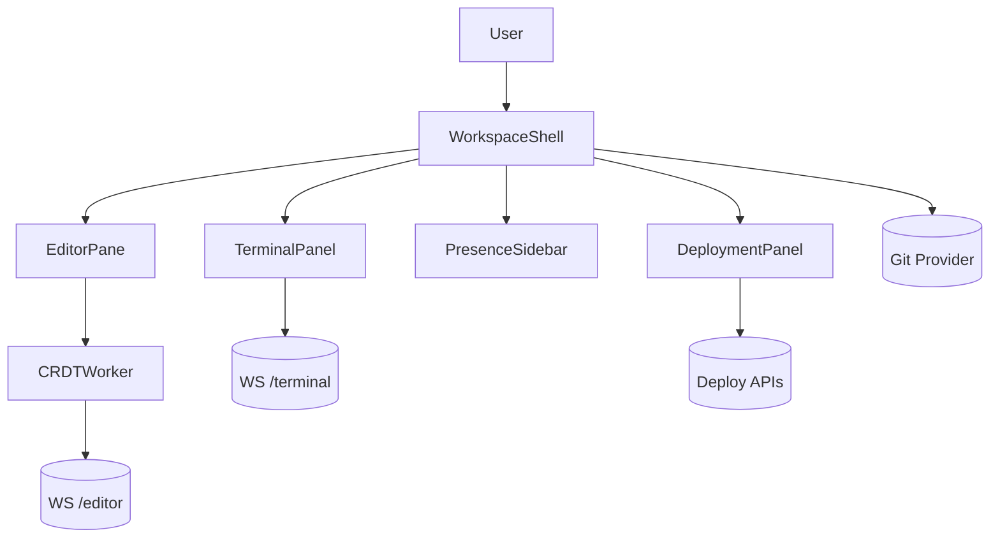

# Real-Time Code Collaboration IDE

## Overview
Browser-based IDE enabling synchronous editing, debugging, and deployment workflows for distributed engineering teams.

## General Requirements
- Support up to 100 concurrent collaborators per workspace with <100 ms shared cursor latency.
- Allow offline edits using CRDT persistence with seamless conflict resolution once reconnected.
- Sandboxed execution for preview/terminal sessions with per-user resource quotas.
- Integrate with Git providers for repository sync, history tracking, and reviews.

## Functional Requirements
- Multi-file editor with syntax highlighting, IntelliSense, and project-wide search.
- Shared terminal sessions and debugger integrations (breakpoints, stepping, variable inspection).
- Presence indicators, inline comments, and review mode with change suggestions.
- Deployment panel to trigger builds, stream logs, and roll back releases.

## Component Architecture
- `WorkspaceShell` coordinates project tree, editors, terminals, and auxiliary panels.
- `EditorPane` wraps Monaco editor instances connected to a CRDT adapter.
- `TerminalPanel` streams PTY output via WebSocket with reconnection and snapshot logic.
- `PresenceSidebar` renders collaborator avatars, focus files, and activity status.
- `DeploymentPanel` fetches pipeline status and surfaces step logs with streaming UI.

## Data Entries
- FileDocument: path, contentVersion, languageId, crdtState, lastModifiedBy.
- Presence record: userId, activeFile, cursorPosition, selectionRange, status.
- TerminalSession: `id`, command, status, lastActivityAt, bufferSnapshot.
- DeploymentRun: `id`, branch, status, steps[], artifacts[], triggeredBy.
- CommentThread: `id`, file, range, comments[], resolved.

## API Design
- `WS /workspaces/{id}/editor` carries CRDT operations and presence updates.
- `GET /workspaces/{id}/files?path` retrieves file tree and metadata lazily.
- `POST /workspaces/{id}/terminal` creates terminal session; `WS /terminal/{id}` streams I/O.
- `GET /workspaces/{id}/deployments` lists runs; `POST /deployments` triggers new deployment.
- `POST /workspaces/{id}/comments` adds annotations referencing file ranges.

## Store Design
- Use Recoil for fine-grained UI state (editor tabs, selections) to minimize rerenders.
- Persist CRDT documents in IndexedDB and sync deltas through worker threads.
- Derived selectors compute open files, unsynced changes, diagnostics, and review states.
- React Query caches deployment data, integrations, and feature toggles with invalidation rules.

## Optimisation
- Offload CRDT merging, linting, and formatting tasks to dedicated Web Workers.
- Batch presence updates at 60 Hz to reduce WebSocket chatter while staying responsive.
- Lazy-load language servers and heavy Monaco features on demand.
- Snapshot terminal buffers periodically for fast reconnection and history replay.

## Accessibility
- Expose keyboard commands for all core actions with searchable command palette.
- Provide high-contrast themes and customizable font sizes across editor and terminal.
- Ensure file tree and code navigation have screen reader friendly semantics.
- Announce collaborator joins/leaves and comments via polite ARIA live regions.

## Frontend Folder Structure
```
src/
  app/
    routes/
      workspace/
      auth/
    providers/
      crdt-provider.tsx
      terminal-provider.tsx
      theme-provider.tsx
  components/
    editor/
    terminal/
    presence/
    deployments/
    navigation/
  hooks/
    use-crdt-document.ts
    use-terminal-session.ts
    use-keymap.ts
  services/
    api/
    git/
    deployments/
    auth/
  store/
    recoil/
    query/
  workers/
    crdt-worker.ts
    lint-worker.ts
  styles/
    theme.css
    editor.css
  utils/
    file-system.ts
    accessibility.ts
```

## Pseudocode Flow
```pseudo
function openWorkspace(workspaceId):
    preloadFileTree(workspaceId)
    connectCRDTStream(workspaceId)
    connectPresenceStream(workspaceId)
    render(WorkspaceShell)

function onCRDTOperation(operation):
    postMessageToWorker({ type: 'merge', operation })
    worker.onmessage = event => updateDocument(event.merged)

function runDeployment(branch):
    dispatch(showDeploymentSpinner())
    deployment = post('/deployments', { branch })
    subscribe(`/deployments/${deployment.id}/events`, handleDeploymentEvent)
```

## Component Interaction Diagram

