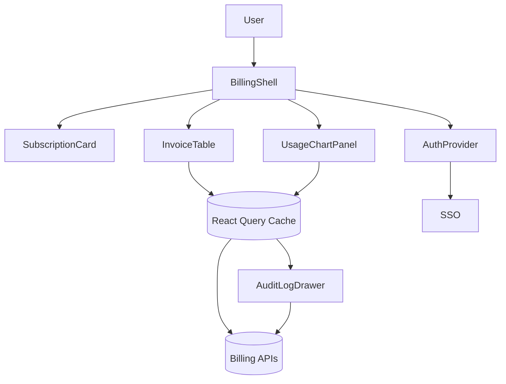

# SaaS Billing Portal

## Overview
Self-service billing center enabling subscription management, usage transparency, and invoicing for SaaS customers.

## General Requirements
- Secure all routes behind SSO with scoped roles (owner, admin, viewer) and audit logs.
- Deliver dashboard summary within 2 seconds using pre-aggregated usage snapshots.
- Provide CSV/JSON exports for invoices and billing changes with immutable audit trails.
- Meet PCI DSS requirements when displaying payment methods and processing updates.

## Functional Requirements
- Subscription overview with upgrade/downgrade flows and proration preview.
- Invoice list supporting filters, exports, and PDF retrieval through signed URLs.
- Usage charts detailing consumption per metric, overage alerts, and anomaly detection.
- Billing contacts management, payment method vaulting, and webhook endpoint configuration.

## Component Architecture
- `BillingShell` wraps navigation, account switcher, toast system, and suspense boundaries.
- `SubscriptionCard` surfaces current plan, limits, and CTAs for changes with optimistic previews.
- `InvoiceTable` uses virtualized grid, column pinning, and CSV exporter integration.
- `UsageChartPanel` streams data via React Suspense and hydrates progressively for first paint.
- `AuditLogDrawer` lazy-loads when users inspect change history or compliance events.

## Data Entries
- Account: `id`, name, taxId, currency, timezone, roles[].
- Subscription: `id`, planId, seats, addOns[], renewalDate, status, trialEndsAt.
- Invoice: `id`, amount, status, issuedAt, dueAt, hostedInvoiceUrl.
- UsageRecord: metricKey, periodStart, periodEnd, quantity, unit, cost, forecastDelta.
- Webhook endpoint: `id`, targetUrl, secret, status, lastFailureAt.

## API Design
- `GET /billing/accounts/{id}` returns account profile, subscription summary, and plan metadata.
- `POST /billing/accounts/{id}/subscription-change` calculates price deltas before confirmation.
- `GET /billing/accounts/{id}/invoices?status&cursor` provides paginated invoice list with totals.
- `GET /billing/accounts/{id}/usage?metric&range` returns aggregated usage series and forecasts.
- `POST /billing/accounts/{id}/webhooks/test` triggers validation pings against configured endpoints.

## Store Design
- Use React Query for server state caching with stale times tuned per resource criticality.
- Maintain light UI state (filters, drawer toggles) in Zustand for ergonomic mutation.
- Memoize computed totals and projection logic with reselect-style selectors.
- Query key factories scope data by account id and metric to enable independent invalidation.

## Optimisation
- Server-render summary panels and stream progressive hydration for tables and charts.
- Virtualize invoice rows with skeleton placeholders while fetching subsequent pages.
- Prefetch catalog and payment method data when user hovers upgrade CTAs.
- Enable background refresh intervals for usage panels during active sessions.

## Accessibility
- Ensure data grids expose keyboard-accessible sorting, filtering, and row actions.
- Provide descriptive ARIA live updates for billing status changes and alerts.
- Surface download links with file size and format metadata for invoices.
- Respect reduced-motion preferences for chart animations and interactive transitions.

## Frontend Folder Structure
```
src/
  app/
    routes/
      overview/
      invoices/
      usage/
      settings/
    loaders/
    actions/
  components/
    billing/
    charts/
    tables/
    shared/
  hooks/
    use-account-context.ts
    use-subscription-preview.ts
  services/
    api/
    auth/
    analytics/
  store/
    query-client.ts
    ui-store.ts
  styles/
    theme.css
    charts.css
  utils/
    currency.ts
    dates.ts
  workers/
    csv-exporter.ts
```

## Pseudocode Flow
```pseudo
function loadBillingOverview(accountId):
    [account, subscription, usage] = Promise.all([
        fetchAccount(accountId),
        fetchSubscription(accountId),
        fetchUsageSummary(accountId)
    ])
    renderOverview({ account, subscription, usage })

function requestPlanChange(payload):
    preview = post(`/billing/accounts/${payload.accountId}/subscription-change`, payload)
    showConfirmation(preview)
    if preview.confirmed:
        mutateSubscription(payload)
        invalidateQuery(['subscription', payload.accountId])

function exportInvoices(accountId, filters):
    data = fetchInvoices(accountId, filters)
    csv = convertInvoicesToCsv(data)
    triggerDownload(csv, 'invoices.csv')
```

## Component Interaction Diagram

