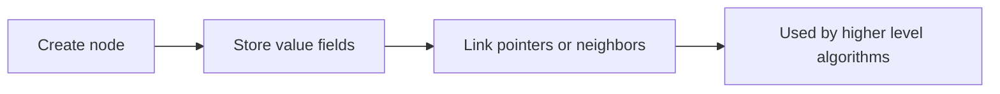
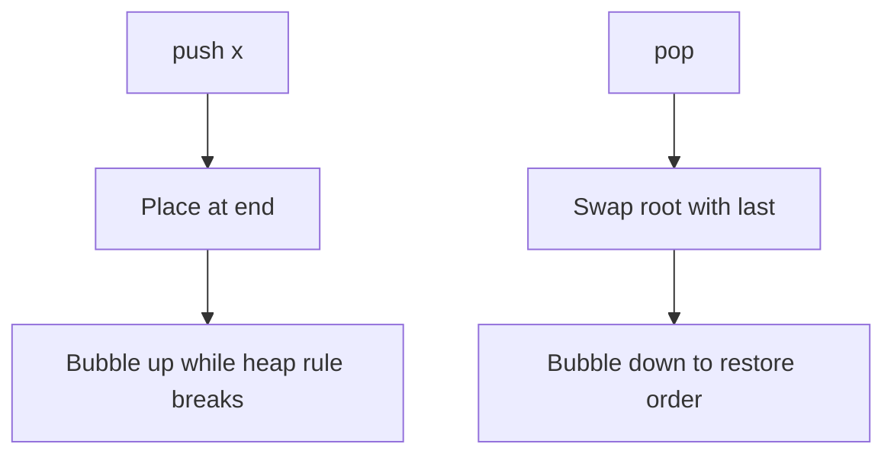
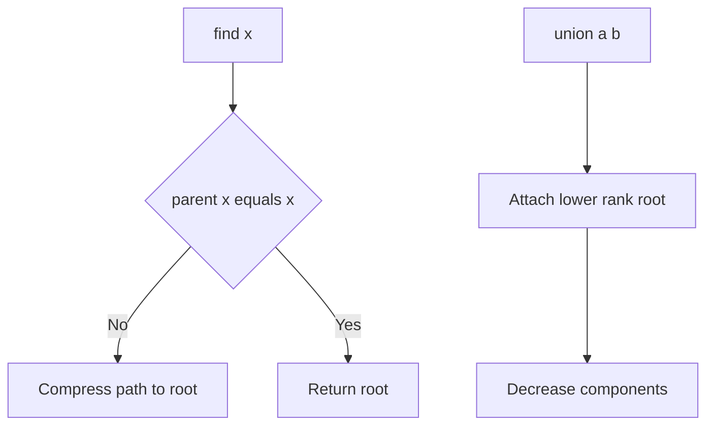
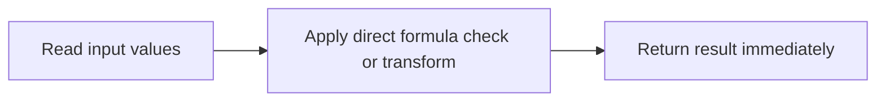
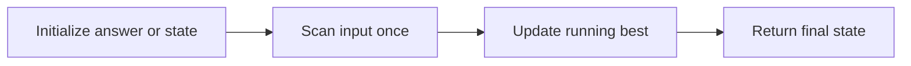
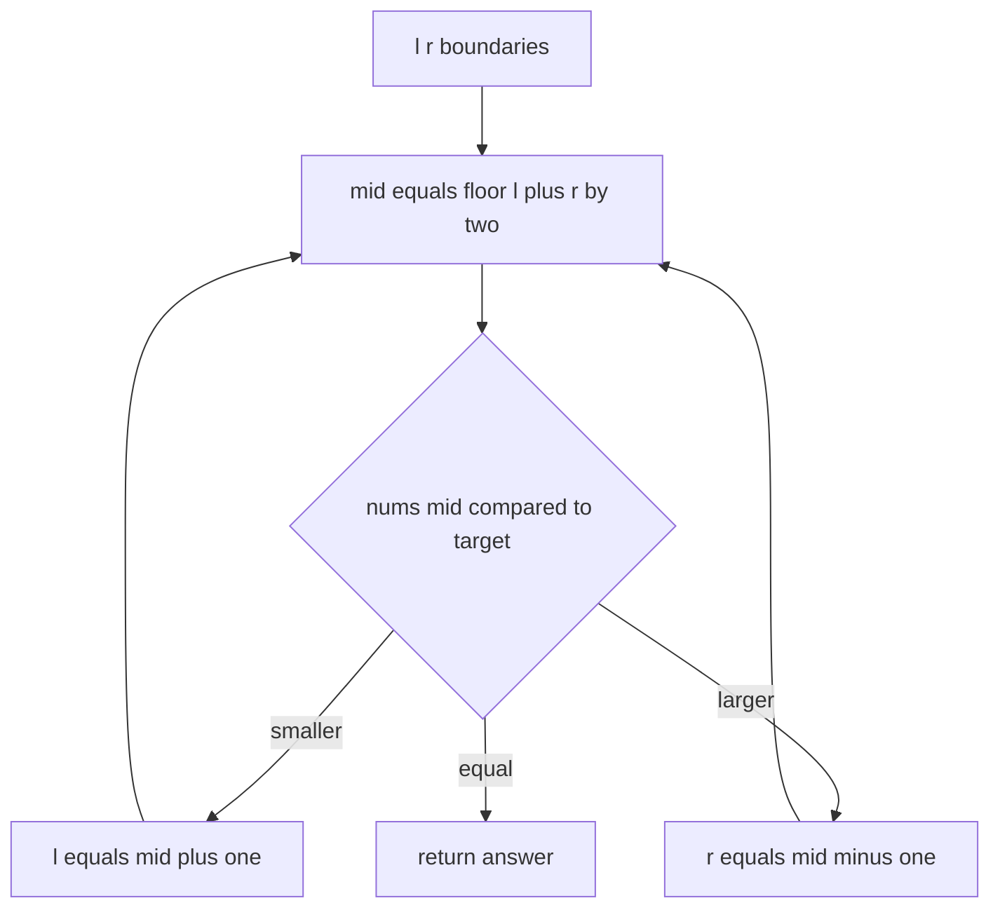
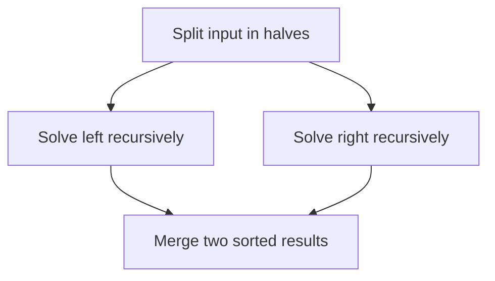
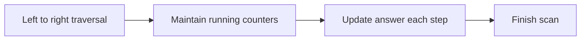
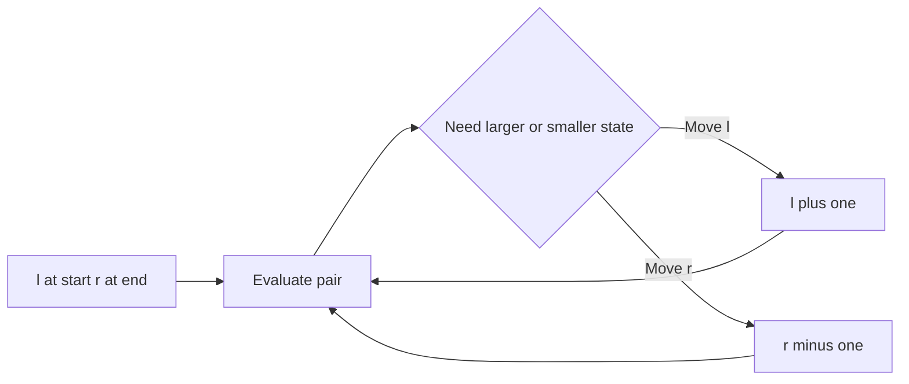

# DSA Sheet Solutions (JavaScript)

Generated at: 2026-04-24T14:24:16.437Z
Total problems: 170

> **Notation Note:** `linkedList([..])`, `tree([..])`, and `graph([..])` are compact input notations used only for readability in examples.

## Common Helpers

### 1. List Node (`ListNode`)

**Problem Statement**
Design and implement the **List Node** class in JavaScript with behavior matching the DSA sheet contract.
- **Input:** Constructor parameters and method calls defined for this class.
- **Output:** Each method should return/update state exactly as required by the class API.
- **Edge Cases:** Empty structure operations and single-element transitions must remain valid.

**Example Cases**
1. Input: `const obj = new ListNode(...); // invoke methods in sequence`
   Output: `Methods return values according to operation sequence`
2. Input: `Use ListNode with empty/single element states`
   Output: `All methods handle boundaries safely`

**JavaScript Solution**
```javascript
class ListNode {
  constructor(val = 0, next = null) {
    this.val = val;
    this.next = next;
  }
}
```

**Detailed Explanation**
- **Core Idea:** Define a minimal data container that stores value and structural links used by higher-level algorithms.
- **Correctness Invariant:** State variables are updated so partial work is always valid for the next step.
- **Code Lens:** Key variable names depend on this implementation.
- **Time Complexity:** O(1) constructor; operations vary by method
- **Space Complexity:** O(1) per node plus stored structure

**Diagram (Step-by-Step)**


**Implementation Walkthrough (Code Order)**
1. Constructor stores node value and the `next` pointer.
2. Each node instance becomes one element in a singly linked list chain.
3. Algorithms connect nodes by rewriting `next` references.

### 2. Tree Node (`TreeNode`)

**Problem Statement**
Design and implement the **Tree Node** class in JavaScript with behavior matching the DSA sheet contract.
- **Input:** Constructor parameters and method calls defined for this class.
- **Output:** Each method should return/update state exactly as required by the class API.
- **Edge Cases:** Empty structure operations and single-element transitions must remain valid.

**Example Cases**
1. Input: `const obj = new TreeNode(...); // invoke methods in sequence`
   Output: `Methods return values according to operation sequence`
2. Input: `Use TreeNode with empty/single element states`
   Output: `All methods handle boundaries safely`

**JavaScript Solution**
```javascript
class TreeNode {
  constructor(val = 0, left = null, right = null) {
    this.val = val;
    this.left = left;
    this.right = right;
  }
}
```

**Detailed Explanation**
- **Core Idea:** Define a minimal data container that stores value and structural links used by higher-level algorithms.
- **Correctness Invariant:** State variables are updated so partial work is always valid for the next step.
- **Code Lens:** Key variables in this code: `left`, `right`.
- **Time Complexity:** O(1) constructor; operations vary by method
- **Space Complexity:** O(1) per node plus stored structure

**Diagram (Step-by-Step)**


**Implementation Walkthrough (Code Order)**
1. Constructor stores `val`, `left`, and `right` references.
2. `left`/`right` can be `null` for missing children.
3. Tree algorithms traverse by following these child references.

### 3. Graph Node (`GraphNode`)

**Problem Statement**
Design and implement the **Graph Node** class in JavaScript with behavior matching the DSA sheet contract.
- **Input:** Constructor parameters and method calls defined for this class.
- **Output:** Each method should return/update state exactly as required by the class API.
- **Edge Cases:** Empty structure operations and single-element transitions must remain valid.

**Example Cases**
1. Input: `const obj = new GraphNode(...); // invoke methods in sequence`
   Output: `Methods return values according to operation sequence`
2. Input: `Use GraphNode with empty/single element states`
   Output: `All methods handle boundaries safely`

**JavaScript Solution**
```javascript
class GraphNode {
  constructor(val = 0, neighbors = []) {
    this.val = val;
    this.neighbors = neighbors;
  }
}
```

**Detailed Explanation**
- **Core Idea:** Define a minimal data container that stores value and structural links used by higher-level algorithms.
- **Correctness Invariant:** State variables are updated so partial work is always valid for the next step.
- **Code Lens:** Key variable names depend on this implementation.
- **Time Complexity:** O(1) constructor; operations vary by method
- **Space Complexity:** O(1) per node plus stored structure

**Diagram (Step-by-Step)**


**Implementation Walkthrough (Code Order)**
1. Constructor stores node value and initializes `neighbors` list.
2. Edges are represented by neighbor references in this array.
3. Graph traversals use `neighbors` to move between nodes.

### 4. Binary Heap (`BinaryHeap`)

**Problem Statement**
Design and implement the **Binary Heap** class in JavaScript with behavior matching the DSA sheet contract.
- **Input:** Constructor parameters and method calls defined for this class.
- **Output:** Each method should return/update state exactly as required by the class API.
- **Edge Cases:** Empty structure operations and single-element transitions must remain valid.

**Example Cases**
1. Input: `const obj = new BinaryHeap(...); // invoke methods in sequence`
   Output: `Methods return values according to operation sequence`
2. Input: `Use BinaryHeap with empty/single element states`
   Output: `All methods handle boundaries safely`

**JavaScript Solution**
```javascript
class BinaryHeap {
  constructor(compare = (a, b) => a - b) {
    this.data = [];
    this.compare = compare;
  }

  size() {
    return this.data.length;
  }

  peek() {
    return this.data[0];
  }

  push(value) {
    this.data.push(value);
    this.bubbleUp(this.data.length - 1);
  }

  pop() {
    if (this.data.length === 0) return null;
    if (this.data.length === 1) return this.data.pop();
    const top = this.data[0];
    this.data[0] = this.data.pop();
    this.bubbleDown(0);
    return top;
  }

  bubbleUp(i) {
    while (i > 0) {
      const p = Math.floor((i - 1) / 2);
      if (this.compare(this.data[i], this.data[p]) < 0) {
        [this.data[i], this.data[p]] = [this.data[p], this.data[i]];
        i = p;
      } else {
        break;
      }
    }
  }

  bubbleDown(i) {
    const n = this.data.length;
    while (true) {
      let best = i;
      const l = 2 * i + 1;
      const r = 2 * i + 2;

      if (l < n && this.compare(this.data[l], this.data[best]) < 0) best = l;
      if (r < n && this.compare(this.data[r], this.data[best]) < 0) best = r;

      if (best === i) break;
      [this.data[i], this.data[best]] = [this.data[best], this.data[i]];
      i = best;
    }
  }
}
```

**Detailed Explanation**
- **Core Idea:** Maintain heap order after every insert/remove using bubble-up and bubble-down operations.
- **Correctness Invariant:** Heap property is restored after every push/pop by bubble operations.
- **Code Lens:** Key variables in this code: `l`, `r`, `best`.
- **Time Complexity:** O(log n) per heap update
- **Space Complexity:** O(n)

**Diagram (Step-by-Step)**


**Implementation Walkthrough (Code Order)**
1. `push` appends element, then `bubbleUp` restores heap order toward root.
2. `pop` removes root, moves last element to root, then `bubbleDown` restores order.
3. `peek` reads root, and comparator controls min-heap/max-heap behavior.

### 5. DSU (`DSU`)

**Problem Statement**
Design and implement the **DSU** class in JavaScript with behavior matching the DSA sheet contract.
- **Input:** Constructor parameters and method calls defined for this class.
- **Output:** Each method should return/update state exactly as required by the class API.
- **Edge Cases:** Empty structure operations and single-element transitions must remain valid.

**Example Cases**
1. Input: `const obj = new DSU(...); // invoke methods in sequence`
   Output: `Methods return values according to operation sequence`
2. Input: `Use DSU with empty/single element states`
   Output: `All methods handle boundaries safely`

**JavaScript Solution**
```javascript
class DSU {
  constructor(n) {
    this.parent = Array.from({ length: n }, (_, i) => i);
    this.rank = Array(n).fill(0);
    this.components = n;
  }

  find(x) {
    if (this.parent[x] !== x) this.parent[x] = this.find(this.parent[x]);
    return this.parent[x];
  }

  union(a, b) {
    let pa = this.find(a);
    let pb = this.find(b);
    if (pa === pb) return false;

    if (this.rank[pa] < this.rank[pb]) [pa, pb] = [pb, pa];
    this.parent[pb] = pa;
    if (this.rank[pa] === this.rank[pb]) this.rank[pa] += 1;
    this.components -= 1;
    return true;
  }
}
```

**Detailed Explanation**
- **Core Idea:** Group elements by representative roots, with path compression and union-by-rank to keep trees shallow.
- **Correctness Invariant:** Each node points to a representative root; path compression only shortens valid root paths.
- **Code Lens:** Key variable names depend on this implementation.
- **Time Complexity:** find/union are near O(1) amortized
- **Space Complexity:** O(n)

**Diagram (Step-by-Step)**


**Implementation Walkthrough (Code Order)**
1. `find` returns representative root and compresses paths for faster future queries.
2. `union` merges two component roots using rank balancing.
3. `components` decreases only when two previously separate sets are merged.

## 1) Foundation

### 6. Sum (`sum`)

**Problem Statement**
Solve **Sum** by implementing **sum(a, b)**.
- **Input:** `a`: integer/number; `b`: integer/number
- **Output:** Return the computed numeric result.
- **Edge Cases:** Handle boundary numeric values (0/1/min/max ranges) correctly.

**Example Cases**
1. Input: `sum(2, 2)`
   Output: `4`
2. Input: `sum(0, 0)`
   Output: `0`

**JavaScript Solution**
```javascript
function sum(a, b) {
  return a + b;
}
```

**Detailed Explanation**
- **Core Idea:** Compute the answer directly from input values using a fixed number of operations.
- **Correctness Invariant:** No iterative state is required; each expression is evaluated exactly once.
- **Code Lens:** Key variable names depend on this implementation.
- **Time Complexity:** O(1)
- **Space Complexity:** O(1)

**Diagram (Step-by-Step)**


**Implementation Walkthrough (Code Order)**
1. Read the required input values.
2. Apply a direct expression/check with constant operations.
3. Return the computed value immediately.

### 7. Second Largest (`secondLargest`)

**Problem Statement**
Solve **Second Largest** by implementing **secondLargest(nums)**.
- **Input:** `nums` is an array of integers.
- **Output:** Return the second largest **distinct** value in `nums`.
- **Edge Cases:** If `nums` has fewer than two distinct values, return `-1`.

**Example Cases**
1. Input: `secondLargest([1,2,3])`
   Output: `2`
2. Input: `secondLargest([])`
   Output: `-1`

**JavaScript Solution**
```javascript
function secondLargest(nums) {
  let first = -Infinity;
  let second = -Infinity;
  for (const x of nums) {
    if (x > first) {
      second = first;
      first = x;
    } else if (x > second && x !== first) {
      second = x;
    }
  }
  return second === -Infinity ? -1 : second;
}
```

**Detailed Explanation**
- **Core Idea:** Iterate through input once while keeping a minimal running state that directly builds the answer.
- **Correctness Invariant:** After each step, running state still summarizes all processed input correctly.
- **Code Lens:** Key variable names depend on this implementation.
- **Time Complexity:** O(n)
- **Space Complexity:** O(1) to O(n) depending on helpers

**Diagram (Step-by-Step)**


**Implementation Walkthrough (Code Order)**
1. Initialize sentinel variable `first` as `-Infinity` for comparisons.
2. Initialize sentinel variable `second` as `-Infinity` for comparisons.
3. Iterate through `nums`, processing each element as `x`.
4. Branch logic based on condition `x > first`.
5. Recompute `second` as `first`.
6. Recompute `first` as `x`.
7. Return final answer as `second === -Infinity ? -1 : second`.

### 8. Is Palindrome Number (`isPalindromeNumber`)

**Problem Statement**
Solve **Is Palindrome Number** by implementing **isPalindromeNumber(x)**.
- **Input:** `x`: integer/number
- **Output:** Return a boolean indicating whether the required condition holds.
- **Edge Cases:** Handle boundary numeric values (0/1/min/max ranges) correctly.

**Example Cases**
1. Input: `isPalindromeNumber(null)`
   Output: `false`
2. Input: `isPalindromeNumber(0)`
   Output: `true`

**JavaScript Solution**
```javascript
function isPalindromeNumber(x) {
  if (x < 0) return false;
  let orig = x;
  let rev = 0;
  while (x > 0) {
    rev = rev * 10 + (x % 10);
    x = Math.floor(x / 10);
  }
  return rev === orig;
}
```

**Detailed Explanation**
- **Core Idea:** Iterate through input once while keeping a minimal running state that directly builds the answer.
- **Correctness Invariant:** After each step, running state still summarizes all processed input correctly.
- **Code Lens:** Key variable names depend on this implementation.
- **Time Complexity:** O(n)
- **Space Complexity:** O(1) to O(n) depending on helpers

**Diagram (Step-by-Step)**


**Implementation Walkthrough (Code Order)**
1. Handle edge/base case early: if `x < 0`, return `false` immediately.
2. Initialize `orig` with `x`.
3. Initialize `rev` with `0`.
4. Repeat loop while condition `x > 0` remains true.
5. Recompute `rev` as `rev * 10 + (x % 10)`.
6. Recompute `x` as `Math.floor(x / 10)`.
7. Return final answer as `rev === orig`.

### 9. Reverse Integer (`reverseInteger`)

**Problem Statement**
Solve **Reverse Integer** by implementing **reverseInteger(x)**.
- **Input:** `x`: integer/number
- **Output:** Return the computed numeric result.
- **Edge Cases:** Handle boundary numeric values (0/1/min/max ranges) correctly.

**Example Cases**
1. Input: `reverseInteger(null)`
   Output: `0`
2. Input: `reverseInteger(0)`
   Output: `0`

**JavaScript Solution**
```javascript
function reverseInteger(x) {
  const sign = x < 0 ? -1 : 1;
  x = Math.abs(x);

  let rev = 0;
  while (x > 0) {
    rev = rev * 10 + (x % 10);
    x = Math.floor(x / 10);
  }

  rev *= sign;
  const INT_MIN = -(2 ** 31);
  const INT_MAX = 2 ** 31 - 1;
  return rev < INT_MIN || rev > INT_MAX ? 0 : rev;
}
```

**Detailed Explanation**
- **Core Idea:** Iterate through input once while keeping a minimal running state that directly builds the answer.
- **Correctness Invariant:** After each step, running state still summarizes all processed input correctly.
- **Code Lens:** Key variable names depend on this implementation.
- **Time Complexity:** O(n)
- **Space Complexity:** O(1) to O(n) depending on helpers

**Diagram (Step-by-Step)**


**Implementation Walkthrough (Code Order)**
1. Initialize `sign` with `x < 0 ? -1 : 1`.
2. Recompute `x` as `Math.abs(x)`.
3. Initialize `rev` with `0`.
4. Repeat loop while condition `x > 0` remains true.
5. Recompute `rev` as `rev * 10 + (x % 10)`.
6. Recompute `x` as `Math.floor(x / 10)`.
7. Return final answer as `rev < INT_MIN || rev > INT_MAX ? 0 : rev`.

### 10. Count Negative Numbers (`countNegativeNumbers`)

**Problem Statement**
Solve **Count Negative Numbers** by implementing **countNegativeNumbers(grid)**.
- **Input:** `grid`: 2D grid/matrix
- **Output:** Return the computed numeric result.
- **Edge Cases:** Handle empty/single-cell grids correctly.

**Example Cases**
1. Input: `countNegativeNumbers([[1,2],[3,4]])`
   Output: `0`
2. Input: `countNegativeNumbers([[]])`
   Output: `0`

**JavaScript Solution**
```javascript
function countNegativeNumbers(grid) {
  let count = 0;
  for (const row of grid) {
    let l = 0;
    let r = row.length - 1;
    let firstNeg = row.length;
    while (l <= r) {
      const m = Math.floor((l + r) / 2);
      if (row[m] < 0) {
        firstNeg = m;
        r = m - 1;
      } else {
        l = m + 1;
      }
    }
    count += row.length - firstNeg;
  }
  return count;
}
```

**Detailed Explanation**
- **Core Idea:** Keep a shrinking valid search interval and decide direction using mid comparisons.
- **Correctness Invariant:** `[l, r]` always contains all possible valid answers not discarded yet.
- **Code Lens:** Key variables in this code: `l`, `r`, `m`.
- **Time Complexity:** O(log n)
- **Space Complexity:** O(1)

**Diagram (Step-by-Step)**


**Implementation Walkthrough (Code Order)**
1. Initialize `count` with `0`.
2. Iterate through `grid`, processing each element as `row`.
3. Initialize `l` with `0`.
4. Initialize `r` with `row.length - 1`.
5. Initialize `firstNeg` with `row.length`.
6. Repeat loop while condition `l <= r` remains true.
7. Return final answer as `count`.

### 11. Find Smallest Number (`findSmallestNumber`)

**Problem Statement**
Solve **Find Smallest Number** by implementing **findSmallestNumber(nums)**.
- **Input:** `nums`: array of numbers
- **Output:** Return the computed numeric result.
- **Edge Cases:** Handle empty arrays, boundary numeric values (0/1/min/max ranges) correctly.

**Example Cases**
1. Input: `findSmallestNumber([1,2,3])`
   Output: `1`
2. Input: `findSmallestNumber([])`
   Output: `Infinity`

**JavaScript Solution**
```javascript
function findSmallestNumber(nums) {
  let minVal = Infinity;
  for (const x of nums) minVal = Math.min(minVal, x);
  return minVal;
}
```

**Detailed Explanation**
- **Core Idea:** Iterate through input once while keeping a minimal running state that directly builds the answer.
- **Correctness Invariant:** After each step, running state still summarizes all processed input correctly.
- **Code Lens:** Key variable names depend on this implementation.
- **Time Complexity:** O(n)
- **Space Complexity:** O(1) to O(n) depending on helpers

**Diagram (Step-by-Step)**


**Implementation Walkthrough (Code Order)**
1. Initialize sentinel variable `minVal` as `Infinity` for comparisons.
2. Iterate through `nums`, processing each element as `x`.
3. Return final answer as `minVal`.

### 12. Find Largest Number (`findLargestNumber`)

**Problem Statement**
Solve **Find Largest Number** by implementing **findLargestNumber(nums)**.
- **Input:** `nums`: array of numbers
- **Output:** Return the computed numeric result.
- **Edge Cases:** Handle empty arrays, boundary numeric values (0/1/min/max ranges) correctly.

**Example Cases**
1. Input: `findLargestNumber([1,2,3])`
   Output: `3`
2. Input: `findLargestNumber([])`
   Output: `-Infinity`

**JavaScript Solution**
```javascript
function findLargestNumber(nums) {
  let maxVal = -Infinity;
  for (const x of nums) maxVal = Math.max(maxVal, x);
  return maxVal;
}
```

**Detailed Explanation**
- **Core Idea:** Iterate through input once while keeping a minimal running state that directly builds the answer.
- **Correctness Invariant:** After each step, running state still summarizes all processed input correctly.
- **Code Lens:** Key variable names depend on this implementation.
- **Time Complexity:** O(n)
- **Space Complexity:** O(1) to O(n) depending on helpers

**Diagram (Step-by-Step)**


**Implementation Walkthrough (Code Order)**
1. Initialize sentinel variable `maxVal` as `-Infinity` for comparisons.
2. Iterate through `nums`, processing each element as `x`.
3. Return final answer as `maxVal`.

### 13. Binary Search (`binarySearch`)

**Problem Statement**
Solve **Binary Search** by implementing **binarySearch(nums, target)**.
- **Input:** `nums`: array of numbers; `target`: integer/number
- **Output:** Return the computed numeric result.
- **Edge Cases:** Handle empty arrays, boundary numeric values (0/1/min/max ranges) correctly.

**Example Cases**
1. Input: `binarySearch([1,3,5,7], 5)`
   Output: `2`
2. Input: `binarySearch([], 0)`
   Output: `-1`

**JavaScript Solution**
```javascript
function binarySearch(nums, target) {
  let l = 0;
  let r = nums.length - 1;
  while (l <= r) {
    const m = Math.floor((l + r) / 2);
    if (nums[m] === target) return m;
    if (nums[m] < target) l = m + 1;
    else r = m - 1;
  }
  return -1;
}
```

**Detailed Explanation**
- **Core Idea:** Keep a shrinking valid search interval and decide direction using mid comparisons.
- **Correctness Invariant:** `[l, r]` always contains all possible valid answers not discarded yet.
- **Code Lens:** Key variables in this code: `l`, `r`, `m`.
- **Time Complexity:** O(log n)
- **Space Complexity:** O(1)

**Diagram (Step-by-Step)**


**Implementation Walkthrough (Code Order)**
1. Initialize `l` with `0`.
2. Initialize `r` with `nums.length - 1`.
3. Repeat loop while condition `l <= r` remains true.
4. Initialize `m` with `Math.floor((l + r) / 2)`.
5. Handle edge/base case early: if `nums[m] === target`, return `m` immediately.
6. Branch logic based on condition `nums[m] < target`.
7. Return final answer as `-1`.

### 14. Merge Sort (`mergeSort`)

**Problem Statement**
Solve **Merge Sort** by implementing **mergeSort(nums)**.
- **Input:** `nums`: array of numbers
- **Output:** Return the resulting array/list structure as defined by the problem.
- **Edge Cases:** Handle empty arrays, boundary numeric values (0/1/min/max ranges) correctly.

**Example Cases**
1. Input: `mergeSort([5,2,3,1])`
   Output: `[1,2,3,5]`
2. Input: `mergeSort([])`
   Output: `[]`

**JavaScript Solution**
```javascript
function mergeSort(nums) {
  if (nums.length <= 1) return nums.slice();

  const merge = (left, right) => {
    const out = [];
    let i = 0;
    let j = 0;
    while (i < left.length && j < right.length) {
      if (left[i] <= right[j]) out.push(left[i++]);
      else out.push(right[j++]);
    }
    while (i < left.length) out.push(left[i++]);
    while (j < right.length) out.push(right[j++]);
    return out;
  };

  const solve = (arr) => {
    if (arr.length <= 1) return arr;
    const mid = Math.floor(arr.length / 2);
    const left = solve(arr.slice(0, mid));
    const right = solve(arr.slice(mid));
    return merge(left, right);
  };

  return solve(nums);
}
```

**Detailed Explanation**
- **Core Idea:** Split into smaller independent parts, solve recursively, then merge results.
- **Correctness Invariant:** State variables are updated so partial work is always valid for the next step.
- **Code Lens:** Key variables in this code: `left`, `right`, `mid`.
- **Time Complexity:** O(n log n)
- **Space Complexity:** O(n)

**Diagram (Step-by-Step)**


**Implementation Walkthrough (Code Order)**
1. Handle edge/base case early: if `nums.length <= 1`, return `nums.slice()` immediately.
2. Initialize `out` as a working array/DP structure.
3. Initialize `i` with `0`.
4. Initialize `j` with `0`.
5. Repeat loop while condition `i < left.length && j < right.length` remains true.
6. Branch logic based on condition `left[i] <= right[j]) out.push(left[i++]`.
7. Return final answer as `solve(nums)`.

### 15. Is Power Of Two (`isPowerOfTwo`)

**Problem Statement**
Solve **Is Power Of Two** by implementing **isPowerOfTwo(n)**.
- **Input:** `n`: integer/number
- **Output:** Return a boolean indicating whether the required condition holds.
- **Edge Cases:** Handle boundary numeric values (0/1/min/max ranges) correctly.

**Example Cases**
1. Input: `isPowerOfTwo(2)`
   Output: `true`
2. Input: `isPowerOfTwo(0)`
   Output: `false`

**JavaScript Solution**
```javascript
function isPowerOfTwo(n) {
  return n > 0 && (n & (n - 1)) === 0;
}
```

**Detailed Explanation**
- **Core Idea:** Compute the answer directly from input values using a fixed number of operations.
- **Correctness Invariant:** No iterative state is required; each expression is evaluated exactly once.
- **Code Lens:** Key variable names depend on this implementation.
- **Time Complexity:** O(1)
- **Space Complexity:** O(1)

**Diagram (Step-by-Step)**


**Implementation Walkthrough (Code Order)**
1. Read the required input values.
2. Apply a direct expression/check with constant operations.
3. Return the computed value immediately.

## 2) Arrays

### 16. Remove Duplicates (`removeDuplicates`)

**Problem Statement**
Solve **Remove Duplicates** by implementing **removeDuplicates(nums)**.
- **Input:** `nums`: integer/number
- **Output:** Return the resulting array/list structure as defined by the problem.
- **Edge Cases:** Handle boundary numeric values (0/1/min/max ranges) correctly.

**Example Cases**
1. Input: `removeDuplicates([1,1,2,2,3])`
   Output: `length=3, prefix=[1,2,3]`
2. Input: `removeDuplicates([])`
   Output: `length=0, prefix=[]`

**JavaScript Solution**
```javascript
function removeDuplicates(nums) {
  if (nums.length === 0) return 0;
  let write = 1;
  for (let read = 1; read < nums.length; read += 1) {
    if (nums[read] !== nums[read - 1]) {
      nums[write] = nums[read];
      write += 1;
    }
  }
  return write;
}
```

**Detailed Explanation**
- **Core Idea:** Scan once while maintaining running state (best/min/max/counter) needed for the final answer.
- **Correctness Invariant:** State variables are updated so partial work is always valid for the next step.
- **Code Lens:** Key variables in this code: `write`, `read`.
- **Time Complexity:** O(n)
- **Space Complexity:** O(1) to O(n) depending on helpers

**Diagram (Step-by-Step)**


**Implementation Walkthrough (Code Order)**
1. Handle edge/base case early: if `nums.length === 0`, return `0` immediately.
2. Initialize `write` with `1`.
3. Run indexed loop controlled by `read` according to the loop bounds.
4. Branch logic based on condition `nums[read] !== nums[read - 1]`.
5. Increment/update `write` by `1` based on current state.
6. Return final answer as `write`.

### 17. Remove Element (`removeElement`)

**Problem Statement**
Solve **Remove Element** by implementing **removeElement(nums, val)**.
- **Input:** `nums`: integer/number; `val`: integer/number
- **Output:** Return the resulting array/list structure as defined by the problem.
- **Edge Cases:** Handle boundary numeric values (0/1/min/max ranges) correctly.

**Example Cases**
1. Input: `removeElement([3,2,2,3], 3)`
   Output: `length=2, prefix=[2,2]`
2. Input: `removeElement([], 0)`
   Output: `length=0, prefix=[]`

**JavaScript Solution**
```javascript
function removeElement(nums, val) {
  let write = 0;
  for (let i = 0; i < nums.length; i += 1) {
    if (nums[i] !== val) nums[write++] = nums[i];
  }
  return write;
}
```

**Detailed Explanation**
- **Core Idea:** Scan once while maintaining running state (best/min/max/counter) needed for the final answer.
- **Correctness Invariant:** State variables are updated so partial work is always valid for the next step.
- **Code Lens:** Key variables in this code: `write`.
- **Time Complexity:** O(n)
- **Space Complexity:** O(1) to O(n) depending on helpers

**Diagram (Step-by-Step)**


**Implementation Walkthrough (Code Order)**
1. Initialize `write` with `0`.
2. Run indexed loop controlled by `i` according to the loop bounds.
3. Branch logic based on condition `nums[i] !== val`.
4. Return final answer as `write`.

### 18. Reverse String (`reverseString`)

**Problem Statement**
Solve **Reverse String** by implementing **reverseString(chars)**.
- **Input:** `chars`: value required by the problem
- **Output:** Return the resulting array/list structure as defined by the problem.
- **Edge Cases:** Handle boundary inputs according to the function contract without runtime errors.

**Example Cases**
1. Input: `reverseString(["h","e","l","l","o"])`
   Output: `["o","l","l","e","h"]`
2. Input: `reverseString(0)`
   Output: `0`

**JavaScript Solution**
```javascript
function reverseString(chars) {
  let l = 0;
  let r = chars.length - 1;
  while (l < r) {
    [chars[l], chars[r]] = [chars[r], chars[l]];
    l += 1;
    r -= 1;
  }
  return chars;
}
```

**Detailed Explanation**
- **Core Idea:** Use two moving indices to avoid nested loops and enforce constraints in linear time.
- **Correctness Invariant:** State variables are updated so partial work is always valid for the next step.
- **Code Lens:** Key variables in this code: `l`, `r`.
- **Time Complexity:** O(n)
- **Space Complexity:** O(1) to O(k)

**Diagram (Step-by-Step)**


**Implementation Walkthrough (Code Order)**
1. Initialize `l` with `0`.
2. Initialize `r` with `chars.length - 1`.
3. Repeat loop while condition `l < r` remains true.
4. Update multiple variables together using destructuring assignment: `[chars[l], chars[r]] = [chars[r], chars[l]];`.
5. Increment/update `l` by `1` based on current state.
6. Return final answer as `chars`.

### 19. Max Profit (`maxProfit`)

**Problem Statement**
Solve **Max Profit** by implementing **maxProfit(prices)**.
- **Input:** `prices`: array of numbers
- **Output:** Return the computed numeric result.
- **Edge Cases:** Handle empty arrays, boundary numeric values (0/1/min/max ranges) correctly.

**Example Cases**
1. Input: `maxProfit([7,1,5,3,6,4])`
   Output: `5`
2. Input: `maxProfit([])`
   Output: `0`

**JavaScript Solution**
```javascript
function maxProfit(prices) {
  let bestBuy = Infinity;
  let ans = 0;
  for (const p of prices) {
    bestBuy = Math.min(bestBuy, p);
    ans = Math.max(ans, p - bestBuy);
  }
  return ans;
}
```

**Detailed Explanation**
- **Core Idea:** Scan once while maintaining running state (best/min/max/counter) needed for the final answer.
- **Correctness Invariant:** State variables are updated so partial work is always valid for the next step.
- **Code Lens:** Key variables in this code: `ans`.
- **Time Complexity:** O(n)
- **Space Complexity:** O(1) to O(n) depending on helpers

**Diagram (Step-by-Step)**


**Implementation Walkthrough (Code Order)**
1. Initialize sentinel variable `bestBuy` as `Infinity` for comparisons.
2. Initialize `ans` with `0`.
3. Iterate through `prices`, processing each element as `p`.
4. Update `bestBuy` using optimal-choice comparison: `Math.min(bestBuy, p)`.
5. Update `ans` using optimal-choice comparison: `Math.max(ans, p - bestBuy)`.
6. Return final answer as `ans`.

### 20. Merge Sorted Arrays (`mergeSortedArrays`)

**Problem Statement**
Solve **Merge Sorted Arrays** by implementing **mergeSortedArrays(nums1, m, nums2, n)**.
- **Input:** `nums1`: array of numbers; `m`: integer/number; `nums2`: integer/number; `n`: integer/number
- **Output:** Return the resulting array/list structure as defined by the problem.
- **Edge Cases:** Handle empty arrays, boundary numeric values (0/1/min/max ranges) correctly.

**Example Cases**
1. Input: `mergeSortedArrays([1,2,3,0,0,0], 3, [2,5,6], 3)`
   Output: `[1,2,2,3,5,6]`
2. Input: `mergeSortedArrays([], 0, [], 0)`
   Output: `[]`

**JavaScript Solution**
```javascript
function mergeSortedArrays(nums1, m, nums2, n) {
  let i = m - 1;
  let j = n - 1;
  let k = m + n - 1;

  while (j >= 0) {
    if (i >= 0 && nums1[i] > nums2[j]) nums1[k--] = nums1[i--];
    else nums1[k--] = nums2[j--];
  }

  return nums1;
}
```

**Detailed Explanation**
- **Core Idea:** Scan once while maintaining running state (best/min/max/counter) needed for the final answer.
- **Correctness Invariant:** State variables are updated so partial work is always valid for the next step.
- **Code Lens:** Key variables in this code: `m`.
- **Time Complexity:** O(n)
- **Space Complexity:** O(1) to O(n) depending on helpers

**Diagram (Step-by-Step)**


**Implementation Walkthrough (Code Order)**
1. Initialize `i` with `m - 1`.
2. Initialize `j` with `n - 1`.
3. Initialize `k` with `m + n - 1`.
4. Repeat loop while condition `j >= 0` remains true.
5. Branch logic based on condition `i >= 0 && nums1[i] > nums2[j]`.
6. Return final answer as `nums1`.

### 21. Move Zeroes (`moveZeroes`)

**Problem Statement**
Solve **Move Zeroes** by implementing **moveZeroes(nums)**.
- **Input:** `nums`: integer/number
- **Output:** Return the resulting array/list structure as defined by the problem.
- **Edge Cases:** Handle boundary numeric values (0/1/min/max ranges) correctly.

**Example Cases**
1. Input: `moveZeroes([0,1,0,3,12])`
   Output: `[1,3,12,0,0]`
2. Input: `moveZeroes([])`
   Output: `[]`

**JavaScript Solution**
```javascript
function moveZeroes(nums) {
  let write = 0;
  for (let i = 0; i < nums.length; i += 1) {
    if (nums[i] !== 0) {
      [nums[write], nums[i]] = [nums[i], nums[write]];
      write += 1;
    }
  }
  return nums;
}
```

**Detailed Explanation**
- **Core Idea:** Scan once while maintaining running state (best/min/max/counter) needed for the final answer.
- **Correctness Invariant:** State variables are updated so partial work is always valid for the next step.
- **Code Lens:** Key variables in this code: `write`.
- **Time Complexity:** O(n)
- **Space Complexity:** O(1) to O(n) depending on helpers

**Diagram (Step-by-Step)**
```mermaid
flowchart LR
  A[Left to right traversal] --> B[Maintain running counters]
  B --> C[Update answer each step]
  C --> D[Finish scan]
```

**Implementation Walkthrough (Code Order)**
1. Initialize `write` with `0`.
2. Run indexed loop controlled by `i` according to the loop bounds.
3. Branch logic based on condition `nums[i] !== 0`.
4. Update multiple variables together using destructuring assignment: `[nums[write], nums[i]] = [nums[i], nums[write]];`.
5. Increment/update `write` by `1` based on current state.
6. Return final answer as `nums`.

### 22. Find Max Consecutive Ones (`findMaxConsecutiveOnes`)

**Problem Statement**
Solve **Find Max Consecutive Ones** by implementing **findMaxConsecutiveOnes(nums)**.
- **Input:** `nums`: array of numbers
- **Output:** Return the computed numeric result.
- **Edge Cases:** Handle empty arrays, boundary numeric values (0/1/min/max ranges) correctly.

**Example Cases**
1. Input: `findMaxConsecutiveOnes([1,1,0,1,1,1])`
   Output: `3`
2. Input: `findMaxConsecutiveOnes([])`
   Output: `0`

**JavaScript Solution**
```javascript
function findMaxConsecutiveOnes(nums) {
  let best = 0;
  let cur = 0;
  for (const x of nums) {
    if (x === 1) cur += 1;
    else cur = 0;
    best = Math.max(best, cur);
  }
  return best;
}
```

**Detailed Explanation**
- **Core Idea:** Scan once while maintaining running state (best/min/max/counter) needed for the final answer.
- **Correctness Invariant:** State variables are updated so partial work is always valid for the next step.
- **Code Lens:** Key variables in this code: `best`.
- **Time Complexity:** O(n)
- **Space Complexity:** O(1) to O(n) depending on helpers

**Diagram (Step-by-Step)**
```mermaid
flowchart LR
  A[Left to right traversal] --> B[Maintain running counters]
  B --> C[Update answer each step]
  C --> D[Finish scan]
```

**Implementation Walkthrough (Code Order)**
1. Initialize `best` with `0`.
2. Initialize `cur` with `0`.
3. Iterate through `nums`, processing each element as `x`.
4. Branch logic based on condition `x === 1`.
5. Update `best` using optimal-choice comparison: `Math.max(best, cur)`.
6. Return final answer as `best`.

### 23. Missing Number (`missingNumber`)

**Problem Statement**
Solve **Missing Number** by implementing **missingNumber(nums)**.
- **Input:** `nums`: integer/number
- **Output:** Return the computed numeric result.
- **Edge Cases:** Handle boundary numeric values (0/1/min/max ranges) correctly.

**Example Cases**
1. Input: `missingNumber([3,0,1])`
   Output: `2`
2. Input: `missingNumber([])`
   Output: `0`

**JavaScript Solution**
```javascript
function missingNumber(nums) {
  let xor = nums.length;
  for (let i = 0; i < nums.length; i += 1) {
    xor ^= i ^ nums[i];
  }
  return xor;
}
```

**Detailed Explanation**
- **Core Idea:** Leverage bit identities (xor/power-of-two checks) to remove unnecessary state and comparisons.
- **Correctness Invariant:** State variables are updated so partial work is always valid for the next step.
- **Code Lens:** Key variable names depend on this implementation.
- **Time Complexity:** O(n)
- **Space Complexity:** O(1) to O(n) depending on helpers

**Diagram (Step-by-Step)**
```mermaid
flowchart LR
  A[Use bit identity] --> B[Eliminate matched pairs or test bit]
  B --> C[Only meaningful bits remain]
  C --> D[Return computed value]
```

**Implementation Walkthrough (Code Order)**
1. Initialize `xor` with `nums.length`.
2. Run indexed loop controlled by `i` according to the loop bounds.
3. Return final answer as `xor`.

### 24. Single Number (`singleNumber`)

**Problem Statement**
Solve **Single Number** by implementing **singleNumber(nums)**.
- **Input:** `nums`: array of numbers
- **Output:** Return the computed numeric result.
- **Edge Cases:** Handle empty arrays, boundary numeric values (0/1/min/max ranges) correctly.

**Example Cases**
1. Input: `singleNumber([4,1,2,1,2])`
   Output: `4`
2. Input: `singleNumber([])`
   Output: `0`

**JavaScript Solution**
```javascript
function singleNumber(nums) {
  let x = 0;
  for (const n of nums) x ^= n;
  return x;
}
```

**Detailed Explanation**
- **Core Idea:** Leverage bit identities (xor/power-of-two checks) to remove unnecessary state and comparisons.
- **Correctness Invariant:** State variables are updated so partial work is always valid for the next step.
- **Code Lens:** Key variable names depend on this implementation.
- **Time Complexity:** O(n)
- **Space Complexity:** O(1) to O(n) depending on helpers

**Diagram (Step-by-Step)**
```mermaid
flowchart LR
  A[Use bit identity] --> B[Eliminate matched pairs or test bit]
  B --> C[Only meaningful bits remain]
  C --> D[Return computed value]
```

**Implementation Walkthrough (Code Order)**
1. Initialize `x` with `0`.
2. Iterate through `nums`, processing each element as `n`.
3. Return final answer as `x`.

## 3) Linked List

### 25. My Linked List (`MyLinkedList`)

**Problem Statement**
Design and implement the **My Linked List** class in JavaScript with behavior matching the DSA sheet contract.
- **Input:** Constructor parameters and method calls defined for this class.
- **Output:** Each method should return/update state exactly as required by the class API.
- **Edge Cases:** Empty structure operations and single-element transitions must remain valid.

**Example Cases**
1. Input: `const obj = new MyLinkedList(...); // invoke methods in sequence`
   Output: `Methods return values according to operation sequence`
2. Input: `Use MyLinkedList with empty/single element states`
   Output: `All methods handle boundaries safely`

**JavaScript Solution**
```javascript
class MyLinkedList {
  constructor() {
    this.size = 0;
    this.head = new ListNode(0); // sentinel
  }

  get(index) {
    if (index < 0 || index >= this.size) return -1;
    let cur = this.head.next;
    for (let i = 0; i < index; i += 1) cur = cur.next;
    return cur.val;
  }

  addAtHead(val) {
    this.addAtIndex(0, val);
  }

  addAtTail(val) {
    this.addAtIndex(this.size, val);
  }

  addAtIndex(index, val) {
    if (index > this.size) return;
    if (index < 0) index = 0;

    let prev = this.head;
    for (let i = 0; i < index; i += 1) prev = prev.next;

    const node = new ListNode(val, prev.next);
    prev.next = node;
    this.size += 1;
  }

  deleteAtIndex(index) {
    if (index < 0 || index >= this.size) return;

    let prev = this.head;
    for (let i = 0; i < index; i += 1) prev = prev.next;
    prev.next = prev.next.next;
    this.size -= 1;
  }
}
```

**Detailed Explanation**
- **Core Idea:** Use a sentinel head node and explicit size tracking so index operations are consistent and edge-safe.
- **Correctness Invariant:** State variables are updated so partial work is always valid for the next step.
- **Code Lens:** Key variable names depend on this implementation.
- **Time Complexity:** O(1) constructor; operations vary by method
- **Space Complexity:** O(1) per node plus stored structure

**Diagram (Step-by-Step)**
```mermaid
flowchart LR
  A[Sentinel head] --> B[Traverse to index]
  B --> C[Insert delete get]
  C --> D[Update size]
```

**Implementation Walkthrough (Code Order)**
1. Uses a sentinel head node so index-based insert/delete always has a predecessor node.
2. `addAtIndex` walks to predecessor and rewires `next` pointers for insertion.
3. `deleteAtIndex` bypasses target node and updates `size` consistently.

### 26. Middle Node (`middleNode`)

**Problem Statement**
Solve **Middle Node** by implementing **middleNode(head)**.
- **Input:** `head`: linked-list head/node
- **Output:** Return the resulting array/list structure as defined by the problem.
- **Edge Cases:** Handle `null` structure inputs correctly.

**Example Cases**
1. Input: `middleNode(linkedList([..]))`
   Output: `[2,3]`
2. Input: `middleNode(null)`
   Output: `null`

**JavaScript Solution**
```javascript
function middleNode(head) {
  let slow = head;
  let fast = head;
  while (fast && fast.next) {
    slow = slow.next;
    fast = fast.next.next;
  }
  return slow;
}
```

**Detailed Explanation**
- **Core Idea:** Move one pointer by 1 and another by 2 to detect midpoint/cycle relationships.
- **Correctness Invariant:** `fast` moves twice as quickly as `slow`, so their relationship encodes structure.
- **Code Lens:** Key variables in this code: `slow`, `fast`.
- **Time Complexity:** O(n)
- **Space Complexity:** O(1)

**Diagram (Step-by-Step)**
```mermaid
flowchart LR
  A[slow head fast head] --> B[slow one step]
  B --> C[fast two steps]
  C --> D{meeting or fast ends}
  D -- meeting --> E[cycle midpoint logic]
  D -- ends --> F[no cycle or midpoint found]
```

**Implementation Walkthrough (Code Order)**
1. Initialize `slow` with `head`.
2. Initialize `fast` with `head`.
3. Repeat loop while condition `fast && fast.next` remains true.
4. Recompute `slow` as `slow.next`.
5. Recompute `fast` as `fast.next.next`.
6. Return final answer as `slow`.

### 27. Reverse List (`reverseList`)

**Problem Statement**
Solve **Reverse List** by implementing **reverseList(head)**.
- **Input:** `head`: linked-list head/node
- **Output:** Return the resulting array/list structure as defined by the problem.
- **Edge Cases:** Handle `null` structure inputs correctly.

**Example Cases**
1. Input: `reverseList(linkedList([..]))`
   Output: `[3,2,1]`
2. Input: `reverseList(null)`
   Output: `null`

**JavaScript Solution**
```javascript
function reverseList(head) {
  let prev = null;
  let cur = head;
  while (cur) {
    const nxt = cur.next;
    cur.next = prev;
    prev = cur;
    cur = nxt;
  }
  return prev;
}
```

**Detailed Explanation**
- **Core Idea:** Re-link next pointers in-place to insert, delete, reverse, or reorder nodes safely.
- **Correctness Invariant:** All rewired pointers still form a valid chain from dummy/head to remaining nodes.
- **Code Lens:** Key variable names depend on this implementation.
- **Time Complexity:** O(n)
- **Space Complexity:** O(1)

**Diagram (Step-by-Step)**
```mermaid
flowchart TD
  A[dummy before head] --> B[Locate prev node]
  B --> C[Rewrite next pointers]
  C --> D[Advance pointers]
  D --> E[Return dummy next]
```

**Implementation Walkthrough (Code Order)**
1. Initialize `prev` with `null`.
2. Initialize `cur` with `head`.
3. Repeat loop while condition `cur` remains true.
4. Initialize `nxt` with `cur.next`.
5. Recompute `prev` as `cur`.
6. Recompute `cur` as `nxt`.
7. Return final answer as `prev`.

### 28. Has Cycle (`hasCycle`)

**Problem Statement**
Solve **Has Cycle** by implementing **hasCycle(head)**.
- **Input:** `head`: linked-list head/node
- **Output:** Return a boolean indicating whether the required condition holds.
- **Edge Cases:** Handle `null` structure inputs correctly.

**Example Cases**
1. Input: `hasCycle(linkedList([..]))`
   Output: `false`
2. Input: `hasCycle(null)`
   Output: `false`

**JavaScript Solution**
```javascript
function hasCycle(head) {
  let slow = head;
  let fast = head;
  while (fast && fast.next) {
    slow = slow.next;
    fast = fast.next.next;
    if (slow === fast) return true;
  }
  return false;
}
```

**Detailed Explanation**
- **Core Idea:** Move one pointer by 1 and another by 2 to detect midpoint/cycle relationships.
- **Correctness Invariant:** `fast` moves twice as quickly as `slow`, so their relationship encodes structure.
- **Code Lens:** Key variables in this code: `slow`, `fast`.
- **Time Complexity:** O(n)
- **Space Complexity:** O(1)

**Diagram (Step-by-Step)**
```mermaid
flowchart LR
  A[slow head fast head] --> B[slow one step]
  B --> C[fast two steps]
  C --> D{meeting or fast ends}
  D -- meeting --> E[cycle midpoint logic]
  D -- ends --> F[no cycle or midpoint found]
```

**Implementation Walkthrough (Code Order)**
1. Initialize `slow` with `head`.
2. Initialize `fast` with `head`.
3. Repeat loop while condition `fast && fast.next` remains true.
4. Recompute `slow` as `slow.next`.
5. Recompute `fast` as `fast.next.next`.
6. Handle edge/base case early: if `slow === fast`, return `true` immediately.
7. Return final answer as `false`.

### 29. Is Palindrome Linked List (`isPalindromeLinkedList`)

**Problem Statement**
Solve **Is Palindrome Linked List** by implementing **isPalindromeLinkedList(head)**.
- **Input:** `head`: node reference
- **Output:** Return a boolean indicating whether the required condition holds.
- **Edge Cases:** Handle `null` structure inputs correctly.

**Example Cases**
1. Input: `isPalindromeLinkedList(linkedList([..]))`
   Output: `false`
2. Input: `isPalindromeLinkedList(null)`
   Output: `true`

**JavaScript Solution**
```javascript
function isPalindromeLinkedList(head) {
  if (!head || !head.next) return true;

  let slow = head;
  let fast = head;
  while (fast && fast.next) {
    slow = slow.next;
    fast = fast.next.next;
  }

  let second = reverseList(slow);
  let first = head;
  while (second) {
    if (first.val !== second.val) return false;
    first = first.next;
    second = second.next;
  }
  return true;
}
```

**Detailed Explanation**
- **Core Idea:** Move one pointer by 1 and another by 2 to detect midpoint/cycle relationships.
- **Correctness Invariant:** `fast` moves twice as quickly as `slow`, so their relationship encodes structure.
- **Code Lens:** Key variables in this code: `slow`, `fast`.
- **Time Complexity:** O(n)
- **Space Complexity:** O(1)

**Diagram (Step-by-Step)**
```mermaid
flowchart LR
  A[slow head fast head] --> B[slow one step]
  B --> C[fast two steps]
  C --> D{meeting or fast ends}
  D -- meeting --> E[cycle midpoint logic]
  D -- ends --> F[no cycle or midpoint found]
```

**Implementation Walkthrough (Code Order)**
1. Handle edge/base case early: if `!head || !head.next`, return `true` immediately.
2. Initialize `slow` with `head`.
3. Initialize `fast` with `head`.
4. Repeat loop while condition `fast && fast.next` remains true.
5. Recompute `slow` as `slow.next`.
6. Recompute `fast` as `fast.next.next`.
7. Return final answer as `true`.

### 30. Get Intersection Node (`getIntersectionNode`)

**Problem Statement**
Solve **Get Intersection Node** by implementing **getIntersectionNode(headA, headB)**.
- **Input:** `headA`: linked-list head/node; `headB`: linked-list head/node
- **Output:** Return the node where both lists intersect; return `null` if no intersection exists.
- **Edge Cases:** Handle `null` structure inputs correctly.

**Example Cases**
1. Input: `getIntersectionNode(linkedList([..]), linkedList([..]))`
   Output: `null`
2. Input: `getIntersectionNode(null, null)`
   Output: `null`

**JavaScript Solution**
```javascript
function getIntersectionNode(headA, headB) {
  let a = headA;
  let b = headB;
  while (a !== b) {
    a = a ? a.next : headB;
    b = b ? b.next : headA;
  }
  return a;
}
```

**Detailed Explanation**
- **Core Idea:** Traverse both lists with pointer switching so path lengths align without extra memory.
- **Correctness Invariant:** State variables are updated so partial work is always valid for the next step.
- **Code Lens:** Key variable names depend on this implementation.
- **Time Complexity:** O(n)
- **Space Complexity:** O(1)

**Diagram (Step-by-Step)**
```mermaid
flowchart LR
  A[pointer a on list A] --> B[pointer b on list B]
  B --> C[a reaches end switch to B]
  C --> D[b reaches end switch to A]
  D --> E[second pass aligns lengths]
  E --> F[a equals b is intersection or null]
```

**Implementation Walkthrough (Code Order)**
1. Initialize `a` with `headA`.
2. Initialize `b` with `headB`.
3. Repeat loop while condition `a !== b` remains true.
4. Recompute `a` as `a ? a.next : headB`.
5. Recompute `b` as `b ? b.next : headA`.
6. Return final answer as `a`.

### 31. Remove Elements (`removeElements`)

**Problem Statement**
Solve **Remove Elements** by implementing **removeElements(head, val)**.
- **Input:** `head`: linked-list head/node; `val`: integer/number
- **Output:** Return the resulting array/list structure as defined by the problem.
- **Edge Cases:** Handle `null` structure inputs, boundary numeric values (0/1/min/max ranges) correctly.

**Example Cases**
1. Input: `removeElements(linkedList([..]), 2)`
   Output: `[1,3]`
2. Input: `removeElements(null, 0)`
   Output: `null`

**JavaScript Solution**
```javascript
function removeElements(head, val) {
  const dummy = new ListNode(0, head);
  let cur = dummy;
  while (cur.next) {
    if (cur.next.val === val) cur.next = cur.next.next;
    else cur = cur.next;
  }
  return dummy.next;
}
```

**Detailed Explanation**
- **Core Idea:** Re-link next pointers in-place to insert, delete, reverse, or reorder nodes safely.
- **Correctness Invariant:** All rewired pointers still form a valid chain from dummy/head to remaining nodes.
- **Code Lens:** Key variable names depend on this implementation.
- **Time Complexity:** O(n)
- **Space Complexity:** O(1)

**Diagram (Step-by-Step)**
```mermaid
flowchart TD
  A[dummy before head] --> B[Locate prev node]
  B --> C[Rewrite next pointers]
  C --> D[Advance pointers]
  D --> E[Return dummy next]
```

**Implementation Walkthrough (Code Order)**
1. Initialize `dummy` with `new ListNode(0, head)`.
2. Initialize `cur` with `dummy`.
3. Repeat loop while condition `cur.next` remains true.
4. Branch logic based on condition `cur.next.val === val`.
5. Return final answer as `dummy.next`.

### 32. Remove Nth From End (`removeNthFromEnd`)

**Problem Statement**
Solve **Remove Nth From End** by implementing **removeNthFromEnd(head, n)**.
- **Input:** `head`: linked-list head/node; `n`: integer/number
- **Output:** Return the resulting array/list structure as defined by the problem.
- **Edge Cases:** Handle `null` structure inputs, boundary numeric values (0/1/min/max ranges) correctly.

**Example Cases**
1. Input: `removeNthFromEnd(linkedList([..]), 2)`
   Output: `[1,3]`
2. Input: `removeNthFromEnd(null, 0)`
   Output: `Result follows problem definition`

**JavaScript Solution**
```javascript
function removeNthFromEnd(head, n) {
  const dummy = new ListNode(0, head);
  let fast = dummy;
  let slow = dummy;

  for (let i = 0; i < n; i += 1) fast = fast.next;

  while (fast.next) {
    fast = fast.next;
    slow = slow.next;
  }

  slow.next = slow.next.next;
  return dummy.next;
}
```

**Detailed Explanation**
- **Core Idea:** Move one pointer by 1 and another by 2 to detect midpoint/cycle relationships.
- **Correctness Invariant:** `fast` moves twice as quickly as `slow`, so their relationship encodes structure.
- **Code Lens:** Key variables in this code: `slow`, `fast`.
- **Time Complexity:** O(n)
- **Space Complexity:** O(1)

**Diagram (Step-by-Step)**
```mermaid
flowchart LR
  A[slow head fast head] --> B[slow one step]
  B --> C[fast two steps]
  C --> D{meeting or fast ends}
  D -- meeting --> E[cycle midpoint logic]
  D -- ends --> F[no cycle or midpoint found]
```

**Implementation Walkthrough (Code Order)**
1. Initialize `dummy` with `new ListNode(0, head)`.
2. Initialize `fast` with `dummy`.
3. Initialize `slow` with `dummy`.
4. Run indexed loop controlled by `i` according to the loop bounds.
5. Repeat loop while condition `fast.next` remains true.
6. Recompute `fast` as `fast.next`.
7. Return final answer as `dummy.next`.

### 33. Delete Duplicates (`deleteDuplicates`)

**Problem Statement**
Solve **Delete Duplicates** by implementing **deleteDuplicates(head)**.
- **Input:** `head`: linked-list head/node
- **Output:** Return the resulting array/list structure as defined by the problem.
- **Edge Cases:** Handle `null` structure inputs correctly.

**Example Cases**
1. Input: `deleteDuplicates(linkedList([..]))`
   Output: `[1,2,3]`
2. Input: `deleteDuplicates(null)`
   Output: `null`

**JavaScript Solution**
```javascript
function deleteDuplicates(head) {
  let cur = head;
  while (cur && cur.next) {
    if (cur.val === cur.next.val) cur.next = cur.next.next;
    else cur = cur.next;
  }
  return head;
}
```

**Detailed Explanation**
- **Core Idea:** Re-link next pointers in-place to insert, delete, reverse, or reorder nodes safely.
- **Correctness Invariant:** All rewired pointers still form a valid chain from dummy/head to remaining nodes.
- **Code Lens:** Key variable names depend on this implementation.
- **Time Complexity:** O(n)
- **Space Complexity:** O(1)

**Diagram (Step-by-Step)**
```mermaid
flowchart TD
  A[dummy before head] --> B[Locate prev node]
  B --> C[Rewrite next pointers]
  C --> D[Advance pointers]
  D --> E[Return dummy next]
```

**Implementation Walkthrough (Code Order)**
1. Initialize `cur` with `head`.
2. Repeat loop while condition `cur && cur.next` remains true.
3. Branch logic based on condition `cur.val === cur.next.val`.
4. Return final answer as `head`.

### 34. Odd Even List (`oddEvenList`)

**Problem Statement**
Solve **Odd Even List** by implementing **oddEvenList(head)**.
- **Input:** `head`: node reference
- **Output:** Return the resulting array/list structure as defined by the problem.
- **Edge Cases:** Handle `null` structure inputs correctly.

**Example Cases**
1. Input: `oddEvenList(linkedList([..]))`
   Output: `[1,3,2]`
2. Input: `oddEvenList(null)`
   Output: `null`

**JavaScript Solution**
```javascript
function oddEvenList(head) {
  if (!head || !head.next) return head;

  let odd = head;
  let even = head.next;
  const evenHead = even;

  while (even && even.next) {
    odd.next = even.next;
    odd = odd.next;
    even.next = odd.next;
    even = even.next;
  }

  odd.next = evenHead;
  return head;
}
```

**Detailed Explanation**
- **Core Idea:** Re-link next pointers in-place to insert, delete, reverse, or reorder nodes safely.
- **Correctness Invariant:** All rewired pointers still form a valid chain from dummy/head to remaining nodes.
- **Code Lens:** Key variable names depend on this implementation.
- **Time Complexity:** O(n)
- **Space Complexity:** O(1)

**Diagram (Step-by-Step)**
```mermaid
flowchart TD
  A[dummy before head] --> B[Locate prev node]
  B --> C[Rewrite next pointers]
  C --> D[Advance pointers]
  D --> E[Return dummy next]
```

**Implementation Walkthrough (Code Order)**
1. Handle edge/base case early: if `!head || !head.next`, return `head` immediately.
2. Initialize `odd` with `head`.
3. Initialize `even` with `head.next`.
4. Initialize `evenHead` with `even`.
5. Repeat loop while condition `even && even.next` remains true.
6. Recompute `odd` as `odd.next`.
7. Return final answer as `head`.

### 35. Add Two Numbers (`addTwoNumbers`)

**Problem Statement**
Solve **Add Two Numbers** by implementing **addTwoNumbers(l1, l2)**.
- **Input:** `l1`: node reference; `l2`: node reference
- **Output:** Return the resulting array/list structure as defined by the problem.
- **Edge Cases:** Handle `null` structure inputs correctly.

**Example Cases**
1. Input: `addTwoNumbers(linkedList([..]), linkedList([..]))`
   Output: `[2,4,6]`
2. Input: `addTwoNumbers(null, null)`
   Output: `null`

**JavaScript Solution**
```javascript
function addTwoNumbers(l1, l2) {
  const dummy = new ListNode(0);
  let cur = dummy;
  let carry = 0;

  while (l1 || l2 || carry) {
    const a = l1 ? l1.val : 0;
    const b = l2 ? l2.val : 0;
    const sumVal = a + b + carry;
    carry = Math.floor(sumVal / 10);

    cur.next = new ListNode(sumVal % 10);
    cur = cur.next;

    if (l1) l1 = l1.next;
    if (l2) l2 = l2.next;
  }

  return dummy.next;
}
```

**Detailed Explanation**
- **Core Idea:** Re-link next pointers in-place to insert, delete, reverse, or reorder nodes safely.
- **Correctness Invariant:** All rewired pointers still form a valid chain from dummy/head to remaining nodes.
- **Code Lens:** Key variable names depend on this implementation.
- **Time Complexity:** O(n)
- **Space Complexity:** O(1)

**Diagram (Step-by-Step)**
```mermaid
flowchart TD
  A[dummy before head] --> B[Locate prev node]
  B --> C[Rewrite next pointers]
  C --> D[Advance pointers]
  D --> E[Return dummy next]
```

**Implementation Walkthrough (Code Order)**
1. Initialize `dummy` with `new ListNode(0)`.
2. Initialize `cur` with `dummy`.
3. Initialize `carry` with `0`.
4. Repeat loop while condition `l1 || l2 || carry` remains true.
5. Initialize `a` with `l1 ? l1.val : 0`.
6. Initialize `b` with `l2 ? l2.val : 0`.
7. Return final answer as `dummy.next`.

### 36. Merge Two Lists (`mergeTwoLists`)

**Problem Statement**
Solve **Merge Two Lists** by implementing **mergeTwoLists(list1, list2)**.
- **Input:** `list1`: node reference; `list2`: node reference
- **Output:** Return the resulting array/list structure as defined by the problem.
- **Edge Cases:** Handle `null` structure inputs correctly.

**Example Cases**
1. Input: `mergeTwoLists(linkedList([..]), linkedList([..]))`
   Output: `[1,1,2,2,3,3]`
2. Input: `mergeTwoLists(null, null)`
   Output: `null`

**JavaScript Solution**
```javascript
function mergeTwoLists(list1, list2) {
  const dummy = new ListNode(0);
  let cur = dummy;

  while (list1 && list2) {
    if (list1.val <= list2.val) {
      cur.next = list1;
      list1 = list1.next;
    } else {
      cur.next = list2;
      list2 = list2.next;
    }
    cur = cur.next;
  }

  cur.next = list1 || list2;
  return dummy.next;
}
```

**Detailed Explanation**
- **Core Idea:** Re-link next pointers in-place to insert, delete, reverse, or reorder nodes safely.
- **Correctness Invariant:** All rewired pointers still form a valid chain from dummy/head to remaining nodes.
- **Code Lens:** Key variable names depend on this implementation.
- **Time Complexity:** O(n)
- **Space Complexity:** O(1)

**Diagram (Step-by-Step)**
```mermaid
flowchart TD
  A[dummy before head] --> B[Locate prev node]
  B --> C[Rewrite next pointers]
  C --> D[Advance pointers]
  D --> E[Return dummy next]
```

**Implementation Walkthrough (Code Order)**
1. Initialize `dummy` with `new ListNode(0)`.
2. Initialize `cur` with `dummy`.
3. Repeat loop while condition `list1 && list2` remains true.
4. Branch logic based on condition `list1.val <= list2.val`.
5. Recompute `list1` as `list1.next`.
6. Recompute `list2` as `list2.next`.
7. Return final answer as `dummy.next`.

### 37. Rotate Right (`rotateRight`)

**Problem Statement**
Solve **Rotate Right** by implementing **rotateRight(head, k)**.
- **Input:** `head`: node reference; `k`: integer/number
- **Output:** Return the resulting array/list structure as defined by the problem.
- **Edge Cases:** Handle `null` structure inputs, boundary numeric values (0/1/min/max ranges) correctly.

**Example Cases**
1. Input: `rotateRight(linkedList([..]), 2)`
   Output: `[2,3,1]`
2. Input: `rotateRight(null, 0)`
   Output: `null`

**JavaScript Solution**
```javascript
function rotateRight(head, k) {
  if (!head || !head.next || k === 0) return head;

  let len = 1;
  let tail = head;
  while (tail.next) {
    tail = tail.next;
    len += 1;
  }

  k %= len;
  if (k === 0) return head;

  tail.next = head;
  let steps = len - k;
  let newTail = tail;
  while (steps > 0) {
    newTail = newTail.next;
    steps -= 1;
  }

  const newHead = newTail.next;
  newTail.next = null;
  return newHead;
}
```

**Detailed Explanation**
- **Core Idea:** Re-link next pointers in-place to insert, delete, reverse, or reorder nodes safely.
- **Correctness Invariant:** All rewired pointers still form a valid chain from dummy/head to remaining nodes.
- **Code Lens:** Key variable names depend on this implementation.
- **Time Complexity:** O(n)
- **Space Complexity:** O(1)

**Diagram (Step-by-Step)**
```mermaid
flowchart TD
  A[dummy before head] --> B[Locate prev node]
  B --> C[Rewrite next pointers]
  C --> D[Advance pointers]
  D --> E[Return dummy next]
```

**Implementation Walkthrough (Code Order)**
1. Handle edge/base case early: if `!head || !head.next || k === 0`, return `head` immediately.
2. Initialize `len` with `1`.
3. Initialize `tail` with `head`.
4. Repeat loop while condition `tail.next` remains true.
5. Recompute `tail` as `tail.next`.
6. Increment/update `len` by `1` based on current state.
7. Return final answer as `newHead`.

### 38. Swap Pairs (`swapPairs`)

**Problem Statement**
Solve **Swap Pairs** by implementing **swapPairs(head)**.
- **Input:** `head`: linked-list head/node
- **Output:** Return the resulting array/list structure as defined by the problem.
- **Edge Cases:** Handle `null` structure inputs correctly.

**Example Cases**
1. Input: `swapPairs(linkedList([..]))`
   Output: `[2,1,3]`
2. Input: `swapPairs(null)`
   Output: `null`

**JavaScript Solution**
```javascript
function swapPairs(head) {
  const dummy = new ListNode(0, head);
  let prev = dummy;

  while (prev.next && prev.next.next) {
    const a = prev.next;
    const b = a.next;

    a.next = b.next;
    b.next = a;
    prev.next = b;

    prev = a;
  }

  return dummy.next;
}
```

**Detailed Explanation**
- **Core Idea:** Re-link next pointers in-place to insert, delete, reverse, or reorder nodes safely.
- **Correctness Invariant:** All rewired pointers still form a valid chain from dummy/head to remaining nodes.
- **Code Lens:** Key variable names depend on this implementation.
- **Time Complexity:** O(n)
- **Space Complexity:** O(1)

**Diagram (Step-by-Step)**
```mermaid
flowchart TD
  A[dummy before head] --> B[Locate prev node]
  B --> C[Rewrite next pointers]
  C --> D[Advance pointers]
  D --> E[Return dummy next]
```

**Implementation Walkthrough (Code Order)**
1. Initialize `dummy` with `new ListNode(0, head)`.
2. Initialize `prev` with `dummy`.
3. Repeat loop while condition `prev.next && prev.next.next` remains true.
4. Initialize `a` with `prev.next`.
5. Initialize `b` with `a.next`.
6. Recompute `prev` as `a`.
7. Return final answer as `dummy.next`.

## 4) Strings

### 39. Length Of Last Word (`lengthOfLastWord`)

**Problem Statement**
Solve **Length Of Last Word** by implementing **lengthOfLastWord(s)**.
- **Input:** `s`: string
- **Output:** Return the computed numeric result.
- **Edge Cases:** Handle empty strings correctly.

**Example Cases**
1. Input: `lengthOfLastWord("Hello World")`
   Output: `5`
2. Input: `lengthOfLastWord("")`
   Output: `0`

**JavaScript Solution**
```javascript
function lengthOfLastWord(s) {
  let i = s.length - 1;
  while (i >= 0 && s[i] === " ") i -= 1;
  let len = 0;
  while (i >= 0 && s[i] !== " ") {
    len += 1;
    i -= 1;
  }
  return len;
}
```

**Detailed Explanation**
- **Core Idea:** Process characters in order and update the required string/count state incrementally.
- **Correctness Invariant:** State variables are updated so partial work is always valid for the next step.
- **Code Lens:** Key variable names depend on this implementation.
- **Time Complexity:** O(n)
- **Space Complexity:** O(1) to O(n) depending on helpers

**Diagram (Step-by-Step)**
```mermaid
flowchart LR
  A[Iterate characters] --> B[Apply rule on each char]
  B --> C[Update count string or state]
  C --> D[Return final text or number]
```

**Implementation Walkthrough (Code Order)**
1. Initialize `i` with `s.length - 1`.
2. Repeat loop while condition `i >= 0 && s[i] === " "` remains true.
3. Initialize `len` with `0`.
4. Repeat loop while condition `i >= 0 && s[i] !== " "` remains true.
5. Increment/update `len` by `1` based on current state.
6. Return final answer as `len`.

### 40. Find Words Containing (`findWordsContaining`)

**Problem Statement**
Solve **Find Words Containing** by implementing **findWordsContaining(words, x)**.
- **Input:** `words`: integer/number; `x`: value required by the problem
- **Output:** Return the resulting array/list structure as defined by the problem.
- **Edge Cases:** Handle boundary numeric values (0/1/min/max ranges) correctly.

**Example Cases**
1. Input: `findWordsContaining(["leet","code"], "e")`
   Output: `[0,1]`
2. Input: `findWordsContaining("", 0)`
   Output: `[]`

**JavaScript Solution**
```javascript
function findWordsContaining(words, x) {
  const out = [];
  for (let i = 0; i < words.length; i += 1) {
    if (words[i].includes(x)) out.push(i);
  }
  return out;
}
```

**Detailed Explanation**
- **Core Idea:** Process characters in order and update the required string/count state incrementally.
- **Correctness Invariant:** State variables are updated so partial work is always valid for the next step.
- **Code Lens:** Key variable names depend on this implementation.
- **Time Complexity:** O(n)
- **Space Complexity:** O(1) to O(n) depending on helpers

**Diagram (Step-by-Step)**
```mermaid
flowchart LR
  A[Iterate characters] --> B[Apply rule on each char]
  B --> C[Update count string or state]
  C --> D[Return final text or number]
```

**Implementation Walkthrough (Code Order)**
1. Initialize `out` as a working array/DP structure.
2. Run indexed loop controlled by `i` according to the loop bounds.
3. Branch logic based on condition `words[i].includes(x)) out.push(i`.
4. Return final answer as `out`.

### 41. Num Jewels In Stones (`numJewelsInStones`)

**Problem Statement**
Solve **Num Jewels In Stones** by implementing **numJewelsInStones(jewels, stones)**.
- **Input:** `jewels`: string; `stones`: array of numbers
- **Output:** Return the computed numeric result.
- **Edge Cases:** Handle empty arrays, empty strings, boundary numeric values (0/1/min/max ranges) correctly.

**Example Cases**
1. Input: `numJewelsInStones("aA", "aAAbbbb")`
   Output: `3`
2. Input: `numJewelsInStones("", [])`
   Output: `0`

**JavaScript Solution**
```javascript
function numJewelsInStones(jewels, stones) {
  const set = new Set(jewels);
  let count = 0;
  for (const ch of stones) {
    if (set.has(ch)) count += 1;
  }
  return count;
}
```

**Detailed Explanation**
- **Core Idea:** Use map/set frequency accounting to convert repeated lookups into O(1) average operations.
- **Correctness Invariant:** State variables are updated so partial work is always valid for the next step.
- **Code Lens:** Key variable names depend on this implementation.
- **Time Complexity:** O(n)
- **Space Complexity:** O(1) to O(n) depending on helpers

**Diagram (Step-by-Step)**
```mermaid
flowchart TD
  A[Build frequency map set] --> B[Traverse second source]
  B --> C[Lookup update in O1 average]
  C --> D[Derive final answer from map]
```

**Implementation Walkthrough (Code Order)**
1. Initialize `set` as a `Set` for fast membership checks.
2. Initialize `count` with `0`.
3. Iterate through `stones`, processing each element as `ch`.
4. Branch logic based on condition `set.has(ch)`.
5. Return final answer as `count`.

### 42. Max Freq Sum (`maxFreqSum`)

**Problem Statement**
Solve **Max Freq Sum** by implementing **maxFreqSum(s)**.
- **Input:** `s`: string
- **Output:** Return the computed numeric result.
- **Edge Cases:** Handle empty strings correctly.

**Example Cases**
1. Input: `maxFreqSum("successes")`
   Output: `6`
2. Input: `maxFreqSum("")`
   Output: `0`

**JavaScript Solution**
```javascript
function maxFreqSum(s) {
  const vowels = new Set(["a", "e", "i", "o", "u"]);
  const v = new Map();
  const c = new Map();

  for (const ch of s.toLowerCase()) {
    if (ch < "a" || ch > "z") continue;
    if (vowels.has(ch)) v.set(ch, (v.get(ch) || 0) + 1);
    else c.set(ch, (c.get(ch) || 0) + 1);
  }

  let mv = 0;
  let mc = 0;
  for (const n of v.values()) mv = Math.max(mv, n);
  for (const n of c.values()) mc = Math.max(mc, n);
  return mv + mc;
}
```

**Detailed Explanation**
- **Core Idea:** Use map/set frequency accounting to convert repeated lookups into O(1) average operations.
- **Correctness Invariant:** State variables are updated so partial work is always valid for the next step.
- **Code Lens:** Key variable names depend on this implementation.
- **Time Complexity:** O(n)
- **Space Complexity:** O(1) to O(n) depending on helpers

**Diagram (Step-by-Step)**
```mermaid
flowchart TD
  A[Build frequency map set] --> B[Traverse second source]
  B --> C[Lookup update in O1 average]
  C --> D[Derive final answer from map]
```

**Implementation Walkthrough (Code Order)**
1. Initialize `vowels` as a `Set` for fast membership checks.
2. Initialize `v` as a `Map` for keyed frequency/state lookups.
3. Initialize `c` as a `Map` for keyed frequency/state lookups.
4. Iterate through `s.toLowerCase(`, processing each element as `ch`.
5. Branch logic based on condition `ch < "a" || ch > "z"`.
6. Branch logic based on condition `vowels.has(ch)) v.set(ch, (v.get(ch) || 0) + 1`.
7. Return final answer as `mv + mc`.

### 43. Balanced String Split (`balancedStringSplit`)

**Problem Statement**
Solve **Balanced String Split** by implementing **balancedStringSplit(s)**.
- **Input:** `s`: string
- **Output:** Return the computed numeric result.
- **Edge Cases:** Handle empty strings correctly.

**Example Cases**
1. Input: `balancedStringSplit("RLRRLLRLRL")`
   Output: `4`
2. Input: `balancedStringSplit("")`
   Output: `0`

**JavaScript Solution**
```javascript
function balancedStringSplit(s) {
  let bal = 0;
  let ans = 0;
  for (const ch of s) {
    bal += ch === "L" ? 1 : -1;
    if (bal === 0) ans += 1;
  }
  return ans;
}
```

**Detailed Explanation**
- **Core Idea:** Process characters in order and update the required string/count state incrementally.
- **Correctness Invariant:** State variables are updated so partial work is always valid for the next step.
- **Code Lens:** Key variables in this code: `ans`.
- **Time Complexity:** O(n)
- **Space Complexity:** O(1) to O(n) depending on helpers

**Diagram (Step-by-Step)**
```mermaid
flowchart LR
  A[Iterate characters] --> B[Apply rule on each char]
  B --> C[Update count string or state]
  C --> D[Return final text or number]
```

**Implementation Walkthrough (Code Order)**
1. Initialize `bal` with `0`.
2. Initialize `ans` with `0`.
3. Iterate through `s`, processing each element as `ch`.
4. Increment/update `bal` by `ch === "L" ? 1 : -1` based on current state.
5. Branch logic based on condition `bal === 0`.
6. Return final answer as `ans`.

### 44. Reverse Str (`reverseStr`)

**Problem Statement**
Solve **Reverse Str** by implementing **reverseStr(s, k)**.
- **Input:** `s`: string; `k`: integer/number
- **Output:** Return the resulting string.
- **Edge Cases:** Handle empty strings, boundary numeric values (0/1/min/max ranges) correctly.

**Example Cases**
1. Input: `reverseStr("abcdefg", 2)`
   Output: `"bacdfeg"`
2. Input: `reverseStr("", 0)`
   Output: `""`

**JavaScript Solution**
```javascript
function reverseStr(s, k) {
  const arr = s.split("");
  for (let i = 0; i < arr.length; i += 2 * k) {
    let l = i;
    let r = Math.min(i + k - 1, arr.length - 1);
    while (l < r) {
      [arr[l], arr[r]] = [arr[r], arr[l]];
      l += 1;
      r -= 1;
    }
  }
  return arr.join("");
}
```

**Detailed Explanation**
- **Core Idea:** Compare or mutate from both ends while skipping irrelevant characters when required.
- **Correctness Invariant:** State variables are updated so partial work is always valid for the next step.
- **Code Lens:** Key variables in this code: `l`, `r`.
- **Time Complexity:** O(n)
- **Space Complexity:** O(1) to O(k)

**Diagram (Step-by-Step)**
```mermaid
flowchart LR
  A[left right over string] --> B[skip invalid chars if needed]
  B --> C[compare normalize or swap]
  C --> D[move inward]
  D --> E[finish when pointers cross]
```

**Implementation Walkthrough (Code Order)**
1. Initialize `arr` with `s.split("")`.
2. Run indexed loop controlled by `i` according to the loop bounds.
3. Initialize `l` with `i`.
4. Initialize `r` with `Math.min(i + k - 1, arr.length - 1)`.
5. Repeat loop while condition `l < r` remains true.
6. Update multiple variables together using destructuring assignment: `[arr[l], arr[r]] = [arr[r], arr[l]];`.
7. Return final answer as `arr.join("")`.

### 45. Is Palindrome String (`isPalindromeString`)

**Problem Statement**
Solve **Is Palindrome String** by implementing **isPalindromeString(s)**.
- **Input:** `s`: integer/number
- **Output:** Return a boolean indicating whether the required condition holds.
- **Edge Cases:** Handle boundary numeric values (0/1/min/max ranges) correctly.

**Example Cases**
1. Input: `isPalindromeString("A man, a plan, a canal: Panama")`
   Output: `true`
2. Input: `isPalindromeString("")`
   Output: `true`

**JavaScript Solution**
```javascript
function isPalindromeString(s) {
  let l = 0;
  let r = s.length - 1;

  const isAlphaNum = (ch) => /[a-z0-9]/i.test(ch);

  while (l < r) {
    while (l < r && !isAlphaNum(s[l])) l += 1;
    while (l < r && !isAlphaNum(s[r])) r -= 1;

    if (s[l].toLowerCase() !== s[r].toLowerCase()) return false;
    l += 1;
    r -= 1;
  }

  return true;
}
```

**Detailed Explanation**
- **Core Idea:** Compare or mutate from both ends while skipping irrelevant characters when required.
- **Correctness Invariant:** State variables are updated so partial work is always valid for the next step.
- **Code Lens:** Key variables in this code: `l`, `r`.
- **Time Complexity:** O(n)
- **Space Complexity:** O(1) to O(k)

**Diagram (Step-by-Step)**
```mermaid
flowchart LR
  A[left right over string] --> B[skip invalid chars if needed]
  B --> C[compare normalize or swap]
  C --> D[move inward]
  D --> E[finish when pointers cross]
```

**Implementation Walkthrough (Code Order)**
1. Initialize `l` with `0`.
2. Initialize `r` with `s.length - 1`.
3. Initialize `isAlphaNum` with `(ch) => /[a-z0-9]/i.test(ch)`.
4. Repeat loop while condition `l < r` remains true.
5. Repeat loop while condition `l < r && !isAlphaNum(s[l])` remains true.
6. Repeat loop while condition `l < r && !isAlphaNum(s[r])` remains true.
7. Return final answer as `true`.

### 46. Largest Odd Number (`largestOddNumber`)

**Problem Statement**
Solve **Largest Odd Number** by implementing **largestOddNumber(num)**.
- **Input:** `num`: string
- **Output:** Return the resulting string.
- **Edge Cases:** Handle empty strings correctly.

**Example Cases**
1. Input: `largestOddNumber("35427")`
   Output: `"35427"`
2. Input: `largestOddNumber(0)`
   Output: `""`

**JavaScript Solution**
```javascript
function largestOddNumber(num) {
  for (let i = num.length - 1; i >= 0; i -= 1) {
    if ((num.charCodeAt(i) - 48) % 2 === 1) return num.slice(0, i + 1);
  }
  return "";
}
```

**Detailed Explanation**
- **Core Idea:** Use map/set frequency accounting to convert repeated lookups into O(1) average operations.
- **Correctness Invariant:** State variables are updated so partial work is always valid for the next step.
- **Code Lens:** Key variable names depend on this implementation.
- **Time Complexity:** O(n)
- **Space Complexity:** O(1) to O(n) depending on helpers

**Diagram (Step-by-Step)**
```mermaid
flowchart TD
  A[Build frequency map set] --> B[Traverse second source]
  B --> C[Lookup update in O1 average]
  C --> D[Derive final answer from map]
```

**Implementation Walkthrough (Code Order)**
1. Run indexed loop controlled by `i` according to the loop bounds.
2. Handle edge/base case early: if `(num.charCodeAt(i) - 48) % 2 === 1`, return `num.slice(0, i + 1)` immediately.
3. Return final answer as `""`.

### 47. Longest Common Prefix (`longestCommonPrefix`)

**Problem Statement**
Solve **Longest Common Prefix** by implementing **longestCommonPrefix(strs)**.
- **Input:** `strs`: integer/number
- **Output:** Return the resulting string.
- **Edge Cases:** Handle boundary numeric values (0/1/min/max ranges) correctly.

**Example Cases**
1. Input: `longestCommonPrefix(["flower","flow","flight"])`
   Output: `"fl"`
2. Input: `longestCommonPrefix("")`
   Output: `""`

**JavaScript Solution**
```javascript
function longestCommonPrefix(strs) {
  if (strs.length === 0) return "";
  let prefix = strs[0];

  for (let i = 1; i < strs.length; i += 1) {
    while (!strs[i].startsWith(prefix)) {
      prefix = prefix.slice(0, -1);
      if (prefix === "") return "";
    }
  }

  return prefix;
}
```

**Detailed Explanation**
- **Core Idea:** Process characters in order and update the required string/count state incrementally.
- **Correctness Invariant:** State variables are updated so partial work is always valid for the next step.
- **Code Lens:** Key variable names depend on this implementation.
- **Time Complexity:** O(n)
- **Space Complexity:** O(1) to O(n) depending on helpers

**Diagram (Step-by-Step)**
```mermaid
flowchart LR
  A[Iterate characters] --> B[Apply rule on each char]
  B --> C[Update count string or state]
  C --> D[Return final text or number]
```

**Implementation Walkthrough (Code Order)**
1. Handle edge/base case early: if `strs.length === 0`, return `""` immediately.
2. Initialize `prefix` with `strs[0]`.
3. Run indexed loop controlled by `i` according to the loop bounds.
4. Repeat loop while condition `!strs[i].startsWith(prefix)` remains true.
5. Update `prefix` with container operation result: `prefix.slice(0, -1)`.
6. Handle edge/base case early: if `prefix === ""`, return `""` immediately.
7. Return final answer as `prefix`.

### 48. Is Anagram (`isAnagram`)

**Problem Statement**
Solve **Is Anagram** by implementing **isAnagram(s, t)**.
- **Input:** `s`: string; `t`: integer/number
- **Output:** Return a boolean indicating whether the required condition holds.
- **Edge Cases:** Handle empty strings, boundary numeric values (0/1/min/max ranges) correctly.

**Example Cases**
1. Input: `isAnagram("anagram", "nagaram")`
   Output: `true`
2. Input: `isAnagram("", "")`
   Output: `true`

**JavaScript Solution**
```javascript
function isAnagram(s, t) {
  if (s.length !== t.length) return false;
  const cnt = Array(26).fill(0);

  for (const ch of s) cnt[ch.charCodeAt(0) - 97] += 1;
  for (const ch of t) cnt[ch.charCodeAt(0) - 97] -= 1;

  return cnt.every((x) => x === 0);
}
```

**Detailed Explanation**
- **Core Idea:** Use map/set frequency accounting to convert repeated lookups into O(1) average operations.
- **Correctness Invariant:** State variables are updated so partial work is always valid for the next step.
- **Code Lens:** Key variable names depend on this implementation.
- **Time Complexity:** O(n)
- **Space Complexity:** O(1) to O(n) depending on helpers

**Diagram (Step-by-Step)**
```mermaid
flowchart TD
  A[Build frequency map set] --> B[Traverse second source]
  B --> C[Lookup update in O1 average]
  C --> D[Derive final answer from map]
```

**Implementation Walkthrough (Code Order)**
1. Handle edge/base case early: if `s.length !== t.length`, return `false` immediately.
2. Initialize `cnt` with `Array(26).fill(0)`.
3. Iterate through `s`, processing each element as `ch`.
4. Iterate through `t`, processing each element as `ch`.
5. Return final answer as `cnt.every((x) => x === 0)`.

### 49. Is Isomorphic (`isIsomorphic`)

**Problem Statement**
Solve **Is Isomorphic** by implementing **isIsomorphic(s, t)**.
- **Input:** `s`: integer/number; `t`: integer/number
- **Output:** Return a boolean indicating whether the required condition holds.
- **Edge Cases:** Handle boundary numeric values (0/1/min/max ranges) correctly.

**Example Cases**
1. Input: `isIsomorphic("egg", "add")`
   Output: `true`
2. Input: `isIsomorphic("", "")`
   Output: `true`

**JavaScript Solution**
```javascript
function isIsomorphic(s, t) {
  if (s.length !== t.length) return false;
  const m1 = new Map();
  const m2 = new Map();

  for (let i = 0; i < s.length; i += 1) {
    const a = s[i];
    const b = t[i];

    if ((m1.has(a) && m1.get(a) !== b) || (m2.has(b) && m2.get(b) !== a)) {
      return false;
    }

    m1.set(a, b);
    m2.set(b, a);
  }

  return true;
}
```

**Detailed Explanation**
- **Core Idea:** Use map/set frequency accounting to convert repeated lookups into O(1) average operations.
- **Correctness Invariant:** State variables are updated so partial work is always valid for the next step.
- **Code Lens:** Key variable names depend on this implementation.
- **Time Complexity:** O(n)
- **Space Complexity:** O(1) to O(n) depending on helpers

**Diagram (Step-by-Step)**
```mermaid
flowchart TD
  A[Build frequency map set] --> B[Traverse second source]
  B --> C[Lookup update in O1 average]
  C --> D[Derive final answer from map]
```

**Implementation Walkthrough (Code Order)**
1. Handle edge/base case early: if `s.length !== t.length`, return `false` immediately.
2. Initialize `m1` as a `Map` for keyed frequency/state lookups.
3. Initialize `m2` as a `Map` for keyed frequency/state lookups.
4. Run indexed loop controlled by `i` according to the loop bounds.
5. Initialize `a` with `s[i]`.
6. Initialize `b` with `t[i]`.
7. Return final answer as `true`.

### 50. Group Anagrams (`groupAnagrams`)

**Problem Statement**
Solve **Group Anagrams** by implementing **groupAnagrams(strs)**.
- **Input:** `strs`: string
- **Output:** Return the resulting array/list structure as defined by the problem.
- **Edge Cases:** Handle empty strings correctly.

**Example Cases**
1. Input: `groupAnagrams(["eat","tea","tan","ate","nat","bat"])`
   Output: `[["eat","tea","ate"],["tan","nat"],["bat"]]`
2. Input: `groupAnagrams("")`
   Output: `[]`

**JavaScript Solution**
```javascript
function groupAnagrams(strs) {
  const map = new Map();

  for (const s of strs) {
    const key = s.split("").sort().join("");
    if (!map.has(key)) map.set(key, []);
    map.get(key).push(s);
  }

  return Array.from(map.values());
}
```

**Detailed Explanation**
- **Core Idea:** Compare or mutate from both ends while skipping irrelevant characters when required.
- **Correctness Invariant:** State variables are updated so partial work is always valid for the next step.
- **Code Lens:** Key variable names depend on this implementation.
- **Time Complexity:** O(n)
- **Space Complexity:** O(1) to O(k)

**Diagram (Step-by-Step)**
```mermaid
flowchart LR
  A[left right over string] --> B[skip invalid chars if needed]
  B --> C[compare normalize or swap]
  C --> D[move inward]
  D --> E[finish when pointers cross]
```

**Implementation Walkthrough (Code Order)**
1. Initialize `map` as a `Map` for keyed frequency/state lookups.
2. Iterate through `strs`, processing each element as `s`.
3. Initialize `key` with `s.split("").sort().join("")`.
4. Branch logic based on condition `!map.has(key)) map.set(key, []`.
5. Return final answer as `Array.from(map.values())`.

### 51. Min Add To Make Valid (`minAddToMakeValid`)

**Problem Statement**
Solve **Min Add To Make Valid** by implementing **minAddToMakeValid(s)**.
- **Input:** `s`: string
- **Output:** Return the computed numeric result.
- **Edge Cases:** Handle empty strings correctly.

**Example Cases**
1. Input: `minAddToMakeValid("()))((")`
   Output: `4`
2. Input: `minAddToMakeValid("")`
   Output: `0`

**JavaScript Solution**
```javascript
function minAddToMakeValid(s) {
  let open = 0;
  let add = 0;

  for (const ch of s) {
    if (ch === "(") open += 1;
    else if (open > 0) open -= 1;
    else add += 1;
  }

  return add + open;
}
```

**Detailed Explanation**
- **Core Idea:** Process characters in order and update the required string/count state incrementally.
- **Correctness Invariant:** State variables are updated so partial work is always valid for the next step.
- **Code Lens:** Key variable names depend on this implementation.
- **Time Complexity:** O(n)
- **Space Complexity:** O(1) to O(n) depending on helpers

**Diagram (Step-by-Step)**
```mermaid
flowchart LR
  A[Iterate characters] --> B[Apply rule on each char]
  B --> C[Update count string or state]
  C --> D[Return final text or number]
```

**Implementation Walkthrough (Code Order)**
1. Initialize `open` with `0`.
2. Initialize `add` with `0`.
3. Iterate through `s`, processing each element as `ch`.
4. Branch logic based on condition `ch === "("`.
5. Handle alternate condition branch `open > 0`.
6. Return final answer as `add + open`.

### 52. Reverse Words (`reverseWords`)

**Problem Statement**
Solve **Reverse Words** by implementing **reverseWords(s)**.
- **Input:** `s`: integer/number
- **Output:** Return the resulting string.
- **Edge Cases:** Handle boundary numeric values (0/1/min/max ranges) correctly.

**Example Cases**
1. Input: `reverseWords("  the sky is blue  ")`
   Output: `"blue is sky the"`
2. Input: `reverseWords("")`
   Output: `""`

**JavaScript Solution**
```javascript
function reverseWords(s) {
  return s
    .trim()
    .split(/\s+/)
    .reverse()
    .join(" ");
}
```

**Detailed Explanation**
- **Core Idea:** Process characters in order and update the required string/count state incrementally.
- **Correctness Invariant:** State variables are updated so partial work is always valid for the next step.
- **Code Lens:** Key variable names depend on this implementation.
- **Time Complexity:** O(n)
- **Space Complexity:** O(1) to O(n) depending on helpers

**Diagram (Step-by-Step)**
```mermaid
flowchart LR
  A[Iterate characters] --> B[Apply rule on each char]
  B --> C[Update count string or state]
  C --> D[Return final text or number]
```

**Implementation Walkthrough (Code Order)**
1. Read characters in order and apply local rule.
2. Maintain running state (count/string/index) per character.
3. Return final constructed or counted result.

### 53. Beauty Sum (`beautySum`)

**Problem Statement**
Solve **Beauty Sum** by implementing **beautySum(s)**.
- **Input:** `s`: string
- **Output:** Return the computed numeric result.
- **Edge Cases:** Handle empty strings correctly.

**Example Cases**
1. Input: `beautySum("aabcb")`
   Output: `5`
2. Input: `beautySum("")`
   Output: `0`

**JavaScript Solution**
```javascript
function beautySum(s) {
  let ans = 0;
  for (let i = 0; i < s.length; i += 1) {
    const freq = Array(26).fill(0);
    for (let j = i; j < s.length; j += 1) {
      freq[s.charCodeAt(j) - 97] += 1;
      let maxF = 0;
      let minF = Infinity;
      for (const x of freq) {
        if (x > 0) {
          maxF = Math.max(maxF, x);
          minF = Math.min(minF, x);
        }
      }
      ans += maxF - minF;
    }
  }
  return ans;
}
```

**Detailed Explanation**
- **Core Idea:** Use map/set frequency accounting to convert repeated lookups into O(1) average operations.
- **Correctness Invariant:** State variables are updated so partial work is always valid for the next step.
- **Code Lens:** Key variables in this code: `ans`.
- **Time Complexity:** O(n)
- **Space Complexity:** O(1) to O(n) depending on helpers

**Diagram (Step-by-Step)**
```mermaid
flowchart TD
  A[Build frequency map set] --> B[Traverse second source]
  B --> C[Lookup update in O1 average]
  C --> D[Derive final answer from map]
```

**Implementation Walkthrough (Code Order)**
1. Initialize `ans` with `0`.
2. Run indexed loop controlled by `i` according to the loop bounds.
3. Initialize `freq` with `Array(26).fill(0)`.
4. Run indexed loop controlled by `j` according to the loop bounds.
5. Initialize `maxF` with `0`.
6. Initialize sentinel variable `minF` as `Infinity` for comparisons.
7. Return final answer as `ans`.

### 54. Decode String (`decodeString`)

**Problem Statement**
Solve **Decode String** by implementing **decodeString(s)**.
- **Input:** `s`: string
- **Output:** Return the resulting string.
- **Edge Cases:** Handle empty strings correctly.

**Example Cases**
1. Input: `decodeString("3[a2[c]]")`
   Output: `"accaccacc"`
2. Input: `decodeString("")`
   Output: `""`

**JavaScript Solution**
```javascript
function decodeString(s) {
  const countStack = [];
  const strStack = [];
  let num = 0;
  let cur = "";

  for (const ch of s) {
    if (ch >= "0" && ch <= "9") {
      num = num * 10 + Number(ch);
    } else if (ch === "[") {
      countStack.push(num);
      strStack.push(cur);
      num = 0;
      cur = "";
    } else if (ch === "]") {
      const repeat = countStack.pop();
      cur = strStack.pop() + cur.repeat(repeat);
    } else {
      cur += ch;
    }
  }

  return cur;
}
```

**Detailed Explanation**
- **Core Idea:** Track nested context with stacks so nested decoding/validation resolves in correct order.
- **Correctness Invariant:** State variables are updated so partial work is always valid for the next step.
- **Code Lens:** Key variable names depend on this implementation.
- **Time Complexity:** Depends on problem constraints and transitions
- **Space Complexity:** Depends on auxiliary structures

**Diagram (Step-by-Step)**
```mermaid
flowchart TD
  A[Read token char] --> B{digit bracket letter}
  B -- digit --> C[build repeat count]
  B -- open bracket --> D[push current state]
  B -- close bracket --> E[pop and expand]
  B -- letter --> F[append current string]
```

**Implementation Walkthrough (Code Order)**
1. Initialize `countStack` as a working array/DP structure.
2. Initialize `strStack` as a working array/DP structure.
3. Initialize `num` with `0`.
4. Initialize `cur` with `""`.
5. Iterate through `s`, processing each element as `ch`.
6. Branch logic based on condition `ch >= "0" && ch <= "9"`.
7. Return final answer as `cur`.

### 55. Count And Say (`countAndSay`)

**Problem Statement**
Solve **Count And Say** by implementing **countAndSay(n)**.
- **Input:** `n`: integer/number
- **Output:** Return the resulting string.
- **Edge Cases:** Handle boundary numeric values (0/1/min/max ranges) correctly.

**Example Cases**
1. Input: `countAndSay(5)`
   Output: `"111221"`
2. Input: `countAndSay(0)`
   Output: `"1"`

**JavaScript Solution**
```javascript
function countAndSay(n) {
  let s = "1";

  for (let i = 2; i <= n; i += 1) {
    let next = "";
    let j = 0;
    while (j < s.length) {
      let k = j;
      while (k < s.length && s[k] === s[j]) k += 1;
      next += String(k - j) + s[j];
      j = k;
    }
    s = next;
  }

  return s;
}
```

**Detailed Explanation**
- **Core Idea:** Process characters in order and update the required string/count state incrementally.
- **Correctness Invariant:** State variables are updated so partial work is always valid for the next step.
- **Code Lens:** Key variable names depend on this implementation.
- **Time Complexity:** O(n)
- **Space Complexity:** O(1) to O(n) depending on helpers

**Diagram (Step-by-Step)**
```mermaid
flowchart LR
  A[Iterate characters] --> B[Apply rule on each char]
  B --> C[Update count string or state]
  C --> D[Return final text or number]
```

**Implementation Walkthrough (Code Order)**
1. Initialize `s` with `"1"`.
2. Run indexed loop controlled by `i` according to the loop bounds.
3. Initialize `next` with `""`.
4. Initialize `j` with `0`.
5. Repeat loop while condition `j < s.length` remains true.
6. Initialize `k` with `j`.
7. Return final answer as `s`.

### 56. Reorganize String (`reorganizeString`)

**Problem Statement**
Solve **Reorganize String** by implementing **reorganizeString(s)**.
- **Input:** `s`: string
- **Output:** Return the resulting string.
- **Edge Cases:** Handle empty strings correctly.

**Example Cases**
1. Input: `reorganizeString("aab")`
   Output: `"aba"`
2. Input: `reorganizeString("")`
   Output: `""`

**JavaScript Solution**
```javascript
function reorganizeString(s) {
  const freq = new Map();
  for (const ch of s) freq.set(ch, (freq.get(ch) || 0) + 1);

  const heap = new BinaryHeap((a, b) => b[1] - a[1]);
  for (const [ch, count] of freq) heap.push([ch, count]);

  let prev = null;
  let out = "";

  while (heap.size() > 0 || prev) {
    if (heap.size() === 0 && prev) return "";

    const [ch, count] = heap.pop();
    out += ch;

    if (prev) {
      heap.push(prev);
      prev = null;
    }

    if (count - 1 > 0) prev = [ch, count - 1];
  }

  return out;
}
```

**Detailed Explanation**
- **Core Idea:** Use map/set frequency accounting to convert repeated lookups into O(1) average operations.
- **Correctness Invariant:** State variables are updated so partial work is always valid for the next step.
- **Code Lens:** Key variables in this code: `heap`.
- **Time Complexity:** O(n)
- **Space Complexity:** O(1) to O(n) depending on helpers

**Diagram (Step-by-Step)**
```mermaid
flowchart TD
  A[Build frequency map set] --> B[Traverse second source]
  B --> C[Lookup update in O1 average]
  C --> D[Derive final answer from map]
```

**Implementation Walkthrough (Code Order)**
1. Initialize `freq` as a `Map` for keyed frequency/state lookups.
2. Iterate through `s`, processing each element as `ch`.
3. Initialize `heap` with `new BinaryHeap((a, b) => b[1] - a[1])`.
4. Initialize `prev` with `null`.
5. Initialize `out` with `""`.
6. Repeat loop while condition `heap.size() > 0 || prev` remains true.
7. Return final answer as `out`.

### 57. Repeated String Match (`repeatedStringMatch`)

**Problem Statement**
Solve **Repeated String Match** by implementing **repeatedStringMatch(a, b)**.
- **Input:** `a`: integer/number; `b`: integer/number
- **Output:** Return the computed numeric result.
- **Edge Cases:** Handle boundary numeric values (0/1/min/max ranges) correctly.

**Example Cases**
1. Input: `repeatedStringMatch("abcd", "cdabcdab")`
   Output: `3`
2. Input: `repeatedStringMatch(0, 0)`
   Output: `Result follows problem definition`

**JavaScript Solution**
```javascript
function repeatedStringMatch(a, b) {
  let repeated = a;
  let count = 1;

  while (repeated.length < b.length) {
    repeated += a;
    count += 1;
  }

  if (repeated.includes(b)) return count;
  if ((repeated + a).includes(b)) return count + 1;
  return -1;
}
```

**Detailed Explanation**
- **Core Idea:** Process characters in order and update the required string/count state incrementally.
- **Correctness Invariant:** State variables are updated so partial work is always valid for the next step.
- **Code Lens:** Key variable names depend on this implementation.
- **Time Complexity:** O(n)
- **Space Complexity:** O(1) to O(n) depending on helpers

**Diagram (Step-by-Step)**
```mermaid
flowchart LR
  A[Iterate characters] --> B[Apply rule on each char]
  B --> C[Update count string or state]
  C --> D[Return final text or number]
```

**Implementation Walkthrough (Code Order)**
1. Initialize `repeated` with `a`.
2. Initialize `count` with `1`.
3. Repeat loop while condition `repeated.length < b.length` remains true.
4. Increment/update `repeated` by `a` based on current state.
5. Increment/update `count` by `1` based on current state.
6. Handle edge/base case early: if `repeated.includes(b)`, return `count` immediately.
7. Return final answer as `-1`.

## 5) Stack and Queues

### 58. Stack (`Stack`)

**Problem Statement**
Design and implement the **Stack** class in JavaScript with behavior matching the DSA sheet contract.
- **Input:** Constructor parameters and method calls defined for this class.
- **Output:** Each method should return/update state exactly as required by the class API.
- **Edge Cases:** Empty structure operations and single-element transitions must remain valid.

**Example Cases**
1. Input: `const obj = new Stack(...); // invoke methods in sequence`
   Output: `Methods return values according to operation sequence`
2. Input: `Use Stack with empty/single element states`
   Output: `All methods handle boundaries safely`

**JavaScript Solution**
```javascript
class Stack {
  constructor() {
    this.items = [];
  }

  push(x) {
    this.items.push(x);
  }

  pop() {
    return this.items.length ? this.items.pop() : -1;
  }

  top() {
    return this.items.length ? this.items[this.items.length - 1] : -1;
  }

  isEmpty() {
    return this.items.length === 0;
  }

  size() {
    return this.items.length;
  }
}
```

**Detailed Explanation**
- **Core Idea:** Represent stack operations with array tail as top so push/pop/top stay constant time.
- **Correctness Invariant:** Top of stack always maps to the latest inserted active element.
- **Code Lens:** Key variable names depend on this implementation.
- **Time Complexity:** O(n)
- **Space Complexity:** O(n)

**Diagram (Step-by-Step)**
```mermaid
flowchart LR
  A[push] --> B[top at end of array]
  B --> C[pop removes last]
  C --> D[top and size in O1]
```

**Implementation Walkthrough (Code Order)**
1. `push` appends to array end (top of stack).
2. `pop` removes last element to preserve LIFO order.
3. `top`/`size`/`isEmpty` read current stack state in O(1).

### 59. My Queue (`MyQueue`)

**Problem Statement**
Design and implement the **My Queue** class in JavaScript with behavior matching the DSA sheet contract.
- **Input:** Constructor parameters and method calls defined for this class.
- **Output:** Each method should return/update state exactly as required by the class API.
- **Edge Cases:** Empty structure operations and single-element transitions must remain valid.

**Example Cases**
1. Input: `const obj = new MyQueue(...); // invoke methods in sequence`
   Output: `Methods return values according to operation sequence`
2. Input: `Use MyQueue with empty/single element states`
   Output: `All methods handle boundaries safely`

**JavaScript Solution**
```javascript
class MyQueue {
  constructor() {
    this.inStack = [];
    this.outStack = [];
  }

  push(x) {
    this.inStack.push(x);
  }

  shiftStacks() {
    if (this.outStack.length === 0) {
      while (this.inStack.length) this.outStack.push(this.inStack.pop());
    }
  }

  pop() {
    this.shiftStacks();
    return this.outStack.pop();
  }

  peek() {
    this.shiftStacks();
    return this.outStack[this.outStack.length - 1];
  }

  empty() {
    return this.inStack.length === 0 && this.outStack.length === 0;
  }
}
```

**Detailed Explanation**
- **Core Idea:** Use two internal stacks to provide amortized O(1) queue operations.
- **Correctness Invariant:** Elements in `outStack` are always in dequeue order; transfer happens only when needed.
- **Code Lens:** Key variable names depend on this implementation.
- **Time Complexity:** O(n)
- **Space Complexity:** O(n)

**Diagram (Step-by-Step)**
```mermaid
flowchart TD
  A[push to inStack] --> B{outStack empty}
  B -- Yes --> C[Move inStack to outStack]
  B -- No --> D[Use outStack directly]
  C --> E[pop peek from outStack]
  D --> E
```

**Implementation Walkthrough (Code Order)**
1. `push` inserts into `inStack`.
2. Before dequeue/peek, values are transferred to `outStack` only when needed.
3. This yields queue FIFO behavior with amortized O(1) operations.

### 60. Is Valid Parentheses (`isValidParentheses`)

**Problem Statement**
Solve **Is Valid Parentheses** by implementing **isValidParentheses(s)**.
- **Input:** `s`: string
- **Output:** Return a boolean indicating whether the required condition holds.
- **Edge Cases:** Handle empty strings correctly.

**Example Cases**
1. Input: `isValidParentheses("()[]{}")`
   Output: `true`
2. Input: `isValidParentheses("")`
   Output: `true`

**JavaScript Solution**
```javascript
function isValidParentheses(s) {
  const map = new Map([
    [")", "("],
    ["]", "["],
    ["}", "{"],
  ]);

  const st = [];
  for (const ch of s) {
    if (!map.has(ch)) st.push(ch);
    else {
      if (st.pop() !== map.get(ch)) return false;
    }
  }

  return st.length === 0;
}
```

**Detailed Explanation**
- **Core Idea:** Push openings and validate closings immediately to detect mismatch at first failure point.
- **Correctness Invariant:** State variables are updated so partial work is always valid for the next step.
- **Code Lens:** Key variable names depend on this implementation.
- **Time Complexity:** O(n)
- **Space Complexity:** O(n)

**Diagram (Step-by-Step)**
```mermaid
flowchart TD
  A[Read bracket] --> B{opening or closing}
  B -- opening --> C[push expected match]
  B -- closing --> D[compare with stack top]
  D --> E{mismatch}
  E -- yes --> F[invalid]
  E -- no --> G[continue]
  G --> H[valid if stack empty at end]
```

**Implementation Walkthrough (Code Order)**
1. Initialize `st` as a working array/DP structure.
2. Iterate through `s`, processing each element as `ch`.
3. Branch logic based on condition `!map.has(ch)) st.push(ch`.
4. Handle edge/base case early: if `st.pop() !== map.get(ch)`, return `false` immediately.
5. Return final answer as `st.length === 0`.

### 61. Min Stack (`MinStack`)

**Problem Statement**
Design and implement the **Min Stack** class in JavaScript with behavior matching the DSA sheet contract.
- **Input:** Constructor parameters and method calls defined for this class.
- **Output:** Each method should return/update state exactly as required by the class API.
- **Edge Cases:** Empty structure operations and single-element transitions must remain valid.

**Example Cases**
1. Input: `const obj = new MinStack(...); // invoke methods in sequence`
   Output: `Methods return values according to operation sequence`
2. Input: `Use MinStack with empty/single element states`
   Output: `All methods handle boundaries safely`

**JavaScript Solution**
```javascript
class MinStack {
  constructor() {
    this.stack = [];
    this.minStack = [];
  }

  push(val) {
    this.stack.push(val);
    if (this.minStack.length === 0 || val <= this.getMin()) {
      this.minStack.push(val);
    }
  }

  pop() {
    const x = this.stack.pop();
    if (x === this.getMin()) this.minStack.pop();
  }

  top() {
    return this.stack[this.stack.length - 1];
  }

  getMin() {
    return this.minStack[this.minStack.length - 1];
  }
}
```

**Detailed Explanation**
- **Core Idea:** Use two internal stacks to provide amortized O(1) queue operations.
- **Correctness Invariant:** Elements in `outStack` are always in dequeue order; transfer happens only when needed.
- **Code Lens:** Key variables in this code: `stack`.
- **Time Complexity:** O(n)
- **Space Complexity:** O(n)

**Diagram (Step-by-Step)**
```mermaid
flowchart TD
  A[push to inStack] --> B{outStack empty}
  B -- Yes --> C[Move inStack to outStack]
  B -- No --> D[Use outStack directly]
  C --> E[pop peek from outStack]
  D --> E
```

**Implementation Walkthrough (Code Order)**
1. `stack` stores all values; `minStack` stores only running minimum candidates.
2. On `push`, value is added to `minStack` if it becomes new minimum.
3. `getMin` reads top of `minStack` in O(1).

### 62. Remove Outer Parentheses (`removeOuterParentheses`)

**Problem Statement**
Solve **Remove Outer Parentheses** by implementing **removeOuterParentheses(s)**.
- **Input:** `s`: string
- **Output:** Return the resulting string.
- **Edge Cases:** Handle empty strings correctly.

**Example Cases**
1. Input: `removeOuterParentheses("(()())(())")`
   Output: `"()()()"`
2. Input: `removeOuterParentheses("")`
   Output: `""`

**JavaScript Solution**
```javascript
function removeOuterParentheses(s) {
  let depth = 0;
  let out = "";

  for (const ch of s) {
    if (ch === "(") {
      if (depth > 0) out += ch;
      depth += 1;
    } else {
      depth -= 1;
      if (depth > 0) out += ch;
    }
  }

  return out;
}
```

**Detailed Explanation**
- **Core Idea:** Use LIFO/FIFO structure to preserve the exact processing order required by the rule.
- **Correctness Invariant:** State variables are updated so partial work is always valid for the next step.
- **Code Lens:** Key variable names depend on this implementation.
- **Time Complexity:** O(n)
- **Space Complexity:** O(n)

**Diagram (Step-by-Step)**
```mermaid
flowchart LR
  A[Traverse input] --> B[push pop based on rule]
  B --> C[stack or queue stores active state]
  C --> D[remaining state yields answer]
```

**Implementation Walkthrough (Code Order)**
1. Initialize `depth` with `0`.
2. Initialize `out` with `""`.
3. Iterate through `s`, processing each element as `ch`.
4. Branch logic based on condition `ch === "("`.
5. Branch logic based on condition `depth > 0`.
6. Increment/update `depth` by `1` based on current state.
7. Return final answer as `out`.

### 63. Eval RPN (`evalRPN`)

**Problem Statement**
Solve **Eval RPN** by implementing **evalRPN(tokens)**.
- **Input:** `tokens`: integer
- **Output:** Return the computed numeric result.
- **Edge Cases:** Handle boundary numeric values (0/1/min/max ranges) correctly.

**Example Cases**
1. Input: `evalRPN(["2","1","+","3","*"])`
   Output: `9`
2. Input: `evalRPN(0)`
   Output: `Result follows problem definition`

**JavaScript Solution**
```javascript
function evalRPN(tokens) {
  const st = [];
  for (const t of tokens) {
    if (["+", "-", "*", "/"].includes(t)) {
      const b = st.pop();
      const a = st.pop();
      if (t === "+") st.push(a + b);
      if (t === "-") st.push(a - b);
      if (t === "*") st.push(a * b);
      if (t === "/") st.push(Math.trunc(a / b));
    } else {
      st.push(Number(t));
    }
  }
  return st[0];
}
```

**Detailed Explanation**
- **Core Idea:** Use LIFO/FIFO structure to preserve the exact processing order required by the rule.
- **Correctness Invariant:** State variables are updated so partial work is always valid for the next step.
- **Code Lens:** Key variable names depend on this implementation.
- **Time Complexity:** O(n)
- **Space Complexity:** O(n)

**Diagram (Step-by-Step)**
```mermaid
flowchart LR
  A[Traverse input] --> B[push pop based on rule]
  B --> C[stack or queue stores active state]
  C --> D[remaining state yields answer]
```

**Implementation Walkthrough (Code Order)**
1. Initialize `st` as a working array/DP structure.
2. Iterate through `tokens`, processing each element as `t`.
3. Branch logic based on condition `["+", "-", "*", "/"].includes(t)`.
4. Initialize `b` with `st.pop()`.
5. Initialize `a` with `st.pop()`.
6. Branch logic based on condition `t === "+") st.push(a + b`.
7. Return final answer as `st[0]`.

### 64. Next Greater Element (`nextGreaterElement`)

**Problem Statement**
Solve **Next Greater Element** by implementing **nextGreaterElement(nums1, nums2)**.
- **Input:** `nums1`: array; `nums2`: array of numbers
- **Output:** Return the resulting array/list structure as defined by the problem.
- **Edge Cases:** Handle empty arrays, boundary numeric values (0/1/min/max ranges) correctly.

**Example Cases**
1. Input: `nextGreaterElement([4,1,2], [1,3,4,2])`
   Output: `[-1,3,-1]`
2. Input: `nextGreaterElement([], [])`
   Output: `[]`

**JavaScript Solution**
```javascript
function nextGreaterElement(nums1, nums2) {
  const next = new Map();
  const st = [];

  for (const x of nums2) {
    while (st.length && st[st.length - 1] < x) {
      next.set(st.pop(), x);
    }
    st.push(x);
  }

  return nums1.map((x) => (next.has(x) ? next.get(x) : -1));
}
```

**Detailed Explanation**
- **Core Idea:** Use LIFO/FIFO structure to preserve the exact processing order required by the rule.
- **Correctness Invariant:** State variables are updated so partial work is always valid for the next step.
- **Code Lens:** Key variable names depend on this implementation.
- **Time Complexity:** O(n)
- **Space Complexity:** O(n)

**Diagram (Step-by-Step)**
```mermaid
flowchart LR
  A[Traverse input] --> B[push pop based on rule]
  B --> C[stack or queue stores active state]
  C --> D[remaining state yields answer]
```

**Implementation Walkthrough (Code Order)**
1. Initialize `next` as a `Map` for keyed frequency/state lookups.
2. Initialize `st` as a working array/DP structure.
3. Iterate through `nums2`, processing each element as `x`.
4. Repeat loop while condition `st.length && st[st.length - 1] < x` remains true.
5. Return final answer as `nums1.map((x) => (next.has(x) ? next.get(x) : -1))`.

### 65. Daily Temperatures (`dailyTemperatures`)

**Problem Statement**
Solve **Daily Temperatures** by implementing **dailyTemperatures(temps)**.
- **Input:** `temps`: integer/number
- **Output:** Return the resulting array/list structure as defined by the problem.
- **Edge Cases:** Handle boundary numeric values (0/1/min/max ranges) correctly.

**Example Cases**
1. Input: `dailyTemperatures([73,74,75,71,69,72,76,73])`
   Output: `[1,1,4,2,1,1,0,0]`
2. Input: `dailyTemperatures(0)`
   Output: `[0]`

**JavaScript Solution**
```javascript
function dailyTemperatures(temps) {
  const n = temps.length;
  const out = Array(n).fill(0);
  const st = [];

  for (let i = 0; i < n; i += 1) {
    while (st.length && temps[i] > temps[st[st.length - 1]]) {
      const idx = st.pop();
      out[idx] = i - idx;
    }
    st.push(i);
  }

  return out;
}
```

**Detailed Explanation**
- **Core Idea:** Use LIFO/FIFO structure to preserve the exact processing order required by the rule.
- **Correctness Invariant:** State variables are updated so partial work is always valid for the next step.
- **Code Lens:** Key variable names depend on this implementation.
- **Time Complexity:** O(n)
- **Space Complexity:** O(n)

**Diagram (Step-by-Step)**
```mermaid
flowchart LR
  A[Traverse input] --> B[push pop based on rule]
  B --> C[stack or queue stores active state]
  C --> D[remaining state yields answer]
```

**Implementation Walkthrough (Code Order)**
1. Initialize `n` with `temps.length`.
2. Initialize `out` with `Array(n).fill(0)`.
3. Initialize `st` as a working array/DP structure.
4. Run indexed loop controlled by `i` according to the loop bounds.
5. Repeat loop while condition `st.length && temps[i] > temps[st[st.length - 1]]` remains true.
6. Initialize `idx` with `st.pop()`.
7. Return final answer as `out`.

### 66. Next Greater Elements (`nextGreaterElements`)

**Problem Statement**
Solve **Next Greater Elements** by implementing **nextGreaterElements(nums)**.
- **Input:** `nums`: array of numbers
- **Output:** Return the resulting array/list structure as defined by the problem.
- **Edge Cases:** Handle empty arrays, boundary numeric values (0/1/min/max ranges) correctly.

**Example Cases**
1. Input: `nextGreaterElements([1,2,1])`
   Output: `[2,-1,2]`
2. Input: `nextGreaterElements([])`
   Output: `[]`

**JavaScript Solution**
```javascript
function nextGreaterElements(nums) {
  const n = nums.length;
  const out = Array(n).fill(-1);
  const st = [];

  for (let i = 0; i < 2 * n; i += 1) {
    const num = nums[i % n];
    while (st.length && nums[st[st.length - 1]] < num) {
      out[st.pop()] = num;
    }
    if (i < n) st.push(i);
  }

  return out;
}
```

**Detailed Explanation**
- **Core Idea:** Use LIFO/FIFO structure to preserve the exact processing order required by the rule.
- **Correctness Invariant:** State variables are updated so partial work is always valid for the next step.
- **Code Lens:** Key variable names depend on this implementation.
- **Time Complexity:** O(n)
- **Space Complexity:** O(n)

**Diagram (Step-by-Step)**
```mermaid
flowchart LR
  A[Traverse input] --> B[push pop based on rule]
  B --> C[stack or queue stores active state]
  C --> D[remaining state yields answer]
```

**Implementation Walkthrough (Code Order)**
1. Initialize `n` with `nums.length`.
2. Initialize `out` with `Array(n).fill(-1)`.
3. Initialize `st` as a working array/DP structure.
4. Run indexed loop controlled by `i` according to the loop bounds.
5. Initialize `num` with `nums[i % n]`.
6. Repeat loop while condition `st.length && nums[st[st.length - 1]] < num` remains true.
7. Return final answer as `out`.

### 67. Oranges Rotting (`orangesRotting`)

**Problem Statement**
Solve **Oranges Rotting** by implementing **orangesRotting(grid)**.
- **Input:** `grid`: 2D grid/matrix
- **Output:** Return the computed numeric result.
- **Edge Cases:** Handle empty/single-cell grids correctly.

**Example Cases**
1. Input: `orangesRotting([[2,1,1],[1,1,0],[0,1,1]])`
   Output: `4`
2. Input: `orangesRotting([[]])`
   Output: `0`

**JavaScript Solution**
```javascript
function orangesRotting(grid) {
  const rows = grid.length;
  const cols = grid[0].length;
  const q = [];
  let fresh = 0;

  for (let r = 0; r < rows; r += 1) {
    for (let c = 0; c < cols; c += 1) {
      if (grid[r][c] === 2) q.push([r, c]);
      if (grid[r][c] === 1) fresh += 1;
    }
  }

  let minutes = 0;
  let head = 0;
  const dirs = [
    [1, 0],
    [-1, 0],
    [0, 1],
    [0, -1],
  ];

  while (head < q.length && fresh > 0) {
    const size = q.length - head;
    for (let i = 0; i < size; i += 1) {
      const [r, c] = q[head++];
      for (const [dr, dc] of dirs) {
        const nr = r + dr;
        const nc = c + dc;
        if (
          nr >= 0 &&
          nr < rows &&
          nc >= 0 &&
          nc < cols &&
          grid[nr][nc] === 1
        ) {
          grid[nr][nc] = 2;
          fresh -= 1;
          q.push([nr, nc]);
        }
      }
    }
    minutes += 1;
  }

  return fresh === 0 ? minutes : -1;
}
```

**Detailed Explanation**
- **Core Idea:** Run level-order BFS from all sources simultaneously to model minute-by-minute spread.
- **Correctness Invariant:** State variables are updated so partial work is always valid for the next step.
- **Code Lens:** Key variables in this code: `r`, `q`.
- **Time Complexity:** O(V + E)
- **Space Complexity:** O(V + E)

**Diagram (Step-by-Step)**
```mermaid
flowchart TD
  A[Seed queue with starting cells] --> B[process level by level]
  B --> C[expand four directions]
  C --> D[mark visited and decrement remaining]
  D --> E[minutes increase per layer]
```

**Implementation Walkthrough (Code Order)**
1. Initialize `rows` with `grid.length`.
2. Initialize `cols` with `grid[0].length`.
3. Initialize `q` as a working array/DP structure.
4. Initialize `fresh` with `0`.
5. Run indexed loop controlled by `r` according to the loop bounds.
6. Run indexed loop controlled by `c` according to the loop bounds.
7. Return final answer as `fresh === 0 ? minutes : -1`.

## 6) Binary Search Algorithm

### 68. My Sqrt (`mySqrt`)

**Problem Statement**
Solve **My Sqrt** by implementing **mySqrt(x)**.
- **Input:** `x`: integer/number
- **Output:** Return the computed numeric result.
- **Edge Cases:** Handle boundary numeric values (0/1/min/max ranges) correctly.

**Example Cases**
1. Input: `mySqrt(8)`
   Output: `2`
2. Input: `mySqrt(0)`
   Output: `0`

**JavaScript Solution**
```javascript
function mySqrt(x) {
  if (x < 2) return x;
  let l = 1;
  let r = Math.floor(x / 2);
  let ans = 1;

  while (l <= r) {
    const m = Math.floor((l + r) / 2);
    if (m * m <= x) {
      ans = m;
      l = m + 1;
    } else {
      r = m - 1;
    }
  }

  return ans;
}
```

**Detailed Explanation**
- **Core Idea:** Keep a shrinking valid search interval and decide direction using mid comparisons.
- **Correctness Invariant:** `[l, r]` always contains all possible valid answers not discarded yet.
- **Code Lens:** Key variables in this code: `l`, `r`, `m`, `ans`.
- **Time Complexity:** O(log n)
- **Space Complexity:** O(1)

**Diagram (Step-by-Step)**
```mermaid
flowchart TD
  A[l r boundaries] --> B[mid equals floor l plus r by two]
  B --> C{nums mid compared to target}
  C -- smaller --> D[l equals mid plus one]
  C -- larger --> E[r equals mid minus one]
  C -- equal --> F[return answer]
  D --> B
  E --> B
```

**Implementation Walkthrough (Code Order)**
1. Handle edge/base case early: if `x < 2`, return `x` immediately.
2. Initialize `l` with `1`.
3. Initialize `r` with `Math.floor(x / 2)`.
4. Initialize `ans` with `1`.
5. Repeat loop while condition `l <= r` remains true.
6. Initialize `m` with `Math.floor((l + r) / 2)`.
7. Return final answer as `ans`.

### 69. Guess Number (`guessNumber`)

**Problem Statement**
Solve **Guess Number** by implementing **guessNumber(n, guess)**.
- **Input:** `n`: integer; `guess`: callback function
- **Output:** Return the computed numeric result.
- **Edge Cases:** Handle boundary numeric values (0/1/min/max ranges) correctly.

**Example Cases**
1. Input: `guessNumber(10, callbackFn)`
   Output: `6`
2. Input: `guessNumber(0, callbackFn)`
   Output: `-1`

**JavaScript Solution**
```javascript
function guessNumber(n, guess) {
  let l = 1;
  let r = n;

  while (l <= r) {
    const m = Math.floor((l + r) / 2);
    const g = guess(m);
    if (g === 0) return m;
    if (g < 0) r = m - 1;
    else l = m + 1;
  }

  return -1;
}
```

**Detailed Explanation**
- **Core Idea:** Keep a shrinking valid search interval and decide direction using mid comparisons.
- **Correctness Invariant:** `[l, r]` always contains all possible valid answers not discarded yet.
- **Code Lens:** Key variables in this code: `l`, `r`, `m`.
- **Time Complexity:** O(log n)
- **Space Complexity:** O(1)

**Diagram (Step-by-Step)**
```mermaid
flowchart TD
  A[l r boundaries] --> B[mid equals floor l plus r by two]
  B --> C{nums mid compared to target}
  C -- smaller --> D[l equals mid plus one]
  C -- larger --> E[r equals mid minus one]
  C -- equal --> F[return answer]
  D --> B
  E --> B
```

**Implementation Walkthrough (Code Order)**
1. Initialize `l` with `1`.
2. Initialize `r` with `n`.
3. Repeat loop while condition `l <= r` remains true.
4. Initialize `m` with `Math.floor((l + r) / 2)`.
5. Initialize `g` with `guess(m)`.
6. Handle edge/base case early: if `g === 0`, return `m` immediately.
7. Return final answer as `-1`.

### 70. Search In Rotated Array (`searchInRotatedArray`)

**Problem Statement**
Solve **Search In Rotated Array** by implementing **searchInRotatedArray(nums, target)**.
- **Input:** `nums`: integer/number; `target`: integer/number
- **Output:** Return the index of `target` in `nums`; return `-1` when not found.
- **Edge Cases:** Handle boundary numeric values (0/1/min/max ranges) correctly.

**Example Cases**
1. Input: `searchInRotatedArray([4,5,6,7,0,1,2], 0)`
   Output: `4`
2. Input: `searchInRotatedArray([], 0)`
   Output: `-1`

**JavaScript Solution**
```javascript
function searchInRotatedArray(nums, target) {
  let l = 0;
  let r = nums.length - 1;

  while (l <= r) {
    const m = Math.floor((l + r) / 2);
    if (nums[m] === target) return m;

    if (nums[l] <= nums[m]) {
      if (nums[l] <= target && target < nums[m]) r = m - 1;
      else l = m + 1;
    } else {
      if (nums[m] < target && target <= nums[r]) l = m + 1;
      else r = m - 1;
    }
  }

  return -1;
}
```

**Detailed Explanation**
- **Core Idea:** At each mid, detect which half is sorted, then keep only the half that can contain target.
- **Correctness Invariant:** At least one side around `mid` remains sorted, letting us discard one side safely.
- **Code Lens:** Key variables in this code: `l`, `r`, `m`.
- **Time Complexity:** O(log n)
- **Space Complexity:** O(1)

**Diagram (Step-by-Step)**
```mermaid
flowchart TD
  A[l r mid] --> B{left half sorted}
  B -- yes --> C{target in left range}
  B -- no --> D{target in right range}
  C -- yes --> E[r mid minus one]
  C -- no --> F[l mid plus one]
  D -- yes --> F
  D -- no --> E
  E --> A
  F --> A
```

**Implementation Walkthrough (Code Order)**
1. Initialize `l` with `0`.
2. Initialize `r` with `nums.length - 1`.
3. Repeat loop while condition `l <= r` remains true.
4. Initialize `m` with `Math.floor((l + r) / 2)`.
5. Handle edge/base case early: if `nums[m] === target`, return `m` immediately.
6. Branch logic based on condition `nums[l] <= nums[m]`.
7. Return final answer as `-1`.

### 71. First Bad Version (`firstBadVersion`)

**Problem Statement**
Solve **First Bad Version** by implementing **firstBadVersion(n, isBadVersion)**.
- **Input:** `n`: integer; `isBadVersion`: callback function
- **Output:** Return the computed numeric result.
- **Edge Cases:** Handle boundary numeric values (0/1/min/max ranges) correctly.

**Example Cases**
1. Input: `firstBadVersion(10, callbackFn)`
   Output: `4`
2. Input: `firstBadVersion(0, callbackFn)`
   Output: `1`

**JavaScript Solution**
```javascript
function firstBadVersion(n, isBadVersion) {
  let l = 1;
  let r = n;

  while (l < r) {
    const m = Math.floor((l + r) / 2);
    if (isBadVersion(m)) r = m;
    else l = m + 1;
  }

  return l;
}
```

**Detailed Explanation**
- **Core Idea:** Keep a shrinking valid search interval and decide direction using mid comparisons.
- **Correctness Invariant:** `[l, r]` always contains all possible valid answers not discarded yet.
- **Code Lens:** Key variables in this code: `l`, `r`, `m`.
- **Time Complexity:** O(log n)
- **Space Complexity:** O(1)

**Diagram (Step-by-Step)**
```mermaid
flowchart TD
  A[l r boundaries] --> B[mid equals floor l plus r by two]
  B --> C{nums mid compared to target}
  C -- smaller --> D[l equals mid plus one]
  C -- larger --> E[r equals mid minus one]
  C -- equal --> F[return answer]
  D --> B
  E --> B
```

**Implementation Walkthrough (Code Order)**
1. Initialize `l` with `1`.
2. Initialize `r` with `n`.
3. Repeat loop while condition `l < r` remains true.
4. Initialize `m` with `Math.floor((l + r) / 2)`.
5. Branch logic based on condition `isBadVersion(m)`.
6. Return final answer as `l`.

### 72. Find Peak Element (`findPeakElement`)

**Problem Statement**
Solve **Find Peak Element** by implementing **findPeakElement(nums)**.
- **Input:** `nums`: integer/number
- **Output:** Return the computed numeric result.
- **Edge Cases:** Handle boundary numeric values (0/1/min/max ranges) correctly.

**Example Cases**
1. Input: `findPeakElement([1,2,1,3,5,6,4])`
   Output: `5`
2. Input: `findPeakElement([])`
   Output: `0`

**JavaScript Solution**
```javascript
function findPeakElement(nums) {
  let l = 0;
  let r = nums.length - 1;

  while (l < r) {
    const m = Math.floor((l + r) / 2);
    if (nums[m] > nums[m + 1]) r = m;
    else l = m + 1;
  }

  return l;
}
```

**Detailed Explanation**
- **Core Idea:** Binary-search on a structured array where half-ordering reveals the valid side each step.
- **Correctness Invariant:** State variables are updated so partial work is always valid for the next step.
- **Code Lens:** Key variables in this code: `l`, `r`, `m`.
- **Time Complexity:** O(log n)
- **Space Complexity:** O(1)

**Diagram (Step-by-Step)**
```mermaid
flowchart TD
  A[Pick mid] --> B[Identify sorted half]
  B --> C{target inside sorted half}
  C -- yes --> D[keep that half]
  C -- no --> E[search other half]
  D --> A
  E --> A
```

**Implementation Walkthrough (Code Order)**
1. Initialize `l` with `0`.
2. Initialize `r` with `nums.length - 1`.
3. Repeat loop while condition `l < r` remains true.
4. Initialize `m` with `Math.floor((l + r) / 2)`.
5. Branch logic based on condition `nums[m] > nums[m + 1]`.
6. Return final answer as `l`.

### 73. Find Min In Rotated Array (`findMinInRotatedArray`)

**Problem Statement**
Solve **Find Min In Rotated Array** by implementing **findMinInRotatedArray(nums)**.
- **Input:** `nums`: integer/number
- **Output:** Return the computed numeric result.
- **Edge Cases:** Handle boundary numeric values (0/1/min/max ranges) correctly.

**Example Cases**
1. Input: `findMinInRotatedArray([3,4,5,1,2])`
   Output: `1`
2. Input: `findMinInRotatedArray([])`
   Output: `undefined`

**JavaScript Solution**
```javascript
function findMinInRotatedArray(nums) {
  let l = 0;
  let r = nums.length - 1;

  while (l < r) {
    const m = Math.floor((l + r) / 2);
    if (nums[m] > nums[r]) l = m + 1;
    else r = m;
  }

  return nums[l];
}
```

**Detailed Explanation**
- **Core Idea:** Binary-search on a structured array where half-ordering reveals the valid side each step.
- **Correctness Invariant:** State variables are updated so partial work is always valid for the next step.
- **Code Lens:** Key variables in this code: `l`, `r`, `m`.
- **Time Complexity:** O(log n)
- **Space Complexity:** O(1)

**Diagram (Step-by-Step)**
```mermaid
flowchart TD
  A[Pick mid] --> B[Identify sorted half]
  B --> C{target inside sorted half}
  C -- yes --> D[keep that half]
  C -- no --> E[search other half]
  D --> A
  E --> A
```

**Implementation Walkthrough (Code Order)**
1. Initialize `l` with `0`.
2. Initialize `r` with `nums.length - 1`.
3. Repeat loop while condition `l < r` remains true.
4. Initialize `m` with `Math.floor((l + r) / 2)`.
5. Branch logic based on condition `nums[m] > nums[r]`.
6. Return final answer as `nums[l]`.

### 74. Search Range (`searchRange`)

**Problem Statement**
Solve **Search Range** by implementing **searchRange(nums, target)**.
- **Input:** `nums`: integer/number; `target`: integer/number
- **Output:** Return the resulting array/list structure as defined by the problem.
- **Edge Cases:** Handle boundary numeric values (0/1/min/max ranges) correctly.

**Example Cases**
1. Input: `searchRange([5,7,7,8,8,10], 8)`
   Output: `[3,4]`
2. Input: `searchRange([], 0)`
   Output: `[-1,-1]`

**JavaScript Solution**
```javascript
function searchRange(nums, target) {
  const lowerBound = () => {
    let l = 0;
    let r = nums.length;
    while (l < r) {
      const m = Math.floor((l + r) / 2);
      if (nums[m] < target) l = m + 1;
      else r = m;
    }
    return l;
  };

  const upperBound = () => {
    let l = 0;
    let r = nums.length;
    while (l < r) {
      const m = Math.floor((l + r) / 2);
      if (nums[m] <= target) l = m + 1;
      else r = m;
    }
    return l;
  };

  const left = lowerBound();
  if (left === nums.length || nums[left] !== target) return [-1, -1];
  const right = upperBound() - 1;
  return [left, right];
}
```

**Detailed Explanation**
- **Core Idea:** Keep a shrinking valid search interval and decide direction using mid comparisons.
- **Correctness Invariant:** `[l, r]` always contains all possible valid answers not discarded yet.
- **Code Lens:** Key variables in this code: `l`, `r`, `m`, `left`, `right`.
- **Time Complexity:** O(log n)
- **Space Complexity:** O(1)

**Diagram (Step-by-Step)**
```mermaid
flowchart TD
  A[l r boundaries] --> B[mid equals floor l plus r by two]
  B --> C{nums mid compared to target}
  C -- smaller --> D[l equals mid plus one]
  C -- larger --> E[r equals mid minus one]
  C -- equal --> F[return answer]
  D --> B
  E --> B
```

**Implementation Walkthrough (Code Order)**
1. Initialize `l` with `0`.
2. Initialize `r` with `nums.length`.
3. Repeat loop while condition `l < r` remains true.
4. Initialize `m` with `Math.floor((l + r) / 2)`.
5. Branch logic based on condition `nums[m] < target`.
6. Return final answer as `l`.
7. Return final answer as `[left, right]`.

### 75. Peak Index In Mountain Array (`peakIndexInMountainArray`)

**Problem Statement**
Solve **Peak Index In Mountain Array** by implementing **peakIndexInMountainArray(arr)**.
- **Input:** `arr`: integer/number
- **Output:** Return the computed numeric result.
- **Edge Cases:** Handle boundary numeric values (0/1/min/max ranges) correctly.

**Example Cases**
1. Input: `peakIndexInMountainArray([0,2,3,1])`
   Output: `2`
2. Input: `peakIndexInMountainArray([])`
   Output: `0`

**JavaScript Solution**
```javascript
function peakIndexInMountainArray(arr) {
  let l = 0;
  let r = arr.length - 1;
  while (l < r) {
    const m = Math.floor((l + r) / 2);
    if (arr[m] < arr[m + 1]) l = m + 1;
    else r = m;
  }
  return l;
}
```

**Detailed Explanation**
- **Core Idea:** Binary-search on a structured array where half-ordering reveals the valid side each step.
- **Correctness Invariant:** State variables are updated so partial work is always valid for the next step.
- **Code Lens:** Key variables in this code: `l`, `r`, `m`.
- **Time Complexity:** O(log n)
- **Space Complexity:** O(1)

**Diagram (Step-by-Step)**
```mermaid
flowchart TD
  A[Pick mid] --> B[Identify sorted half]
  B --> C{target inside sorted half}
  C -- yes --> D[keep that half]
  C -- no --> E[search other half]
  D --> A
  E --> A
```

**Implementation Walkthrough (Code Order)**
1. Initialize `l` with `0`.
2. Initialize `r` with `arr.length - 1`.
3. Repeat loop while condition `l < r` remains true.
4. Initialize `m` with `Math.floor((l + r) / 2)`.
5. Branch logic based on condition `arr[m] < arr[m + 1]`.
6. Return final answer as `l`.

### 76. Single Non Duplicate (`singleNonDuplicate`)

**Problem Statement**
Solve **Single Non Duplicate** by implementing **singleNonDuplicate(nums)**.
- **Input:** `nums`: integer/number
- **Output:** Return the computed numeric result.
- **Edge Cases:** Handle boundary numeric values (0/1/min/max ranges) correctly.

**Example Cases**
1. Input: `singleNonDuplicate([1,1,2,3,3,4,4,8,8])`
   Output: `2`
2. Input: `singleNonDuplicate([])`
   Output: `undefined`

**JavaScript Solution**
```javascript
function singleNonDuplicate(nums) {
  let l = 0;
  let r = nums.length - 1;

  while (l < r) {
    let m = Math.floor((l + r) / 2);
    if (m % 2 === 1) m -= 1;

    if (nums[m] === nums[m + 1]) l = m + 2;
    else r = m;
  }

  return nums[l];
}
```

**Detailed Explanation**
- **Core Idea:** Keep a shrinking valid search interval and decide direction using mid comparisons.
- **Correctness Invariant:** `[l, r]` always contains all possible valid answers not discarded yet.
- **Code Lens:** Key variables in this code: `l`, `r`, `m`.
- **Time Complexity:** O(log n)
- **Space Complexity:** O(1)

**Diagram (Step-by-Step)**
```mermaid
flowchart TD
  A[l r boundaries] --> B[mid equals floor l plus r by two]
  B --> C{nums mid compared to target}
  C -- smaller --> D[l equals mid plus one]
  C -- larger --> E[r equals mid minus one]
  C -- equal --> F[return answer]
  D --> B
  E --> B
```

**Implementation Walkthrough (Code Order)**
1. Initialize `l` with `0`.
2. Initialize `r` with `nums.length - 1`.
3. Repeat loop while condition `l < r` remains true.
4. Initialize `m` with `Math.floor((l + r) / 2)`.
5. Branch logic based on condition `m % 2 === 1`.
6. Branch logic based on condition `nums[m] === nums[m + 1]`.
7. Return final answer as `nums[l]`.

### 77. Find Closest Elements (`findClosestElements`)

**Problem Statement**
Solve **Find Closest Elements** by implementing **findClosestElements(arr, k, x)**.
- **Input:** `arr`: integer/number; `k`: integer/number; `x`: integer/number
- **Output:** Return the resulting array/list structure as defined by the problem.
- **Edge Cases:** Handle boundary numeric values (0/1/min/max ranges) correctly.

**Example Cases**
1. Input: `findClosestElements([1,2,3,4,5], 4, 3)`
   Output: `[1,2,3,4]`
2. Input: `findClosestElements([], 0, 0)`
   Output: `[]`

**JavaScript Solution**
```javascript
function findClosestElements(arr, k, x) {
  let l = 0;
  let r = arr.length - k;

  while (l < r) {
    const m = Math.floor((l + r) / 2);
    if (x - arr[m] > arr[m + k] - x) l = m + 1;
    else r = m;
  }

  return arr.slice(l, l + k);
}
```

**Detailed Explanation**
- **Core Idea:** Keep a shrinking valid search interval and decide direction using mid comparisons.
- **Correctness Invariant:** `[l, r]` always contains all possible valid answers not discarded yet.
- **Code Lens:** Key variables in this code: `l`, `r`, `m`.
- **Time Complexity:** O(log n)
- **Space Complexity:** O(1)

**Diagram (Step-by-Step)**
```mermaid
flowchart TD
  A[l r boundaries] --> B[mid equals floor l plus r by two]
  B --> C{nums mid compared to target}
  C -- smaller --> D[l equals mid plus one]
  C -- larger --> E[r equals mid minus one]
  C -- equal --> F[return answer]
  D --> B
  E --> B
```

**Implementation Walkthrough (Code Order)**
1. Initialize `l` with `0`.
2. Initialize `r` with `arr.length - k`.
3. Repeat loop while condition `l < r` remains true.
4. Initialize `m` with `Math.floor((l + r) / 2)`.
5. Branch logic based on condition `x - arr[m] > arr[m + k] - x`.
6. Return final answer as `arr.slice(l, l + k)`.

## 7) Two Pointers & Sliding Window

### 78. Two Sum (`twoSum`)

**Problem Statement**
Solve **Two Sum** by implementing **twoSum(nums, target)**.
- **Input:** `nums`: integer/number; `target`: integer/number
- **Output:** Return the resulting array/list structure as defined by the problem.
- **Edge Cases:** Handle boundary numeric values (0/1/min/max ranges) correctly.

**Example Cases**
1. Input: `twoSum([2,7,11,15], 9)`
   Output: `[0,1]`
2. Input: `twoSum([], 0)`
   Output: `[]`

**JavaScript Solution**
```javascript
function twoSum(nums, target) {
  const map = new Map();
  for (let i = 0; i < nums.length; i += 1) {
    const need = target - nums[i];
    if (map.has(need)) return [map.get(need), i];
    map.set(nums[i], i);
  }
  return [];
}
```

**Detailed Explanation**
- **Core Idea:** Use two moving indices to avoid nested loops and enforce constraints in linear time.
- **Correctness Invariant:** State variables are updated so partial work is always valid for the next step.
- **Code Lens:** Key variable names depend on this implementation.
- **Time Complexity:** O(n)
- **Space Complexity:** O(1) to O(k)

**Diagram (Step-by-Step)**
```mermaid
flowchart LR
  A[l at start r at end] --> B[Evaluate pair]
  B --> C{Need larger or smaller state}
  C -- Move l --> D[l plus one]
  C -- Move r --> E[r minus one]
  D --> B
  E --> B
```

**Implementation Walkthrough (Code Order)**
1. Initialize `map` as a `Map` for keyed frequency/state lookups.
2. Run indexed loop controlled by `i` according to the loop bounds.
3. Initialize `need` with `target - nums[i]`.
4. Handle edge/base case early: if `map.has(need)`, return `[map.get(need), i]` immediately.
5. Return final answer as `[]`.

### 79. Two Sum II (`twoSumII`)

**Problem Statement**
Solve **Two Sum II** by implementing **twoSumII(numbers, target)**.
- **Input:** `numbers`: integer/number; `target`: integer/number
- **Output:** Return the resulting array/list structure as defined by the problem.
- **Edge Cases:** Handle boundary numeric values (0/1/min/max ranges) correctly.

**Example Cases**
1. Input: `twoSumII([2,7,11,15], 9)`
   Output: `[1,2]`
2. Input: `twoSumII(0, 0)`
   Output: `[]`

**JavaScript Solution**
```javascript
function twoSumII(numbers, target) {
  let l = 0;
  let r = numbers.length - 1;

  while (l < r) {
    const sumVal = numbers[l] + numbers[r];
    if (sumVal === target) return [l + 1, r + 1];
    if (sumVal < target) l += 1;
    else r -= 1;
  }

  return [];
}
```

**Detailed Explanation**
- **Core Idea:** Use two moving indices to avoid nested loops and enforce constraints in linear time.
- **Correctness Invariant:** State variables are updated so partial work is always valid for the next step.
- **Code Lens:** Key variables in this code: `l`, `r`.
- **Time Complexity:** O(n)
- **Space Complexity:** O(1) to O(k)

**Diagram (Step-by-Step)**
```mermaid
flowchart LR
  A[l at start r at end] --> B[Evaluate pair]
  B --> C{Need larger or smaller state}
  C -- Move l --> D[l plus one]
  C -- Move r --> E[r minus one]
  D --> B
  E --> B
```

**Implementation Walkthrough (Code Order)**
1. Initialize `l` with `0`.
2. Initialize `r` with `numbers.length - 1`.
3. Repeat loop while condition `l < r` remains true.
4. Initialize `sumVal` with `numbers[l] + numbers[r]`.
5. Handle edge/base case early: if `sumVal === target`, return `[l + 1, r + 1]` immediately.
6. Branch logic based on condition `sumVal < target`.
7. Return final answer as `[]`.

### 80. Is Subsequence (`isSubsequence`)

**Problem Statement**
Solve **Is Subsequence** by implementing **isSubsequence(s, t)**.
- **Input:** `s`: integer/number; `t`: string
- **Output:** Return a boolean indicating whether the required condition holds.
- **Edge Cases:** Handle empty strings, boundary numeric values (0/1/min/max ranges) correctly.

**Example Cases**
1. Input: `isSubsequence("abc", "ahbgdc")`
   Output: `true`
2. Input: `isSubsequence("", "")`
   Output: `true`

**JavaScript Solution**
```javascript
function isSubsequence(s, t) {
  let i = 0;
  for (const ch of t) {
    if (i < s.length && s[i] === ch) i += 1;
  }
  return i === s.length;
}
```

**Detailed Explanation**
- **Core Idea:** Use two moving indices to avoid nested loops and enforce constraints in linear time.
- **Correctness Invariant:** State variables are updated so partial work is always valid for the next step.
- **Code Lens:** Key variable names depend on this implementation.
- **Time Complexity:** O(n)
- **Space Complexity:** O(1) to O(k)

**Diagram (Step-by-Step)**
```mermaid
flowchart LR
  A[l at start r at end] --> B[Evaluate pair]
  B --> C{Need larger or smaller state}
  C -- Move l --> D[l plus one]
  C -- Move r --> E[r minus one]
  D --> B
  E --> B
```

**Implementation Walkthrough (Code Order)**
1. Initialize `i` with `0`.
2. Iterate through `t`, processing each element as `ch`.
3. Branch logic based on condition `i < s.length && s[i] === ch`.
4. Return final answer as `i === s.length`.

### 81. Str Str (`strStr`)

**Problem Statement**
Solve **Str Str** by implementing **strStr(haystack, needle)**.
- **Input:** `haystack`: string; `needle`: integer/number
- **Output:** Return the computed numeric result.
- **Edge Cases:** Handle empty strings, boundary numeric values (0/1/min/max ranges) correctly.

**Example Cases**
1. Input: `strStr("sadbutsad", "sad")`
   Output: `0`
2. Input: `strStr("", "")`
   Output: `0`

**JavaScript Solution**
```javascript
function strStr(haystack, needle) {
  if (needle === "") return 0;
  return haystack.indexOf(needle);
}
```

**Detailed Explanation**
- **Core Idea:** Compute the answer directly from input values using a fixed number of operations.
- **Correctness Invariant:** No iterative state is required; each expression is evaluated exactly once.
- **Code Lens:** Key variable names depend on this implementation.
- **Time Complexity:** O(1)
- **Space Complexity:** O(1)

**Diagram (Step-by-Step)**
```mermaid
flowchart LR
  A[Read input values] --> B[Apply direct formula check or transform]
  B --> C[Return result immediately]
```

**Implementation Walkthrough (Code Order)**
1. Read the required input values.
2. Apply a direct expression/check with constant operations.
3. Return the computed value immediately.

### 82. Get Intersection Node Two Pointers (`getIntersectionNodeTwoPointers`)

**Problem Statement**
Solve **Get Intersection Node Two Pointers** by implementing **getIntersectionNodeTwoPointers(headA, headB)**.
- **Input:** `headA`: linked-list head/node; `headB`: linked-list head/node
- **Output:** Return the expected node/object reference, or `null` when no valid result exists.
- **Edge Cases:** Handle `null` structure inputs correctly.

**Example Cases**
1. Input: `getIntersectionNodeTwoPointers(linkedList([..]), linkedList([..]))`
   Output: `null`
2. Input: `getIntersectionNodeTwoPointers(null, null)`
   Output: `null`

**JavaScript Solution**
```javascript
function getIntersectionNodeTwoPointers(headA, headB) {
  return getIntersectionNode(headA, headB);
}
```

**Detailed Explanation**
- **Core Idea:** Compute the answer directly from input values using a fixed number of operations.
- **Correctness Invariant:** No iterative state is required; each expression is evaluated exactly once.
- **Code Lens:** Key variable names depend on this implementation.
- **Time Complexity:** O(1)
- **Space Complexity:** O(1)

**Diagram (Step-by-Step)**
```mermaid
flowchart LR
  A[Read input values] --> B[Apply direct formula check or transform]
  B --> C[Return result immediately]
```

**Implementation Walkthrough (Code Order)**
1. Read the required input values.
2. Apply a direct expression/check with constant operations.
3. Return the computed value immediately.

### 83. Max Area (`maxArea`)

**Problem Statement**
Solve **Max Area** by implementing **maxArea(height)**.
- **Input:** `height`: integer/number
- **Output:** Return the computed numeric result.
- **Edge Cases:** Handle boundary numeric values (0/1/min/max ranges) correctly.

**Example Cases**
1. Input: `maxArea([1,8,6,2,5,4,8,3,7])`
   Output: `49`
2. Input: `maxArea(0)`
   Output: `0`

**JavaScript Solution**
```javascript
function maxArea(height) {
  let l = 0;
  let r = height.length - 1;
  let best = 0;

  while (l < r) {
    best = Math.max(best, Math.min(height[l], height[r]) * (r - l));
    if (height[l] < height[r]) l += 1;
    else r -= 1;
  }

  return best;
}
```

**Detailed Explanation**
- **Core Idea:** Use two moving indices to avoid nested loops and enforce constraints in linear time.
- **Correctness Invariant:** State variables are updated so partial work is always valid for the next step.
- **Code Lens:** Key variables in this code: `l`, `r`, `best`.
- **Time Complexity:** O(n)
- **Space Complexity:** O(1) to O(k)

**Diagram (Step-by-Step)**
```mermaid
flowchart LR
  A[l at start r at end] --> B[Evaluate pair]
  B --> C{Need larger or smaller state}
  C -- Move l --> D[l plus one]
  C -- Move r --> E[r minus one]
  D --> B
  E --> B
```

**Implementation Walkthrough (Code Order)**
1. Initialize `l` with `0`.
2. Initialize `r` with `height.length - 1`.
3. Initialize `best` with `0`.
4. Repeat loop while condition `l < r` remains true.
5. Update `best` using optimal-choice comparison: `Math.max(best, Math.min(height[l], height[r]) * (r - l))`.
6. Branch logic based on condition `height[l] < height[r]`.
7. Return final answer as `best`.

### 84. Three Sum (`threeSum`)

**Problem Statement**
Solve **Three Sum** by implementing **threeSum(nums)**.
- **Input:** `nums`: array (often sorted in-place)
- **Output:** Return the resulting array/list structure as defined by the problem.
- **Edge Cases:** Handle empty arrays correctly.

**Example Cases**
1. Input: `threeSum([-1,0,1,2,-1,-4])`
   Output: `[[-1,-1,2],[-1,0,1]]`
2. Input: `threeSum([])`
   Output: `[]`

**JavaScript Solution**
```javascript
function threeSum(nums) {
  nums.sort((a, b) => a - b);
  const out = [];

  for (let i = 0; i < nums.length - 2; i += 1) {
    if (i > 0 && nums[i] === nums[i - 1]) continue;

    let l = i + 1;
    let r = nums.length - 1;
    while (l < r) {
      const sumVal = nums[i] + nums[l] + nums[r];
      if (sumVal === 0) {
        out.push([nums[i], nums[l], nums[r]]);
        l += 1;
        r -= 1;
        while (l < r && nums[l] === nums[l - 1]) l += 1;
        while (l < r && nums[r] === nums[r + 1]) r -= 1;
      } else if (sumVal < 0) {
        l += 1;
      } else {
        r -= 1;
      }
    }
  }

  return out;
}
```

**Detailed Explanation**
- **Core Idea:** Use two moving indices to avoid nested loops and enforce constraints in linear time.
- **Correctness Invariant:** State variables are updated so partial work is always valid for the next step.
- **Code Lens:** Key variables in this code: `l`, `r`.
- **Time Complexity:** O(n)
- **Space Complexity:** O(1) to O(k)

**Diagram (Step-by-Step)**
```mermaid
flowchart LR
  A[l at start r at end] --> B[Evaluate pair]
  B --> C{Need larger or smaller state}
  C -- Move l --> D[l plus one]
  C -- Move r --> E[r minus one]
  D --> B
  E --> B
```

**Implementation Walkthrough (Code Order)**
1. Initialize `out` as a working array/DP structure.
2. Run indexed loop controlled by `i` according to the loop bounds.
3. Branch logic based on condition `i > 0 && nums[i] === nums[i - 1]`.
4. Initialize `l` with `i + 1`.
5. Initialize `r` with `nums.length - 1`.
6. Repeat loop while condition `l < r` remains true.
7. Return final answer as `out`.

### 85. Trap (`trap`)

**Problem Statement**
Solve **Trap** by implementing **trap(height)**.
- **Input:** `height`: integer/number
- **Output:** Return the computed numeric result.
- **Edge Cases:** Handle boundary numeric values (0/1/min/max ranges) correctly.

**Example Cases**
1. Input: `trap([0,1,0,2,1,0,1,3,2,1,2,1])`
   Output: `6`
2. Input: `trap(0)`
   Output: `0`

**JavaScript Solution**
```javascript
function trap(height) {
  let l = 0;
  let r = height.length - 1;
  let lMax = 0;
  let rMax = 0;
  let water = 0;

  while (l < r) {
    if (height[l] < height[r]) {
      lMax = Math.max(lMax, height[l]);
      water += lMax - height[l];
      l += 1;
    } else {
      rMax = Math.max(rMax, height[r]);
      water += rMax - height[r];
      r -= 1;
    }
  }

  return water;
}
```

**Detailed Explanation**
- **Core Idea:** Use two moving indices to avoid nested loops and enforce constraints in linear time.
- **Correctness Invariant:** State variables are updated so partial work is always valid for the next step.
- **Code Lens:** Key variables in this code: `l`, `r`.
- **Time Complexity:** O(n)
- **Space Complexity:** O(1) to O(k)

**Diagram (Step-by-Step)**
```mermaid
flowchart LR
  A[l at start r at end] --> B[Evaluate pair]
  B --> C{Need larger or smaller state}
  C -- Move l --> D[l plus one]
  C -- Move r --> E[r minus one]
  D --> B
  E --> B
```

**Implementation Walkthrough (Code Order)**
1. Initialize `l` with `0`.
2. Initialize `r` with `height.length - 1`.
3. Initialize `lMax` with `0`.
4. Initialize `rMax` with `0`.
5. Initialize `water` with `0`.
6. Repeat loop while condition `l < r` remains true.
7. Return final answer as `water`.

### 86. Length Of Longest Substring (`lengthOfLongestSubstring`)

**Problem Statement**
Solve **Length Of Longest Substring** by implementing **lengthOfLongestSubstring(s)**.
- **Input:** `s`: integer/number
- **Output:** Return the computed numeric result.
- **Edge Cases:** Handle boundary numeric values (0/1/min/max ranges) correctly.

**Example Cases**
1. Input: `lengthOfLongestSubstring("abcabcbb")`
   Output: `3`
2. Input: `lengthOfLongestSubstring("")`
   Output: `0`

**JavaScript Solution**
```javascript
function lengthOfLongestSubstring(s) {
  const seen = new Map();
  let left = 0;
  let best = 0;

  for (let right = 0; right < s.length; right += 1) {
    const ch = s[right];
    if (seen.has(ch) && seen.get(ch) >= left) {
      left = seen.get(ch) + 1;
    }
    seen.set(ch, right);
    best = Math.max(best, right - left + 1);
  }

  return best;
}
```

**Detailed Explanation**
- **Core Idea:** Expand the right boundary, and contract left boundary only when window constraints break.
- **Correctness Invariant:** Window always represents current valid or near-valid segment after each shrink/expand.
- **Code Lens:** Key variables in this code: `left`, `right`, `best`.
- **Time Complexity:** O(n)
- **Space Complexity:** O(1) to O(k)

**Diagram (Step-by-Step)**
```mermaid
flowchart TD
  A[Expand right pointer] --> B[update counts in window]
  B --> C{window violates condition}
  C -- yes --> D[shrink from left]
  C -- no --> E[record best answer]
  D --> C
  E --> A
```

**Implementation Walkthrough (Code Order)**
1. Initialize `seen` as a `Map` for keyed frequency/state lookups.
2. Initialize `left` with `0`.
3. Initialize `best` with `0`.
4. Run indexed loop controlled by `right` according to the loop bounds.
5. Initialize `ch` with `s[right]`.
6. Branch logic based on condition `seen.has(ch) && seen.get(ch) >= left`.
7. Return final answer as `best`.

### 87. Character Replacement (`characterReplacement`)

**Problem Statement**
Solve **Character Replacement** by implementing **characterReplacement(s, k)**.
- **Input:** `s`: string; `k`: integer/number
- **Output:** Return the computed numeric result.
- **Edge Cases:** Handle empty strings, boundary numeric values (0/1/min/max ranges) correctly.

**Example Cases**
1. Input: `characterReplacement("AABABBA", 1)`
   Output: `4`
2. Input: `characterReplacement("", 0)`
   Output: `0`

**JavaScript Solution**
```javascript
function characterReplacement(s, k) {
  const cnt = Array(26).fill(0);
  let left = 0;
  let maxFreq = 0;
  let best = 0;

  for (let right = 0; right < s.length; right += 1) {
    const idx = s.charCodeAt(right) - 65;
    cnt[idx] += 1;
    maxFreq = Math.max(maxFreq, cnt[idx]);

    while (right - left + 1 - maxFreq > k) {
      cnt[s.charCodeAt(left) - 65] -= 1;
      left += 1;
    }

    best = Math.max(best, right - left + 1);
  }

  return best;
}
```

**Detailed Explanation**
- **Core Idea:** Expand the right boundary, and contract left boundary only when window constraints break.
- **Correctness Invariant:** Window always represents current valid or near-valid segment after each shrink/expand.
- **Code Lens:** Key variables in this code: `left`, `right`, `best`.
- **Time Complexity:** O(n)
- **Space Complexity:** O(1) to O(k)

**Diagram (Step-by-Step)**
```mermaid
flowchart TD
  A[Expand right pointer] --> B[update counts in window]
  B --> C{window violates condition}
  C -- yes --> D[shrink from left]
  C -- no --> E[record best answer]
  D --> C
  E --> A
```

**Implementation Walkthrough (Code Order)**
1. Initialize `cnt` with `Array(26).fill(0)`.
2. Initialize `left` with `0`.
3. Initialize `maxFreq` with `0`.
4. Initialize `best` with `0`.
5. Run indexed loop controlled by `right` according to the loop bounds.
6. Initialize `idx` with `s.charCodeAt(right) - 65`.
7. Return final answer as `best`.

### 88. Check Inclusion (`checkInclusion`)

**Problem Statement**
Solve **Check Inclusion** by implementing **checkInclusion(s1, s2)**.
- **Input:** `s1`: integer/number; `s2`: string
- **Output:** Return a boolean indicating whether the required condition holds.
- **Edge Cases:** Handle empty strings, boundary numeric values (0/1/min/max ranges) correctly.

**Example Cases**
1. Input: `checkInclusion("ab", "eidbaooo")`
   Output: `true`
2. Input: `checkInclusion(0, 0)`
   Output: `Result follows problem definition`

**JavaScript Solution**
```javascript
function checkInclusion(s1, s2) {
  if (s1.length > s2.length) return false;

  const need = Array(26).fill(0);
  const have = Array(26).fill(0);

  for (const ch of s1) need[ch.charCodeAt(0) - 97] += 1;

  let matches = 0;
  for (let i = 0; i < 26; i += 1) {
    if (need[i] === have[i]) matches += 1;
  }

  let left = 0;
  for (let right = 0; right < s2.length; right += 1) {
    const add = s2.charCodeAt(right) - 97;
    have[add] += 1;
    if (have[add] === need[add]) matches += 1;
    else if (have[add] === need[add] + 1) matches -= 1;

    if (right - left + 1 > s1.length) {
      const del = s2.charCodeAt(left) - 97;
      have[del] -= 1;
      if (have[del] === need[del]) matches += 1;
      else if (have[del] === need[del] - 1) matches -= 1;
      left += 1;
    }

    if (matches === 26) return true;
  }

  return false;
}
```

**Detailed Explanation**
- **Core Idea:** Expand the right boundary, and contract left boundary only when window constraints break.
- **Correctness Invariant:** Window always represents current valid or near-valid segment after each shrink/expand.
- **Code Lens:** Key variables in this code: `left`, `right`.
- **Time Complexity:** O(n)
- **Space Complexity:** O(1) to O(k)

**Diagram (Step-by-Step)**
```mermaid
flowchart TD
  A[Expand right pointer] --> B[update counts in window]
  B --> C{window violates condition}
  C -- yes --> D[shrink from left]
  C -- no --> E[record best answer]
  D --> C
  E --> A
```

**Implementation Walkthrough (Code Order)**
1. Handle edge/base case early: if `s1.length > s2.length`, return `false` immediately.
2. Initialize `need` with `Array(26).fill(0)`.
3. Initialize `have` with `Array(26).fill(0)`.
4. Iterate through `s1`, processing each element as `ch`.
5. Initialize `matches` with `0`.
6. Run indexed loop controlled by `i` according to the loop bounds.
7. Return final answer as `false`.

### 89. Max Sliding Window (`maxSlidingWindow`)

**Problem Statement**
Solve **Max Sliding Window** by implementing **maxSlidingWindow(nums, k)**.
- **Input:** `nums`: integer/number; `k`: integer/number
- **Output:** Return the resulting array/list structure as defined by the problem.
- **Edge Cases:** Handle boundary numeric values (0/1/min/max ranges) correctly.

**Example Cases**
1. Input: `maxSlidingWindow([1,3,-1,-3,5,3,6,7], 3)`
   Output: `[3,3,5,5,6,7]`
2. Input: `maxSlidingWindow([], 0)`
   Output: `[]`

**JavaScript Solution**
```javascript
function maxSlidingWindow(nums, k) {
  const deque = []; // store indices
  const out = [];

  for (let i = 0; i < nums.length; i += 1) {
    while (deque.length && deque[0] <= i - k) deque.shift();
    while (deque.length && nums[deque[deque.length - 1]] <= nums[i]) {
      deque.pop();
    }
    deque.push(i);

    if (i >= k - 1) out.push(nums[deque[0]]);
  }

  return out;
}
```

**Detailed Explanation**
- **Core Idea:** Expand the right boundary, and contract left boundary only when window constraints break.
- **Correctness Invariant:** Window always represents current valid or near-valid segment after each shrink/expand.
- **Code Lens:** Key variable names depend on this implementation.
- **Time Complexity:** O(n)
- **Space Complexity:** O(1) to O(k)

**Diagram (Step-by-Step)**
```mermaid
flowchart TD
  A[Expand right pointer] --> B[update counts in window]
  B --> C{window violates condition}
  C -- yes --> D[shrink from left]
  C -- no --> E[record best answer]
  D --> C
  E --> A
```

**Implementation Walkthrough (Code Order)**
1. Initialize `deque` as a working array/DP structure.
2. Initialize `out` as a working array/DP structure.
3. Run indexed loop controlled by `i` according to the loop bounds.
4. Repeat loop while condition `deque.length && deque[0] <= i - k) deque.shift(` remains true.
5. Repeat loop while condition `deque.length && nums[deque[deque.length - 1]] <= nums[i]` remains true.
6. Branch logic based on condition `i >= k - 1) out.push(nums[deque[0]]`.
7. Return final answer as `out`.

## 8) Binary Tree

### 90. Preorder Traversal (`preorderTraversal`)

**Problem Statement**
Solve **Preorder Traversal** by implementing **preorderTraversal(root)**.
- **Input:** `root`: tree/graph node reference
- **Output:** Return the resulting array/list structure as defined by the problem.
- **Edge Cases:** Handle `null` structure inputs correctly.

**Example Cases**
1. Input: `preorderTraversal(tree([..]))`
   Output: `[1,2,3]`
2. Input: `preorderTraversal(null)`
   Output: `[]`

**JavaScript Solution**
```javascript
function preorderTraversal(root) {
  const out = [];
  const dfs = (node) => {
    if (!node) return;
    out.push(node.val);
    dfs(node.left);
    dfs(node.right);
  };
  dfs(root);
  return out;
}
```

**Detailed Explanation**
- **Core Idea:** Use postorder-style recursion to compute child results and combine at each node.
- **Correctness Invariant:** Returned value from each node fully summarizes that node subtree for parent computation.
- **Code Lens:** Key variables in this code: `left`, `right`.
- **Time Complexity:** O(n) in general tree traversal
- **Space Complexity:** O(h) recursion or O(w) queue

**Diagram (Step-by-Step)**
```mermaid
flowchart TD
  A[DFS on node] --> B{node null}
  B -- yes --> C[return base value]
  B -- no --> D[compute left result]
  D --> E[compute right result]
  E --> F[combine at current node]
```

**Implementation Walkthrough (Code Order)**
1. Initialize `out` as a working array/DP structure.
2. Branch logic based on condition `!node`.
3. Return final answer as `out`.

### 91. Inorder Traversal (`inorderTraversal`)

**Problem Statement**
Solve **Inorder Traversal** by implementing **inorderTraversal(root)**.
- **Input:** `root`: tree/graph node reference
- **Output:** Return the resulting array/list structure as defined by the problem.
- **Edge Cases:** Handle `null` structure inputs correctly.

**Example Cases**
1. Input: `inorderTraversal(tree([..]))`
   Output: `[2,1,3]`
2. Input: `inorderTraversal(null)`
   Output: `[]`

**JavaScript Solution**
```javascript
function inorderTraversal(root) {
  const out = [];
  const dfs = (node) => {
    if (!node) return;
    dfs(node.left);
    out.push(node.val);
    dfs(node.right);
  };
  dfs(root);
  return out;
}
```

**Detailed Explanation**
- **Core Idea:** Use postorder-style recursion to compute child results and combine at each node.
- **Correctness Invariant:** Returned value from each node fully summarizes that node subtree for parent computation.
- **Code Lens:** Key variables in this code: `left`, `right`.
- **Time Complexity:** O(n) in general tree traversal
- **Space Complexity:** O(h) recursion or O(w) queue

**Diagram (Step-by-Step)**
```mermaid
flowchart TD
  A[DFS on node] --> B{node null}
  B -- yes --> C[return base value]
  B -- no --> D[compute left result]
  D --> E[compute right result]
  E --> F[combine at current node]
```

**Implementation Walkthrough (Code Order)**
1. Initialize `out` as a working array/DP structure.
2. Branch logic based on condition `!node`.
3. Return final answer as `out`.

### 92. Postorder Traversal (`postorderTraversal`)

**Problem Statement**
Solve **Postorder Traversal** by implementing **postorderTraversal(root)**.
- **Input:** `root`: tree/graph node reference
- **Output:** Return the resulting array/list structure as defined by the problem.
- **Edge Cases:** Handle `null` structure inputs correctly.

**Example Cases**
1. Input: `postorderTraversal(tree([..]))`
   Output: `[2,3,1]`
2. Input: `postorderTraversal(null)`
   Output: `[]`

**JavaScript Solution**
```javascript
function postorderTraversal(root) {
  const out = [];
  const dfs = (node) => {
    if (!node) return;
    dfs(node.left);
    dfs(node.right);
    out.push(node.val);
  };
  dfs(root);
  return out;
}
```

**Detailed Explanation**
- **Core Idea:** Use postorder-style recursion to compute child results and combine at each node.
- **Correctness Invariant:** Returned value from each node fully summarizes that node subtree for parent computation.
- **Code Lens:** Key variables in this code: `left`, `right`.
- **Time Complexity:** O(n) in general tree traversal
- **Space Complexity:** O(h) recursion or O(w) queue

**Diagram (Step-by-Step)**
```mermaid
flowchart TD
  A[DFS on node] --> B{node null}
  B -- yes --> C[return base value]
  B -- no --> D[compute left result]
  D --> E[compute right result]
  E --> F[combine at current node]
```

**Implementation Walkthrough (Code Order)**
1. Initialize `out` as a working array/DP structure.
2. Branch logic based on condition `!node`.
3. Return final answer as `out`.

### 93. Level Order (`levelOrder`)

**Problem Statement**
Solve **Level Order** by implementing **levelOrder(root)**.
- **Input:** `root`: tree/graph node reference
- **Output:** Return the resulting array/list structure as defined by the problem.
- **Edge Cases:** Handle `null` structure inputs correctly.

**Example Cases**
1. Input: `levelOrder(tree([..]))`
   Output: `[[1],[2,3]]`
2. Input: `levelOrder(null)`
   Output: `[]`

**JavaScript Solution**
```javascript
function levelOrder(root) {
  if (!root) return [];
  const out = [];
  const q = [root];
  let head = 0;

  while (head < q.length) {
    const size = q.length - head;
    const level = [];
    for (let i = 0; i < size; i += 1) {
      const node = q[head++];
      level.push(node.val);
      if (node.left) q.push(node.left);
      if (node.right) q.push(node.right);
    }
    out.push(level);
  }

  return out;
}
```

**Detailed Explanation**
- **Core Idea:** Process nodes level-by-level with a queue to build breadth-oriented outputs.
- **Correctness Invariant:** Queue contains exactly the next frontier to process in level order.
- **Code Lens:** Key variables in this code: `left`, `right`, `q`.
- **Time Complexity:** O(n) in general tree traversal
- **Space Complexity:** O(h) recursion or O(w) queue

**Diagram (Step-by-Step)**
```mermaid
flowchart TD
  A[queue root] --> B[loop while queue not empty]
  B --> C[read current level size]
  C --> D[pop each node in level]
  D --> E[push children]
  E --> F[store level answer]
```

**Implementation Walkthrough (Code Order)**
1. Handle edge/base case early: if `!root`, return `[]` immediately.
2. Initialize `out` as a working array/DP structure.
3. Initialize `q` with `[root]`.
4. Initialize `head` with `0`.
5. Repeat loop while condition `head < q.length` remains true.
6. Initialize `size` with `q.length - head`.
7. Return final answer as `out`.

### 94. Max Depth (`maxDepth`)

**Problem Statement**
Solve **Max Depth** by implementing **maxDepth(root)**.
- **Input:** `root`: node reference
- **Output:** Return the computed numeric result.
- **Edge Cases:** Handle `null` structure inputs correctly.

**Example Cases**
1. Input: `maxDepth(tree([..]))`
   Output: `2`
2. Input: `maxDepth(null)`
   Output: `0`

**JavaScript Solution**
```javascript
function maxDepth(root) {
  if (!root) return 0;
  return 1 + Math.max(maxDepth(root.left), maxDepth(root.right));
}
```

**Detailed Explanation**
- **Core Idea:** Compute the answer directly from input values using a fixed number of operations.
- **Correctness Invariant:** No iterative state is required; each expression is evaluated exactly once.
- **Code Lens:** Key variables in this code: `left`, `right`.
- **Time Complexity:** O(1)
- **Space Complexity:** O(1)

**Diagram (Step-by-Step)**
```mermaid
flowchart LR
  A[Read input values] --> B[Apply direct formula check or transform]
  B --> C[Return result immediately]
```

**Implementation Walkthrough (Code Order)**
1. Read the required input values.
2. Apply a direct expression/check with constant operations.
3. Return the computed value immediately.

### 95. Has Path Sum (`hasPathSum`)

**Problem Statement**
Solve **Has Path Sum** by implementing **hasPathSum(root, targetSum)**.
- **Input:** `root`: node reference; `targetSum`: integer/number
- **Output:** Return a boolean indicating whether the required condition holds.
- **Edge Cases:** Handle `null` structure inputs, boundary numeric values (0/1/min/max ranges) correctly.

**Example Cases**
1. Input: `hasPathSum(tree([..]), 2)`
   Output: `false`
2. Input: `hasPathSum(null, 0)`
   Output: `false`

**JavaScript Solution**
```javascript
function hasPathSum(root, targetSum) {
  if (!root) return false;
  if (!root.left && !root.right) return targetSum === root.val;
  return (
    hasPathSum(root.left, targetSum - root.val) ||
    hasPathSum(root.right, targetSum - root.val)
  );
}
```

**Detailed Explanation**
- **Core Idea:** Use postorder-style recursion to compute child results and combine at each node.
- **Correctness Invariant:** Returned value from each node fully summarizes that node subtree for parent computation.
- **Code Lens:** Key variables in this code: `left`, `right`.
- **Time Complexity:** O(n) in general tree traversal
- **Space Complexity:** O(h) recursion or O(w) queue

**Diagram (Step-by-Step)**
```mermaid
flowchart TD
  A[DFS on node] --> B{node null}
  B -- yes --> C[return base value]
  B -- no --> D[compute left result]
  D --> E[compute right result]
  E --> F[combine at current node]
```

**Implementation Walkthrough (Code Order)**
1. Recursively compute answer for left and right children first.
2. Combine child results with current node value/rule.
3. Return combined value upward until root finishes.

### 96. Is Symmetric (`isSymmetric`)

**Problem Statement**
Solve **Is Symmetric** by implementing **isSymmetric(root)**.
- **Input:** `root`: tree/graph node reference
- **Output:** Return a boolean indicating whether the required condition holds.
- **Edge Cases:** Handle `null` structure inputs correctly.

**Example Cases**
1. Input: `isSymmetric(tree([..]))`
   Output: `false`
2. Input: `isSymmetric(null)`
   Output: `true`

**JavaScript Solution**
```javascript
function isSymmetric(root) {
  const mirror = (a, b) => {
    if (!a && !b) return true;
    if (!a || !b) return false;
    return a.val === b.val && mirror(a.left, b.right) && mirror(a.right, b.left);
  };
  return mirror(root, root);
}
```

**Detailed Explanation**
- **Core Idea:** Use postorder-style recursion to compute child results and combine at each node.
- **Correctness Invariant:** Returned value from each node fully summarizes that node subtree for parent computation.
- **Code Lens:** Key variables in this code: `left`, `right`.
- **Time Complexity:** O(n) in general tree traversal
- **Space Complexity:** O(h) recursion or O(w) queue

**Diagram (Step-by-Step)**
```mermaid
flowchart TD
  A[DFS on node] --> B{node null}
  B -- yes --> C[return base value]
  B -- no --> D[compute left result]
  D --> E[compute right result]
  E --> F[combine at current node]
```

**Implementation Walkthrough (Code Order)**
1. Handle edge/base case early: if `!a && !b`, return `true` immediately.
2. Handle edge/base case early: if `!a || !b`, return `false` immediately.
3. Return final answer as `a.val === b.val && mirror(a.left, b.right) && mirror(a.right, b.left)`.
4. Return final answer as `mirror(root, root)`.

### 97. Invert Tree (`invertTree`)

**Problem Statement**
Solve **Invert Tree** by implementing **invertTree(root)**.
- **Input:** `root`: node reference
- **Output:** Return the resulting array/list structure as defined by the problem.
- **Edge Cases:** Handle `null` structure inputs correctly.

**Example Cases**
1. Input: `invertTree(tree([..]))`
   Output: `[1,3,2]`
2. Input: `invertTree(null)`
   Output: `null`

**JavaScript Solution**
```javascript
function invertTree(root) {
  if (!root) return null;
  [root.left, root.right] = [invertTree(root.right), invertTree(root.left)];
  return root;
}
```

**Detailed Explanation**
- **Core Idea:** Compute the answer directly from input values using a fixed number of operations.
- **Correctness Invariant:** No iterative state is required; each expression is evaluated exactly once.
- **Code Lens:** Key variables in this code: `left`, `right`.
- **Time Complexity:** O(1)
- **Space Complexity:** O(1)

**Diagram (Step-by-Step)**
```mermaid
flowchart LR
  A[Read input values] --> B[Apply direct formula check or transform]
  B --> C[Return result immediately]
```

**Implementation Walkthrough (Code Order)**
1. Handle edge/base case early: if `!root`, return `null` immediately.
2. Update multiple variables together using destructuring assignment: `[root.left, root.right] = [invertTree(root.right), invertTree(root.left)];`.
3. Return final answer as `root`.

### 98. Is Same Tree (`isSameTree`)

**Problem Statement**
Solve **Is Same Tree** by implementing **isSameTree(p, q)**.
- **Input:** `p`: node reference; `q`: node reference
- **Output:** Return a boolean indicating whether the required condition holds.
- **Edge Cases:** Handle `null` structure inputs correctly.

**Example Cases**
1. Input: `isSameTree(null, null)`
   Output: `true`
2. Input: `isSameTree(null, null)`
   Output: `true`

**JavaScript Solution**
```javascript
function isSameTree(p, q) {
  if (!p && !q) return true;
  if (!p || !q) return false;
  return p.val === q.val && isSameTree(p.left, q.left) && isSameTree(p.right, q.right);
}
```

**Detailed Explanation**
- **Core Idea:** Compute the answer directly from input values using a fixed number of operations.
- **Correctness Invariant:** No iterative state is required; each expression is evaluated exactly once.
- **Code Lens:** Key variables in this code: `left`, `right`, `q`.
- **Time Complexity:** O(1)
- **Space Complexity:** O(1)

**Diagram (Step-by-Step)**
```mermaid
flowchart LR
  A[Read input values] --> B[Apply direct formula check or transform]
  B --> C[Return result immediately]
```

**Implementation Walkthrough (Code Order)**
1. Handle edge/base case early: if `!p && !q`, return `true` immediately.
2. Handle edge/base case early: if `!p || !q`, return `false` immediately.
3. Return final answer as `p.val === q.val && isSameTree(p.left, q.left) && isSameTree(p.right, q.right)`.

### 99. Is Balanced (`isBalanced`)

**Problem Statement**
Solve **Is Balanced** by implementing **isBalanced(root)**.
- **Input:** `root`: tree/graph node reference
- **Output:** Return a boolean indicating whether the required condition holds.
- **Edge Cases:** Handle `null` structure inputs correctly.

**Example Cases**
1. Input: `isBalanced(tree([..]))`
   Output: `true`
2. Input: `isBalanced(null)`
   Output: `true`

**JavaScript Solution**
```javascript
function isBalanced(root) {
  const height = (node) => {
    if (!node) return 0;
    const lh = height(node.left);
    if (lh === -1) return -1;
    const rh = height(node.right);
    if (rh === -1) return -1;
    if (Math.abs(lh - rh) > 1) return -1;
    return 1 + Math.max(lh, rh);
  };
  return height(root) !== -1;
}
```

**Detailed Explanation**
- **Core Idea:** Use postorder-style recursion to compute child results and combine at each node.
- **Correctness Invariant:** Returned value from each node fully summarizes that node subtree for parent computation.
- **Code Lens:** Key variables in this code: `left`, `right`.
- **Time Complexity:** O(n) in general tree traversal
- **Space Complexity:** O(h) recursion or O(w) queue

**Diagram (Step-by-Step)**
```mermaid
flowchart TD
  A[DFS on node] --> B{node null}
  B -- yes --> C[return base value]
  B -- no --> D[compute left result]
  D --> E[compute right result]
  E --> F[combine at current node]
```

**Implementation Walkthrough (Code Order)**
1. Handle edge/base case early: if `!node`, return `0` immediately.
2. Initialize `lh` with `height(node.left)`.
3. Handle edge/base case early: if `lh === -1`, return `-1` immediately.
4. Initialize `rh` with `height(node.right)`.
5. Handle edge/base case early: if `rh === -1`, return `-1` immediately.
6. Handle edge/base case early: if `Math.abs(lh - rh) > 1`, return `-1` immediately.
7. Return final answer as `height(root) !== -1`.

### 100. Diameter Of Binary Tree (`diameterOfBinaryTree`)

**Problem Statement**
Solve **Diameter Of Binary Tree** by implementing **diameterOfBinaryTree(root)**.
- **Input:** `root`: tree/graph node reference
- **Output:** Return the computed numeric result.
- **Edge Cases:** Handle `null` structure inputs correctly.

**Example Cases**
1. Input: `diameterOfBinaryTree(tree([..]))`
   Output: `2`
2. Input: `diameterOfBinaryTree(null)`
   Output: `0`

**JavaScript Solution**
```javascript
function diameterOfBinaryTree(root) {
  let best = 0;
  const dfs = (node) => {
    if (!node) return 0;
    const l = dfs(node.left);
    const r = dfs(node.right);
    best = Math.max(best, l + r);
    return 1 + Math.max(l, r);
  };
  dfs(root);
  return best;
}
```

**Detailed Explanation**
- **Core Idea:** Use postorder-style recursion to compute child results and combine at each node.
- **Correctness Invariant:** Returned value from each node fully summarizes that node subtree for parent computation.
- **Code Lens:** Key variables in this code: `l`, `r`, `left`, `right`, `best`.
- **Time Complexity:** O(n) in general tree traversal
- **Space Complexity:** O(h) recursion or O(w) queue

**Diagram (Step-by-Step)**
```mermaid
flowchart TD
  A[DFS on node] --> B{node null}
  B -- yes --> C[return base value]
  B -- no --> D[compute left result]
  D --> E[compute right result]
  E --> F[combine at current node]
```

**Implementation Walkthrough (Code Order)**
1. Initialize `best` with `0`.
2. Handle edge/base case early: if `!node`, return `0` immediately.
3. Initialize `l` with `dfs(node.left)`.
4. Initialize `r` with `dfs(node.right)`.
5. Update `best` using optimal-choice comparison: `Math.max(best, l + r)`.
6. Return final answer as `1 + Math.max(l, r)`.
7. Return final answer as `best`.

### 101. Zigzag Level Order (`zigzagLevelOrder`)

**Problem Statement**
Solve **Zigzag Level Order** by implementing **zigzagLevelOrder(root)**.
- **Input:** `root`: tree/graph node reference
- **Output:** Return the resulting array/list structure as defined by the problem.
- **Edge Cases:** Handle `null` structure inputs correctly.

**Example Cases**
1. Input: `zigzagLevelOrder(tree([..]))`
   Output: `[[1],[3,2]]`
2. Input: `zigzagLevelOrder(null)`
   Output: `[]`

**JavaScript Solution**
```javascript
function zigzagLevelOrder(root) {
  if (!root) return [];
  const out = [];
  const q = [root];
  let head = 0;
  let leftToRight = true;

  while (head < q.length) {
    const size = q.length - head;
    const level = Array(size);

    for (let i = 0; i < size; i += 1) {
      const node = q[head++];
      const idx = leftToRight ? i : size - 1 - i;
      level[idx] = node.val;
      if (node.left) q.push(node.left);
      if (node.right) q.push(node.right);
    }

    out.push(level);
    leftToRight = !leftToRight;
  }

  return out;
}
```

**Detailed Explanation**
- **Core Idea:** Process nodes level-by-level with a queue to build breadth-oriented outputs.
- **Correctness Invariant:** Queue contains exactly the next frontier to process in level order.
- **Code Lens:** Key variables in this code: `left`, `right`, `q`.
- **Time Complexity:** O(n) in general tree traversal
- **Space Complexity:** O(h) recursion or O(w) queue

**Diagram (Step-by-Step)**
```mermaid
flowchart TD
  A[queue root] --> B[loop while queue not empty]
  B --> C[read current level size]
  C --> D[pop each node in level]
  D --> E[push children]
  E --> F[store level answer]
```

**Implementation Walkthrough (Code Order)**
1. Handle edge/base case early: if `!root`, return `[]` immediately.
2. Initialize `out` as a working array/DP structure.
3. Initialize `q` with `[root]`.
4. Initialize `head` with `0`.
5. Initialize `leftToRight` with `true`.
6. Repeat loop while condition `head < q.length` remains true.
7. Return final answer as `out`.

### 102. Is Subtree (`isSubtree`)

**Problem Statement**
Solve **Is Subtree** by implementing **isSubtree(root, subRoot)**.
- **Input:** `root`: node reference; `subRoot`: tree/graph node reference
- **Output:** Return a boolean indicating whether the required condition holds.
- **Edge Cases:** Handle `null` structure inputs correctly.

**Example Cases**
1. Input: `isSubtree(tree([..]), tree([..]))`
   Output: `true`
2. Input: `isSubtree(null, null)`
   Output: `false`

**JavaScript Solution**
```javascript
function isSubtree(root, subRoot) {
  const same = (a, b) => {
    if (!a && !b) return true;
    if (!a || !b) return false;
    return a.val === b.val && same(a.left, b.left) && same(a.right, b.right);
  };

  if (!root) return false;
  if (same(root, subRoot)) return true;
  return isSubtree(root.left, subRoot) || isSubtree(root.right, subRoot);
}
```

**Detailed Explanation**
- **Core Idea:** Traverse candidate roots and run a strict tree-equality check whenever values match.
- **Correctness Invariant:** State variables are updated so partial work is always valid for the next step.
- **Code Lens:** Key variables in this code: `left`, `right`.
- **Time Complexity:** O(n) in general tree traversal
- **Space Complexity:** O(h) recursion or O(w) queue

**Diagram (Step-by-Step)**
```mermaid
flowchart TD
  A[Traverse every node in main tree] --> B[at each node compare two trees]
  B --> C{same structure and values}
  C -- yes --> D[subtree found]
  C -- no --> E[check left and right recursively]
  E --> B
```

**Implementation Walkthrough (Code Order)**
1. Handle edge/base case early: if `!a && !b`, return `true` immediately.
2. Handle edge/base case early: if `!a || !b`, return `false` immediately.
3. Return final answer as `a.val === b.val && same(a.left, b.left) && same(a.right, b.right)`.
4. Handle edge/base case early: if `!root`, return `false` immediately.
5. Handle edge/base case early: if `same(root, subRoot)`, return `true` immediately.
6. Return final answer as `isSubtree(root.left, subRoot) || isSubtree(root.right, subRoot)`.

### 103. Lowest Common Ancestor (`lowestCommonAncestor`)

**Problem Statement**
Solve **Lowest Common Ancestor** by implementing **lowestCommonAncestor(root, p, q)**.
- **Input:** `root`: node reference; `p`: integer/number; `q`: integer/number
- **Output:** Return the expected node/object reference, or `null` when no valid result exists.
- **Edge Cases:** Handle `null` structure inputs, boundary numeric values (0/1/min/max ranges) correctly.

**Example Cases**
1. Input: `lowestCommonAncestor(tree([..]), null, null)`
   Output: `null`
2. Input: `lowestCommonAncestor(null, null, null)`
   Output: `null`

**JavaScript Solution**
```javascript
function lowestCommonAncestor(root, p, q) {
  if (!root || root === p || root === q) return root;
  const left = lowestCommonAncestor(root.left, p, q);
  const right = lowestCommonAncestor(root.right, p, q);

  if (left && right) return root;
  return left || right;
}
```

**Detailed Explanation**
- **Core Idea:** Return node references from children and identify the first split point as the ancestor.
- **Correctness Invariant:** State variables are updated so partial work is always valid for the next step.
- **Code Lens:** Key variables in this code: `left`, `right`, `q`.
- **Time Complexity:** O(n) in general tree traversal
- **Space Complexity:** O(h) recursion or O(w) queue

**Diagram (Step-by-Step)**
```mermaid
flowchart TD
  A[DFS root] --> B{root null or root is p q}
  B -- yes --> C[return root]
  B -- no --> D[left DFS]
  B -- no --> E[right DFS]
  D --> F{both sides non null}
  E --> F
  F -- yes --> G[current root is LCA]
  F -- no --> H[return non null side]
```

**Implementation Walkthrough (Code Order)**
1. Handle edge/base case early: if `!root || root === p || root === q`, return `root` immediately.
2. Initialize `left` with `lowestCommonAncestor(root.left, p, q)`.
3. Initialize `right` with `lowestCommonAncestor(root.right, p, q)`.
4. Handle edge/base case early: if `left && right`, return `root` immediately.
5. Return final answer as `left || right`.

### 104. Right Side View (`rightSideView`)

**Problem Statement**
Solve **Right Side View** by implementing **rightSideView(root)**.
- **Input:** `root`: tree/graph node reference
- **Output:** Return the resulting array/list structure as defined by the problem.
- **Edge Cases:** Handle `null` structure inputs correctly.

**Example Cases**
1. Input: `rightSideView(tree([..]))`
   Output: `[1,3]`
2. Input: `rightSideView(null)`
   Output: `[]`

**JavaScript Solution**
```javascript
function rightSideView(root) {
  if (!root) return [];
  const out = [];
  const q = [root];
  let head = 0;

  while (head < q.length) {
    const size = q.length - head;
    for (let i = 0; i < size; i += 1) {
      const node = q[head++];
      if (node.left) q.push(node.left);
      if (node.right) q.push(node.right);
      if (i === size - 1) out.push(node.val);
    }
  }

  return out;
}
```

**Detailed Explanation**
- **Core Idea:** Process nodes level-by-level with a queue to build breadth-oriented outputs.
- **Correctness Invariant:** Queue contains exactly the next frontier to process in level order.
- **Code Lens:** Key variables in this code: `left`, `right`, `q`.
- **Time Complexity:** O(n) in general tree traversal
- **Space Complexity:** O(h) recursion or O(w) queue

**Diagram (Step-by-Step)**
```mermaid
flowchart TD
  A[queue root] --> B[loop while queue not empty]
  B --> C[read current level size]
  C --> D[pop each node in level]
  D --> E[push children]
  E --> F[store level answer]
```

**Implementation Walkthrough (Code Order)**
1. Handle edge/base case early: if `!root`, return `[]` immediately.
2. Initialize `out` as a working array/DP structure.
3. Initialize `q` with `[root]`.
4. Initialize `head` with `0`.
5. Repeat loop while condition `head < q.length` remains true.
6. Initialize `size` with `q.length - head`.
7. Return final answer as `out`.

### 105. Good Nodes (`goodNodes`)

**Problem Statement**
Solve **Good Nodes** by implementing **goodNodes(root)**.
- **Input:** `root`: tree/graph node reference
- **Output:** Return the computed numeric result.
- **Edge Cases:** Handle `null` structure inputs correctly.

**Example Cases**
1. Input: `goodNodes(tree([..]))`
   Output: `3`
2. Input: `goodNodes(null)`
   Output: `0`

**JavaScript Solution**
```javascript
function goodNodes(root) {
  let ans = 0;

  const dfs = (node, maxSeen) => {
    if (!node) return;
    if (node.val >= maxSeen) {
      ans += 1;
      maxSeen = node.val;
    }
    dfs(node.left, maxSeen);
    dfs(node.right, maxSeen);
  };

  dfs(root, -Infinity);
  return ans;
}
```

**Detailed Explanation**
- **Core Idea:** Use postorder-style recursion to compute child results and combine at each node.
- **Correctness Invariant:** Returned value from each node fully summarizes that node subtree for parent computation.
- **Code Lens:** Key variables in this code: `left`, `right`, `ans`.
- **Time Complexity:** O(n) in general tree traversal
- **Space Complexity:** O(h) recursion or O(w) queue

**Diagram (Step-by-Step)**
```mermaid
flowchart TD
  A[DFS on node] --> B{node null}
  B -- yes --> C[return base value]
  B -- no --> D[compute left result]
  D --> E[compute right result]
  E --> F[combine at current node]
```

**Implementation Walkthrough (Code Order)**
1. Initialize `ans` with `0`.
2. Branch logic based on condition `!node`.
3. Branch logic based on condition `node.val >= maxSeen`.
4. Increment/update `ans` by `1` based on current state.
5. Recompute `maxSeen` as `node.val`.
6. Return final answer as `ans`.

### 106. Connect (`connect`)

**Problem Statement**
Solve **Connect** by implementing **connect(root)**.
- **Input:** `root`: tree/graph node reference
- **Output:** Return the resulting array/list structure as defined by the problem.
- **Edge Cases:** Handle `null` structure inputs correctly.

**Example Cases**
1. Input: `connect(linkedList([..]))`
   Output: `[1]`
2. Input: `connect(null)`
   Output: `null`

**JavaScript Solution**
```javascript
function connect(root) {
  if (!root) return null;
  const q = [root];
  let head = 0;

  while (head < q.length) {
    const size = q.length - head;
    let prev = null;

    for (let i = 0; i < size; i += 1) {
      const node = q[head++];
      if (prev) prev.next = node;
      prev = node;
      if (node.left) q.push(node.left);
      if (node.right) q.push(node.right);
    }

    prev.next = null;
  }

  return root;
}
```

**Detailed Explanation**
- **Core Idea:** Process nodes level-by-level with a queue to build breadth-oriented outputs.
- **Correctness Invariant:** Queue contains exactly the next frontier to process in level order.
- **Code Lens:** Key variables in this code: `left`, `right`, `q`.
- **Time Complexity:** O(n) in general tree traversal
- **Space Complexity:** O(h) recursion or O(w) queue

**Diagram (Step-by-Step)**
```mermaid
flowchart TD
  A[queue root] --> B[loop while queue not empty]
  B --> C[read current level size]
  C --> D[pop each node in level]
  D --> E[push children]
  E --> F[store level answer]
```

**Implementation Walkthrough (Code Order)**
1. Handle edge/base case early: if `!root`, return `null` immediately.
2. Initialize `q` with `[root]`.
3. Initialize `head` with `0`.
4. Repeat loop while condition `head < q.length` remains true.
5. Initialize `size` with `q.length - head`.
6. Initialize `prev` with `null`.
7. Return final answer as `root`.

### 107. Max Path Sum (`maxPathSum`)

**Problem Statement**
Solve **Max Path Sum** by implementing **maxPathSum(root)**.
- **Input:** `root`: tree/graph node reference
- **Output:** Return the computed numeric result.
- **Edge Cases:** Handle `null` structure inputs correctly.

**Example Cases**
1. Input: `maxPathSum(tree([..]))`
   Output: `6`
2. Input: `maxPathSum(null)`
   Output: `-Infinity`

**JavaScript Solution**
```javascript
function maxPathSum(root) {
  let best = -Infinity;

  const gain = (node) => {
    if (!node) return 0;
    const left = Math.max(0, gain(node.left));
    const right = Math.max(0, gain(node.right));
    best = Math.max(best, node.val + left + right);
    return node.val + Math.max(left, right);
  };

  gain(root);
  return best;
}
```

**Detailed Explanation**
- **Core Idea:** Use postorder-style recursion to compute child results and combine at each node.
- **Correctness Invariant:** Returned value from each node fully summarizes that node subtree for parent computation.
- **Code Lens:** Key variables in this code: `left`, `right`, `best`.
- **Time Complexity:** O(n) in general tree traversal
- **Space Complexity:** O(h) recursion or O(w) queue

**Diagram (Step-by-Step)**
```mermaid
flowchart TD
  A[DFS on node] --> B{node null}
  B -- yes --> C[return base value]
  B -- no --> D[compute left result]
  D --> E[compute right result]
  E --> F[combine at current node]
```

**Implementation Walkthrough (Code Order)**
1. Initialize sentinel variable `best` as `-Infinity` for comparisons.
2. Handle edge/base case early: if `!node`, return `0` immediately.
3. Initialize `left` with `Math.max(0, gain(node.left))`.
4. Initialize `right` with `Math.max(0, gain(node.right))`.
5. Update `best` using optimal-choice comparison: `Math.max(best, node.val + left + right)`.
6. Return final answer as `node.val + Math.max(left, right)`.
7. Return final answer as `best`.

## 9) Binary Search Tree

### 108. Is Valid BST (`isValidBST`)

**Problem Statement**
Solve **Is Valid BST** by implementing **isValidBST(root)**.
- **Input:** `root`: tree/graph node reference
- **Output:** Return a boolean indicating whether the required condition holds.
- **Edge Cases:** Handle `null` structure inputs correctly.

**Example Cases**
1. Input: `isValidBST(tree([..]))`
   Output: `false`
2. Input: `isValidBST(null)`
   Output: `true`

**JavaScript Solution**
```javascript
function isValidBST(root) {
  const dfs = (node, lo, hi) => {
    if (!node) return true;
    if (node.val <= lo || node.val >= hi) return false;
    return dfs(node.left, lo, node.val) && dfs(node.right, node.val, hi);
  };
  return dfs(root, -Infinity, Infinity);
}
```

**Detailed Explanation**
- **Core Idea:** Exploit BST ordering to skip half the tree on each comparison.
- **Correctness Invariant:** State variables are updated so partial work is always valid for the next step.
- **Code Lens:** Key variables in this code: `left`, `right`.
- **Time Complexity:** O(n) in general tree traversal
- **Space Complexity:** O(h) recursion or O(w) queue

**Diagram (Step-by-Step)**
```mermaid
flowchart TD
  A[current node] --> B{target relation with node val}
  B -- smaller --> C[go left]
  B -- larger --> D[go right]
  B -- equal --> E[found answer]
  C --> A
  D --> A
```

**Implementation Walkthrough (Code Order)**
1. Handle edge/base case early: if `!node`, return `true` immediately.
2. Handle edge/base case early: if `node.val <= lo || node.val >= hi`, return `false` immediately.
3. Return final answer as `dfs(node.left, lo, node.val) && dfs(node.right, node.val, hi)`.
4. Return final answer as `dfs(root, -Infinity, Infinity)`.

### 109. Search BST (`searchBST`)

**Problem Statement**
Solve **Search BST** by implementing **searchBST(root, val)**.
- **Input:** `root`: tree/graph node reference; `val`: integer/number
- **Output:** Return the expected node/object reference, or `null` when no valid result exists.
- **Edge Cases:** Handle `null` structure inputs, boundary numeric values (0/1/min/max ranges) correctly.

**Example Cases**
1. Input: `searchBST(tree([..]), 2)`
   Output: `null`
2. Input: `searchBST(null, 0)`
   Output: `null`

**JavaScript Solution**
```javascript
function searchBST(root, val) {
  let cur = root;
  while (cur) {
    if (cur.val === val) return cur;
    cur = val < cur.val ? cur.left : cur.right;
  }
  return null;
}
```

**Detailed Explanation**
- **Core Idea:** Exploit BST ordering to skip half the tree on each comparison.
- **Correctness Invariant:** State variables are updated so partial work is always valid for the next step.
- **Code Lens:** Key variables in this code: `left`, `right`.
- **Time Complexity:** O(n) in general tree traversal
- **Space Complexity:** O(h) recursion or O(w) queue

**Diagram (Step-by-Step)**
```mermaid
flowchart TD
  A[current node] --> B{target relation with node val}
  B -- smaller --> C[go left]
  B -- larger --> D[go right]
  B -- equal --> E[found answer]
  C --> A
  D --> A
```

**Implementation Walkthrough (Code Order)**
1. Initialize `cur` with `root`.
2. Repeat loop while condition `cur` remains true.
3. Handle edge/base case early: if `cur.val === val`, return `cur` immediately.
4. Recompute `cur` as `val < cur.val ? cur.left : cur.right`.
5. Return final answer as `null`.

### 110. Insert Into BST (`insertIntoBST`)

**Problem Statement**
Solve **Insert Into BST** by implementing **insertIntoBST(root, val)**.
- **Input:** `root`: tree/graph node reference; `val`: integer/number
- **Output:** Return the resulting array/list structure as defined by the problem.
- **Edge Cases:** Handle `null` structure inputs, boundary numeric values (0/1/min/max ranges) correctly.

**Example Cases**
1. Input: `insertIntoBST(tree([..]), 2)`
   Output: `[1,2,3,null,null,2]`
2. Input: `insertIntoBST(null, 0)`
   Output: `[0]`

**JavaScript Solution**
```javascript
function insertIntoBST(root, val) {
  if (!root) return new TreeNode(val);

  let cur = root;
  while (true) {
    if (val < cur.val) {
      if (!cur.left) {
        cur.left = new TreeNode(val);
        break;
      }
      cur = cur.left;
    } else {
      if (!cur.right) {
        cur.right = new TreeNode(val);
        break;
      }
      cur = cur.right;
    }
  }

  return root;
}
```

**Detailed Explanation**
- **Core Idea:** Exploit BST ordering to skip half the tree on each comparison.
- **Correctness Invariant:** State variables are updated so partial work is always valid for the next step.
- **Code Lens:** Key variables in this code: `left`, `right`.
- **Time Complexity:** O(n) in general tree traversal
- **Space Complexity:** O(h) recursion or O(w) queue

**Diagram (Step-by-Step)**
```mermaid
flowchart TD
  A[current node] --> B{target relation with node val}
  B -- smaller --> C[go left]
  B -- larger --> D[go right]
  B -- equal --> E[found answer]
  C --> A
  D --> A
```

**Implementation Walkthrough (Code Order)**
1. Handle edge/base case early: if `!root`, return `new TreeNode(val)` immediately.
2. Initialize `cur` with `root`.
3. Repeat loop while condition `true` remains true.
4. Branch logic based on condition `val < cur.val`.
5. Branch logic based on condition `!cur.left`.
6. Recompute `cur` as `cur.left`.
7. Return final answer as `root`.

### 111. Kth Smallest (`kthSmallest`)

**Problem Statement**
Solve **Kth Smallest** by implementing **kthSmallest(root, k)**.
- **Input:** `root`: tree/graph node reference; `k`: integer/number
- **Output:** Return the computed numeric result.
- **Edge Cases:** Handle `null` structure inputs, boundary numeric values (0/1/min/max ranges) correctly.

**Example Cases**
1. Input: `kthSmallest(tree([..]), 2)`
   Output: `1`
2. Input: `kthSmallest(null, 0)`
   Output: `-1`

**JavaScript Solution**
```javascript
function kthSmallest(root, k) {
  const st = [];
  let cur = root;

  while (cur || st.length) {
    while (cur) {
      st.push(cur);
      cur = cur.left;
    }
    cur = st.pop();
    k -= 1;
    if (k === 0) return cur.val;
    cur = cur.right;
  }

  return -1;
}
```

**Detailed Explanation**
- **Core Idea:** Exploit BST ordering to skip half the tree on each comparison.
- **Correctness Invariant:** State variables are updated so partial work is always valid for the next step.
- **Code Lens:** Key variables in this code: `left`, `right`.
- **Time Complexity:** O(n) in general tree traversal
- **Space Complexity:** O(h) recursion or O(w) queue

**Diagram (Step-by-Step)**
```mermaid
flowchart TD
  A[current node] --> B{target relation with node val}
  B -- smaller --> C[go left]
  B -- larger --> D[go right]
  B -- equal --> E[found answer]
  C --> A
  D --> A
```

**Implementation Walkthrough (Code Order)**
1. Initialize `st` as a working array/DP structure.
2. Initialize `cur` with `root`.
3. Repeat loop while condition `cur || st.length` remains true.
4. Repeat loop while condition `cur` remains true.
5. Recompute `cur` as `cur.left`.
6. Update `cur` with container operation result: `st.pop()`.
7. Return final answer as `-1`.

### 112. Lowest Common Ancestor BST (`lowestCommonAncestorBST`)

**Problem Statement**
Solve **Lowest Common Ancestor BST** by implementing **lowestCommonAncestorBST(root, p, q)**.
- **Input:** `root`: tree/graph node reference; `p`: tree/graph node reference; `q`: tree/graph node reference
- **Output:** Return the result exactly as defined in the problem requirements.
- **Edge Cases:** Handle `null` structure inputs correctly.

**Example Cases**
1. Input: `lowestCommonAncestorBST(tree([..]), null, null)`
   Output: `Result follows problem definition`
2. Input: `lowestCommonAncestorBST(null, null, null)`
   Output: `null`

**JavaScript Solution**
```javascript
function lowestCommonAncestorBST(root, p, q) {
  let cur = root;
  while (cur) {
    if (p.val < cur.val && q.val < cur.val) cur = cur.left;
    else if (p.val > cur.val && q.val > cur.val) cur = cur.right;
    else return cur;
  }
  return null;
}
```

**Detailed Explanation**
- **Core Idea:** Exploit BST ordering to skip half the tree on each comparison.
- **Correctness Invariant:** State variables are updated so partial work is always valid for the next step.
- **Code Lens:** Key variables in this code: `left`, `right`, `q`.
- **Time Complexity:** O(n) in general tree traversal
- **Space Complexity:** O(h) recursion or O(w) queue

**Diagram (Step-by-Step)**
```mermaid
flowchart TD
  A[current node] --> B{target relation with node val}
  B -- smaller --> C[go left]
  B -- larger --> D[go right]
  B -- equal --> E[found answer]
  C --> A
  D --> A
```

**Implementation Walkthrough (Code Order)**
1. Initialize `cur` with `root`.
2. Repeat loop while condition `cur` remains true.
3. Branch logic based on condition `p.val < cur.val && q.val < cur.val`.
4. Handle alternate condition branch `p.val > cur.val && q.val > cur.val`.
5. Return final answer as `null`.

## 10) Heap

### 113. Find Kth Largest (`findKthLargest`)

**Problem Statement**
Solve **Find Kth Largest** by implementing **findKthLargest(nums, k)**.
- **Input:** `nums`: array of numbers; `k`: integer/number
- **Output:** Return the computed numeric result.
- **Edge Cases:** Handle empty arrays, boundary numeric values (0/1/min/max ranges) correctly.

**Example Cases**
1. Input: `findKthLargest([3,2,1,5,6,4], 2)`
   Output: `5`
2. Input: `findKthLargest([], 0)`
   Output: `undefined`

**JavaScript Solution**
```javascript
function findKthLargest(nums, k) {
  const heap = new BinaryHeap((a, b) => a - b); // min-heap
  for (const x of nums) {
    heap.push(x);
    if (heap.size() > k) heap.pop();
  }
  return heap.peek();
}
```

**Detailed Explanation**
- **Core Idea:** Keep only the most relevant k or top candidates in a priority queue.
- **Correctness Invariant:** State variables are updated so partial work is always valid for the next step.
- **Code Lens:** Key variables in this code: `heap`.
- **Time Complexity:** O(log n) per heap update
- **Space Complexity:** O(n)

**Diagram (Step-by-Step)**
```mermaid
flowchart TD
  A[Push candidate into heap] --> B{heap size constraint}
  B -- exceeded --> C[pop root]
  B -- ok --> D[continue]
  C --> D
  D --> E[root stores current kth or best]
```

**Implementation Walkthrough (Code Order)**
1. Initialize `heap` with `new BinaryHeap((a, b) => a - b)`.
2. Iterate through `nums`, processing each element as `x`.
3. Branch logic based on condition `heap.size() > k) heap.pop(`.
4. Return final answer as `heap.peek()`.

### 114. Kth Largest (`KthLargest`)

**Problem Statement**
Design and implement the **Kth Largest** class in JavaScript with behavior matching the DSA sheet contract.
- **Input:** Constructor parameters and method calls defined for this class.
- **Output:** Each method should return/update state exactly as required by the class API.
- **Edge Cases:** Empty structure operations and single-element transitions must remain valid.

**Example Cases**
1. Input: `const obj = new KthLargest(...); // invoke methods in sequence`
   Output: `Methods return values according to operation sequence`
2. Input: `Use KthLargest with empty/single element states`
   Output: `All methods handle boundaries safely`

**JavaScript Solution**
```javascript
class KthLargest {
  constructor(k, nums) {
    this.k = k;
    this.heap = new BinaryHeap((a, b) => a - b);
    for (const x of nums) this.add(x);
  }

  add(val) {
    this.heap.push(val);
    if (this.heap.size() > this.k) this.heap.pop();
    return this.heap.peek();
  }
}
```

**Detailed Explanation**
- **Core Idea:** Maintain heap order after every insert/remove using bubble-up and bubble-down operations.
- **Correctness Invariant:** Heap property is restored after every push/pop by bubble operations.
- **Code Lens:** Key variables in this code: `heap`.
- **Time Complexity:** O(log n) per heap update
- **Space Complexity:** O(n)

**Diagram (Step-by-Step)**
```mermaid
flowchart TD
  A[push x] --> B[Place at end]
  B --> C[Bubble up while heap rule breaks]
  D[pop] --> E[Swap root with last]
  E --> F[Bubble down to restore order]
```

**Implementation Walkthrough (Code Order)**
1. Maintains a min-heap of size at most `k`.
2. Each `add` inserts value, then pops when heap exceeds `k`.
3. Heap root is always the kth largest among seen values.

### 115. Last Stone Weight (`lastStoneWeight`)

**Problem Statement**
Solve **Last Stone Weight** by implementing **lastStoneWeight(stones)**.
- **Input:** `stones`: array of numbers
- **Output:** Return the computed numeric result.
- **Edge Cases:** Handle empty arrays, boundary numeric values (0/1/min/max ranges) correctly.

**Example Cases**
1. Input: `lastStoneWeight([2,7,4,1,8,1])`
   Output: `1`
2. Input: `lastStoneWeight([])`
   Output: `0`

**JavaScript Solution**
```javascript
function lastStoneWeight(stones) {
  const heap = new BinaryHeap((a, b) => b - a); // max-heap
  for (const s of stones) heap.push(s);

  while (heap.size() > 1) {
    const a = heap.pop();
    const b = heap.pop();
    if (a !== b) heap.push(a - b);
  }

  return heap.size() ? heap.pop() : 0;
}
```

**Detailed Explanation**
- **Core Idea:** Keep only the most relevant k or top candidates in a priority queue.
- **Correctness Invariant:** State variables are updated so partial work is always valid for the next step.
- **Code Lens:** Key variables in this code: `heap`.
- **Time Complexity:** O(log n) per heap update
- **Space Complexity:** O(n)

**Diagram (Step-by-Step)**
```mermaid
flowchart TD
  A[Push candidate into heap] --> B{heap size constraint}
  B -- exceeded --> C[pop root]
  B -- ok --> D[continue]
  C --> D
  D --> E[root stores current kth or best]
```

**Implementation Walkthrough (Code Order)**
1. Initialize `heap` with `new BinaryHeap((a, b) => b - a)`.
2. Iterate through `stones`, processing each element as `s`.
3. Repeat loop while condition `heap.size() > 1` remains true.
4. Initialize `a` with `heap.pop()`.
5. Initialize `b` with `heap.pop()`.
6. Branch logic based on condition `a !== b) heap.push(a - b`.
7. Return final answer as `heap.size() ? heap.pop() : 0`.

### 116. Top KFrequent (`topKFrequent`)

**Problem Statement**
Solve **Top KFrequent** by implementing **topKFrequent(nums, k)**.
- **Input:** `nums`: array of numbers; `k`: integer/number
- **Output:** Return the resulting array/list structure as defined by the problem.
- **Edge Cases:** Handle empty arrays, boundary numeric values (0/1/min/max ranges) correctly.

**Example Cases**
1. Input: `topKFrequent([1,1,1,2,2,3], 2)`
   Output: `[1,2]`
2. Input: `topKFrequent([], 0)`
   Output: `[]`

**JavaScript Solution**
```javascript
function topKFrequent(nums, k) {
  const freq = new Map();
  for (const x of nums) freq.set(x, (freq.get(x) || 0) + 1);

  const heap = new BinaryHeap((a, b) => a[1] - b[1]); // min-heap by freq
  for (const entry of freq) {
    heap.push(entry);
    if (heap.size() > k) heap.pop();
  }

  const out = [];
  while (heap.size()) out.push(heap.pop()[0]);
  return out.reverse();
}
```

**Detailed Explanation**
- **Core Idea:** Keep only the most relevant k or top candidates in a priority queue.
- **Correctness Invariant:** State variables are updated so partial work is always valid for the next step.
- **Code Lens:** Key variables in this code: `heap`.
- **Time Complexity:** O(log n) per heap update
- **Space Complexity:** O(n)

**Diagram (Step-by-Step)**
```mermaid
flowchart TD
  A[Push candidate into heap] --> B{heap size constraint}
  B -- exceeded --> C[pop root]
  B -- ok --> D[continue]
  C --> D
  D --> E[root stores current kth or best]
```

**Implementation Walkthrough (Code Order)**
1. Initialize `freq` as a `Map` for keyed frequency/state lookups.
2. Iterate through `nums`, processing each element as `x`.
3. Initialize `heap` with `new BinaryHeap((a, b) => a[1] - b[1])`.
4. Iterate through `freq`, processing each element as `entry`.
5. Branch logic based on condition `heap.size() > k) heap.pop(`.
6. Initialize `out` as a working array/DP structure.
7. Return final answer as `out.reverse()`.

### 117. Kth Smallest In Sorted Matrix (`kthSmallestInSortedMatrix`)

**Problem Statement**
Solve **Kth Smallest In Sorted Matrix** by implementing **kthSmallestInSortedMatrix(matrix, k)**.
- **Input:** `matrix`: integer/number; `k`: integer/number
- **Output:** Return the computed numeric result.
- **Edge Cases:** Handle boundary numeric values (0/1/min/max ranges) correctly.

**Example Cases**
1. Input: `kthSmallestInSortedMatrix([[1,5,9],[10,11,13],[12,13,15]], 8)`
   Output: `13`
2. Input: `kthSmallestInSortedMatrix([[]], 0)`
   Output: `0`

**JavaScript Solution**
```javascript
function kthSmallestInSortedMatrix(matrix, k) {
  const n = matrix.length;
  const heap = new BinaryHeap((a, b) => a.val - b.val);

  for (let r = 0; r < Math.min(n, k); r += 1) {
    heap.push({ val: matrix[r][0], r, c: 0 });
  }

  let ans = 0;
  for (let i = 0; i < k; i += 1) {
    const cur = heap.pop();
    ans = cur.val;
    if (cur.c + 1 < matrix[cur.r].length) {
      heap.push({
        val: matrix[cur.r][cur.c + 1],
        r: cur.r,
        c: cur.c + 1,
      });
    }
  }

  return ans;
}
```

**Detailed Explanation**
- **Core Idea:** Keep only the most relevant k or top candidates in a priority queue.
- **Correctness Invariant:** State variables are updated so partial work is always valid for the next step.
- **Code Lens:** Key variables in this code: `r`, `heap`, `ans`.
- **Time Complexity:** O(log n) per heap update
- **Space Complexity:** O(n)

**Diagram (Step-by-Step)**
```mermaid
flowchart TD
  A[Push candidate into heap] --> B{heap size constraint}
  B -- exceeded --> C[pop root]
  B -- ok --> D[continue]
  C --> D
  D --> E[root stores current kth or best]
```

**Implementation Walkthrough (Code Order)**
1. Initialize `n` with `matrix.length`.
2. Initialize `heap` with `new BinaryHeap((a, b) => a.val - b.val)`.
3. Run indexed loop controlled by `r` according to the loop bounds.
4. Initialize `ans` with `0`.
5. Run indexed loop controlled by `i` according to the loop bounds.
6. Initialize `cur` with `heap.pop()`.
7. Return final answer as `ans`.

## 11) Backtracking

### 118. Subsets (`subsets`)

**Problem Statement**
Solve **Subsets** by implementing **subsets(nums)**.
- **Input:** `nums`: integer/number
- **Output:** Return the resulting array/list structure as defined by the problem.
- **Edge Cases:** Handle boundary numeric values (0/1/min/max ranges) correctly.

**Example Cases**
1. Input: `subsets([1,2,3])`
   Output: `[[1,2,3],[1,2],[1,3],[1],[2,3],[2],[3],[]]`
2. Input: `subsets([])`
   Output: `[[]]`

**JavaScript Solution**
```javascript
function subsets(nums) {
  const out = [];
  const cur = [];

  const dfs = (idx) => {
    if (idx === nums.length) {
      out.push(cur.slice());
      return;
    }

    cur.push(nums[idx]);
    dfs(idx + 1);
    cur.pop();
    dfs(idx + 1);
  };

  dfs(0);
  return out;
}
```

**Detailed Explanation**
- **Core Idea:** Try a choice, recurse, then undo that choice to explore the next branch cleanly.
- **Correctness Invariant:** `path` is always a valid partial solution before each recursive call.
- **Code Lens:** Key variable names depend on this implementation.
- **Time Complexity:** Exponential in decision depth (problem dependent)
- **Space Complexity:** O(depth) plus output size

**Diagram (Step-by-Step)**
```mermaid
flowchart TD
  A[Choose next candidate] --> B[append to path]
  B --> C[recurse deeper]
  C --> D[pop to backtrack]
  D --> E[next candidate]
  C --> F{base case reached}
  F -- yes --> G[copy path to output]
```

**Implementation Walkthrough (Code Order)**
1. Initialize `out` as a working array/DP structure.
2. Initialize `cur` as a working array/DP structure.
3. Branch logic based on condition `idx === nums.length`.
4. Return final answer as `out`.

### 119. Combine (`combine`)

**Problem Statement**
Solve **Combine** by implementing **combine(n, k)**.
- **Input:** `n`: integer/number; `k`: integer/number
- **Output:** Return the resulting array/list structure as defined by the problem.
- **Edge Cases:** Handle boundary numeric values (0/1/min/max ranges) correctly.

**Example Cases**
1. Input: `combine(4, 2)`
   Output: `[[1,2],[1,3],[1,4],[2,3],[2,4],[3,4]]`
2. Input: `combine(0, 0)`
   Output: `[[]]`

**JavaScript Solution**
```javascript
function combine(n, k) {
  const out = [];
  const cur = [];

  const dfs = (start) => {
    if (cur.length === k) {
      out.push(cur.slice());
      return;
    }

    for (let x = start; x <= n; x += 1) {
      cur.push(x);
      dfs(x + 1);
      cur.pop();
    }
  };

  dfs(1);
  return out;
}
```

**Detailed Explanation**
- **Core Idea:** Try a choice, recurse, then undo that choice to explore the next branch cleanly.
- **Correctness Invariant:** `path` is always a valid partial solution before each recursive call.
- **Code Lens:** Key variable names depend on this implementation.
- **Time Complexity:** Exponential in decision depth (problem dependent)
- **Space Complexity:** O(depth) plus output size

**Diagram (Step-by-Step)**
```mermaid
flowchart TD
  A[Choose next candidate] --> B[append to path]
  B --> C[recurse deeper]
  C --> D[pop to backtrack]
  D --> E[next candidate]
  C --> F{base case reached}
  F -- yes --> G[copy path to output]
```

**Implementation Walkthrough (Code Order)**
1. Initialize `out` as a working array/DP structure.
2. Initialize `cur` as a working array/DP structure.
3. Branch logic based on condition `cur.length === k`.
4. Run indexed loop controlled by `x` according to the loop bounds.
5. Return final answer as `out`.

### 120. Permute (`permute`)

**Problem Statement**
Solve **Permute** by implementing **permute(nums)**.
- **Input:** `nums`: integer/number
- **Output:** Return the resulting array/list structure as defined by the problem.
- **Edge Cases:** Handle boundary numeric values (0/1/min/max ranges) correctly.

**Example Cases**
1. Input: `permute([1,2,3])`
   Output: `[[1,2,3],[1,3,2],[2,1,3],[2,3,1],[3,1,2],[3,2,1]]`
2. Input: `permute([])`
   Output: `[[]]`

**JavaScript Solution**
```javascript
function permute(nums) {
  const out = [];
  const used = Array(nums.length).fill(false);
  const cur = [];

  const dfs = () => {
    if (cur.length === nums.length) {
      out.push(cur.slice());
      return;
    }

    for (let i = 0; i < nums.length; i += 1) {
      if (used[i]) continue;
      used[i] = true;
      cur.push(nums[i]);
      dfs();
      cur.pop();
      used[i] = false;
    }
  };

  dfs();
  return out;
}
```

**Detailed Explanation**
- **Core Idea:** Try a choice, recurse, then undo that choice to explore the next branch cleanly.
- **Correctness Invariant:** `path` is always a valid partial solution before each recursive call.
- **Code Lens:** Key variable names depend on this implementation.
- **Time Complexity:** Exponential in decision depth (problem dependent)
- **Space Complexity:** O(depth) plus output size

**Diagram (Step-by-Step)**
```mermaid
flowchart TD
  A[Choose next candidate] --> B[append to path]
  B --> C[recurse deeper]
  C --> D[pop to backtrack]
  D --> E[next candidate]
  C --> F{base case reached}
  F -- yes --> G[copy path to output]
```

**Implementation Walkthrough (Code Order)**
1. Initialize `out` as a working array/DP structure.
2. Initialize `used` with `Array(nums.length).fill(false)`.
3. Initialize `cur` as a working array/DP structure.
4. Branch logic based on condition `cur.length === nums.length`.
5. Run indexed loop controlled by `i` according to the loop bounds.
6. Branch logic based on condition `used[i]`.
7. Return final answer as `out`.

### 121. Subsets With Dup (`subsetsWithDup`)

**Problem Statement**
Solve **Subsets With Dup** by implementing **subsetsWithDup(nums)**.
- **Input:** `nums`: array (often sorted in-place)
- **Output:** Return the resulting array/list structure as defined by the problem.
- **Edge Cases:** Handle empty arrays correctly.

**Example Cases**
1. Input: `subsetsWithDup([1,2,2])`
   Output: `[[],[1],[1,2],[1,2,2],[2],[2,2]]`
2. Input: `subsetsWithDup([])`
   Output: `[[]]`

**JavaScript Solution**
```javascript
function subsetsWithDup(nums) {
  nums.sort((a, b) => a - b);
  const out = [];
  const cur = [];

  const dfs = (idx) => {
    out.push(cur.slice());

    for (let i = idx; i < nums.length; i += 1) {
      if (i > idx && nums[i] === nums[i - 1]) continue;
      cur.push(nums[i]);
      dfs(i + 1);
      cur.pop();
    }
  };

  dfs(0);
  return out;
}
```

**Detailed Explanation**
- **Core Idea:** Try a choice, recurse, then undo that choice to explore the next branch cleanly.
- **Correctness Invariant:** `path` is always a valid partial solution before each recursive call.
- **Code Lens:** Key variable names depend on this implementation.
- **Time Complexity:** Exponential in decision depth (problem dependent)
- **Space Complexity:** O(depth) plus output size

**Diagram (Step-by-Step)**
```mermaid
flowchart TD
  A[Choose next candidate] --> B[append to path]
  B --> C[recurse deeper]
  C --> D[pop to backtrack]
  D --> E[next candidate]
  C --> F{base case reached}
  F -- yes --> G[copy path to output]
```

**Implementation Walkthrough (Code Order)**
1. Initialize `out` as a working array/DP structure.
2. Initialize `cur` as a working array/DP structure.
3. Run indexed loop controlled by `i` according to the loop bounds.
4. Branch logic based on condition `i > idx && nums[i] === nums[i - 1]`.
5. Return final answer as `out`.

### 122. Combination Sum (`combinationSum`)

**Problem Statement**
Solve **Combination Sum** by implementing **combinationSum(candidates, target)**.
- **Input:** `candidates`: integer/number; `target`: integer
- **Output:** Return the resulting array/list structure as defined by the problem.
- **Edge Cases:** Handle boundary numeric values (0/1/min/max ranges) correctly.

**Example Cases**
1. Input: `combinationSum([2,3,6,7], 7)`
   Output: `[[2,2,3],[7]]`
2. Input: `combinationSum(0, 0)`
   Output: `[[]]`

**JavaScript Solution**
```javascript
function combinationSum(candidates, target) {
  const out = [];
  const cur = [];

  const dfs = (idx, rem) => {
    if (rem === 0) {
      out.push(cur.slice());
      return;
    }
    if (idx === candidates.length || rem < 0) return;

    cur.push(candidates[idx]);
    dfs(idx, rem - candidates[idx]);
    cur.pop();

    dfs(idx + 1, rem);
  };

  dfs(0, target);
  return out;
}
```

**Detailed Explanation**
- **Core Idea:** Try a choice, recurse, then undo that choice to explore the next branch cleanly.
- **Correctness Invariant:** `path` is always a valid partial solution before each recursive call.
- **Code Lens:** Key variable names depend on this implementation.
- **Time Complexity:** Exponential in decision depth (problem dependent)
- **Space Complexity:** O(depth) plus output size

**Diagram (Step-by-Step)**
```mermaid
flowchart TD
  A[Choose next candidate] --> B[append to path]
  B --> C[recurse deeper]
  C --> D[pop to backtrack]
  D --> E[next candidate]
  C --> F{base case reached}
  F -- yes --> G[copy path to output]
```

**Implementation Walkthrough (Code Order)**
1. Initialize `out` as a working array/DP structure.
2. Initialize `cur` as a working array/DP structure.
3. Branch logic based on condition `rem === 0`.
4. Branch logic based on condition `idx === candidates.length || rem < 0`.
5. Return final answer as `out`.

### 123. Combination Sum2 (`combinationSum2`)

**Problem Statement**
Solve **Combination Sum2** by implementing **combinationSum2(candidates, target)**.
- **Input:** `candidates`: array (often sorted in-place); `target`: integer
- **Output:** Return the resulting array/list structure as defined by the problem.
- **Edge Cases:** Handle empty arrays, boundary numeric values (0/1/min/max ranges) correctly.

**Example Cases**
1. Input: `combinationSum2([10,1,2,7,6,1,5], 8)`
   Output: `[[1,1,6],[1,2,5],[1,7],[2,6]]`
2. Input: `combinationSum2(0, 0)`
   Output: `Result follows problem definition`

**JavaScript Solution**
```javascript
function combinationSum2(candidates, target) {
  candidates.sort((a, b) => a - b);
  const out = [];
  const cur = [];

  const dfs = (start, rem) => {
    if (rem === 0) {
      out.push(cur.slice());
      return;
    }

    for (let i = start; i < candidates.length; i += 1) {
      if (i > start && candidates[i] === candidates[i - 1]) continue;
      if (candidates[i] > rem) break;
      cur.push(candidates[i]);
      dfs(i + 1, rem - candidates[i]);
      cur.pop();
    }
  };

  dfs(0, target);
  return out;
}
```

**Detailed Explanation**
- **Core Idea:** Try a choice, recurse, then undo that choice to explore the next branch cleanly.
- **Correctness Invariant:** `path` is always a valid partial solution before each recursive call.
- **Code Lens:** Key variable names depend on this implementation.
- **Time Complexity:** Exponential in decision depth (problem dependent)
- **Space Complexity:** O(depth) plus output size

**Diagram (Step-by-Step)**
```mermaid
flowchart TD
  A[Choose next candidate] --> B[append to path]
  B --> C[recurse deeper]
  C --> D[pop to backtrack]
  D --> E[next candidate]
  C --> F{base case reached}
  F -- yes --> G[copy path to output]
```

**Implementation Walkthrough (Code Order)**
1. Initialize `out` as a working array/DP structure.
2. Initialize `cur` as a working array/DP structure.
3. Branch logic based on condition `rem === 0`.
4. Run indexed loop controlled by `i` according to the loop bounds.
5. Branch logic based on condition `i > start && candidates[i] === candidates[i - 1]`.
6. Branch logic based on condition `candidates[i] > rem`.
7. Return final answer as `out`.

### 124. Combination Sum3 (`combinationSum3`)

**Problem Statement**
Solve **Combination Sum3** by implementing **combinationSum3(k, n)**.
- **Input:** `k`: integer/number; `n`: integer
- **Output:** Return the resulting array/list structure as defined by the problem.
- **Edge Cases:** Handle boundary numeric values (0/1/min/max ranges) correctly.

**Example Cases**
1. Input: `combinationSum3(3, 7)`
   Output: `[[1,2,4]]`
2. Input: `combinationSum3(0, 0)`
   Output: `[[]]`

**JavaScript Solution**
```javascript
function combinationSum3(k, n) {
  const out = [];
  const cur = [];

  const dfs = (start, rem) => {
    if (cur.length === k && rem === 0) {
      out.push(cur.slice());
      return;
    }
    if (cur.length >= k || rem <= 0) return;

    for (let x = start; x <= 9; x += 1) {
      cur.push(x);
      dfs(x + 1, rem - x);
      cur.pop();
    }
  };

  dfs(1, n);
  return out;
}
```

**Detailed Explanation**
- **Core Idea:** Try a choice, recurse, then undo that choice to explore the next branch cleanly.
- **Correctness Invariant:** `path` is always a valid partial solution before each recursive call.
- **Code Lens:** Key variable names depend on this implementation.
- **Time Complexity:** Exponential in decision depth (problem dependent)
- **Space Complexity:** O(depth) plus output size

**Diagram (Step-by-Step)**
```mermaid
flowchart TD
  A[Choose next candidate] --> B[append to path]
  B --> C[recurse deeper]
  C --> D[pop to backtrack]
  D --> E[next candidate]
  C --> F{base case reached}
  F -- yes --> G[copy path to output]
```

**Implementation Walkthrough (Code Order)**
1. Initialize `out` as a working array/DP structure.
2. Initialize `cur` as a working array/DP structure.
3. Branch logic based on condition `cur.length === k && rem === 0`.
4. Branch logic based on condition `cur.length >= k || rem <= 0`.
5. Run indexed loop controlled by `x` according to the loop bounds.
6. Return final answer as `out`.

### 125. Letter Combinations (`letterCombinations`)

**Problem Statement**
Solve **Letter Combinations** by implementing **letterCombinations(digits)**.
- **Input:** `digits`: integer/number
- **Output:** Return the resulting array/list structure as defined by the problem.
- **Edge Cases:** Handle boundary numeric values (0/1/min/max ranges) correctly.

**Example Cases**
1. Input: `letterCombinations("23")`
   Output: `["ad","ae","af","bd","be","bf","cd","ce","cf"]`
2. Input: `letterCombinations("")`
   Output: `[]`

**JavaScript Solution**
```javascript
function letterCombinations(digits) {
  if (!digits) return [];

  const map = {
    2: "abc",
    3: "def",
    4: "ghi",
    5: "jkl",
    6: "mno",
    7: "pqrs",
    8: "tuv",
    9: "wxyz",
  };

  const out = [];
  const cur = [];

  const dfs = (idx) => {
    if (idx === digits.length) {
      out.push(cur.join(""));
      return;
    }

    for (const ch of map[digits[idx]]) {
      cur.push(ch);
      dfs(idx + 1);
      cur.pop();
    }
  };

  dfs(0);
  return out;
}
```

**Detailed Explanation**
- **Core Idea:** Try a choice, recurse, then undo that choice to explore the next branch cleanly.
- **Correctness Invariant:** `path` is always a valid partial solution before each recursive call.
- **Code Lens:** Key variable names depend on this implementation.
- **Time Complexity:** Exponential in decision depth (problem dependent)
- **Space Complexity:** O(depth) plus output size

**Diagram (Step-by-Step)**
```mermaid
flowchart TD
  A[Choose next candidate] --> B[append to path]
  B --> C[recurse deeper]
  C --> D[pop to backtrack]
  D --> E[next candidate]
  C --> F{base case reached}
  F -- yes --> G[copy path to output]
```

**Implementation Walkthrough (Code Order)**
1. Handle edge/base case early: if `!digits`, return `[]` immediately.
2. Initialize `out` as a working array/DP structure.
3. Initialize `cur` as a working array/DP structure.
4. Branch logic based on condition `idx === digits.length`.
5. Iterate through `map[digits[idx]]`, processing each element as `ch`.
6. Return final answer as `out`.

### 126. Permute Unique (`permuteUnique`)

**Problem Statement**
Solve **Permute Unique** by implementing **permuteUnique(nums)**.
- **Input:** `nums`: array (often sorted in-place)
- **Output:** Return the resulting array/list structure as defined by the problem.
- **Edge Cases:** Handle empty arrays correctly.

**Example Cases**
1. Input: `permuteUnique([1,1,2])`
   Output: `[[1,1,2],[1,2,1],[2,1,1]]`
2. Input: `permuteUnique([])`
   Output: `[[]]`

**JavaScript Solution**
```javascript
function permuteUnique(nums) {
  nums.sort((a, b) => a - b);
  const out = [];
  const cur = [];
  const used = Array(nums.length).fill(false);

  const dfs = () => {
    if (cur.length === nums.length) {
      out.push(cur.slice());
      return;
    }

    for (let i = 0; i < nums.length; i += 1) {
      if (used[i]) continue;
      if (i > 0 && nums[i] === nums[i - 1] && !used[i - 1]) continue;

      used[i] = true;
      cur.push(nums[i]);
      dfs();
      cur.pop();
      used[i] = false;
    }
  };

  dfs();
  return out;
}
```

**Detailed Explanation**
- **Core Idea:** Try a choice, recurse, then undo that choice to explore the next branch cleanly.
- **Correctness Invariant:** `path` is always a valid partial solution before each recursive call.
- **Code Lens:** Key variable names depend on this implementation.
- **Time Complexity:** Exponential in decision depth (problem dependent)
- **Space Complexity:** O(depth) plus output size

**Diagram (Step-by-Step)**
```mermaid
flowchart TD
  A[Choose next candidate] --> B[append to path]
  B --> C[recurse deeper]
  C --> D[pop to backtrack]
  D --> E[next candidate]
  C --> F{base case reached}
  F -- yes --> G[copy path to output]
```

**Implementation Walkthrough (Code Order)**
1. Initialize `out` as a working array/DP structure.
2. Initialize `cur` as a working array/DP structure.
3. Initialize `used` with `Array(nums.length).fill(false)`.
4. Branch logic based on condition `cur.length === nums.length`.
5. Run indexed loop controlled by `i` according to the loop bounds.
6. Branch logic based on condition `used[i]`.
7. Return final answer as `out`.

### 127. Partition (`partition`)

**Problem Statement**
Solve **Partition** by implementing **partition(s)**.
- **Input:** `s`: integer/number
- **Output:** Return the resulting array/list structure as defined by the problem.
- **Edge Cases:** Handle boundary numeric values (0/1/min/max ranges) correctly.

**Example Cases**
1. Input: `partition("aab")`
   Output: `[["a","a","b"],["aa","b"]]`
2. Input: `partition("")`
   Output: `[[]]`

**JavaScript Solution**
```javascript
function partition(s) {
  const out = [];
  const cur = [];

  const isPal = (l, r) => {
    while (l < r) {
      if (s[l] !== s[r]) return false;
      l += 1;
      r -= 1;
    }
    return true;
  };

  const dfs = (idx) => {
    if (idx === s.length) {
      out.push(cur.slice());
      return;
    }

    for (let end = idx; end < s.length; end += 1) {
      if (!isPal(idx, end)) continue;
      cur.push(s.slice(idx, end + 1));
      dfs(end + 1);
      cur.pop();
    }
  };

  dfs(0);
  return out;
}
```

**Detailed Explanation**
- **Core Idea:** Try a choice, recurse, then undo that choice to explore the next branch cleanly.
- **Correctness Invariant:** `path` is always a valid partial solution before each recursive call.
- **Code Lens:** Key variables in this code: `l`, `r`.
- **Time Complexity:** Exponential in decision depth (problem dependent)
- **Space Complexity:** O(depth) plus output size

**Diagram (Step-by-Step)**
```mermaid
flowchart TD
  A[Choose next candidate] --> B[append to path]
  B --> C[recurse deeper]
  C --> D[pop to backtrack]
  D --> E[next candidate]
  C --> F{base case reached}
  F -- yes --> G[copy path to output]
```

**Implementation Walkthrough (Code Order)**
1. Initialize `out` as a working array/DP structure.
2. Initialize `cur` as a working array/DP structure.
3. Repeat loop while condition `l < r` remains true.
4. Handle edge/base case early: if `s[l] !== s[r]`, return `false` immediately.
5. Increment/update `l` by `1` based on current state.
6. Return final answer as `true`.
7. Return final answer as `out`.

### 128. Exist (`exist`)

**Problem Statement**
Solve **Exist** by implementing **exist(board, word)**.
- **Input:** `board`: 2D grid/matrix; `word`: integer/number
- **Output:** Return a boolean indicating whether the required condition holds.
- **Edge Cases:** Handle empty/single-cell grids, boundary numeric values (0/1/min/max ranges) correctly.

**Example Cases**
1. Input: `exist([["A","B","C","E"],["S","F","C","S"],["A","D","E","E"]], "ABCCED")`
   Output: `true`
2. Input: `exist([[]], "")`
   Output: `false`

**JavaScript Solution**
```javascript
function exist(board, word) {
  const rows = board.length;
  const cols = board[0].length;

  const dfs = (r, c, i) => {
    if (i === word.length) return true;
    if (
      r < 0 ||
      r >= rows ||
      c < 0 ||
      c >= cols ||
      board[r][c] !== word[i]
    ) {
      return false;
    }

    const ch = board[r][c];
    board[r][c] = "#";

    const ok =
      dfs(r + 1, c, i + 1) ||
      dfs(r - 1, c, i + 1) ||
      dfs(r, c + 1, i + 1) ||
      dfs(r, c - 1, i + 1);

    board[r][c] = ch;
    return ok;
  };

  for (let r = 0; r < rows; r += 1) {
    for (let c = 0; c < cols; c += 1) {
      if (dfs(r, c, 0)) return true;
    }
  }

  return false;
}
```

**Detailed Explanation**
- **Core Idea:** Try a choice, recurse, then undo that choice to explore the next branch cleanly.
- **Correctness Invariant:** `path` is always a valid partial solution before each recursive call.
- **Code Lens:** Key variables in this code: `r`.
- **Time Complexity:** Exponential in decision depth (problem dependent)
- **Space Complexity:** O(depth) plus output size

**Diagram (Step-by-Step)**
```mermaid
flowchart TD
  A[Choose next candidate] --> B[append to path]
  B --> C[recurse deeper]
  C --> D[pop to backtrack]
  D --> E[next candidate]
  C --> F{base case reached}
  F -- yes --> G[copy path to output]
```

**Implementation Walkthrough (Code Order)**
1. Initialize `rows` with `board.length`.
2. Initialize `cols` with `board[0].length`.
3. Handle edge/base case early: if `i === word.length`, return `true` immediately.
4. Return final answer as `false`.
5. Initialize `ch` with `board[r][c]`.
6. Return final answer as `ok`.
7. Run indexed loop controlled by `r` according to the loop bounds.

### 129. Solve NQueens (`solveNQueens`)

**Problem Statement**
Solve **Solve NQueens** by implementing **solveNQueens(n)**.
- **Input:** `n`: integer size/count value
- **Output:** Return the resulting array/list structure as defined by the problem.
- **Edge Cases:** Handle boundary numeric values (0/1/min/max ranges) correctly.

**Example Cases**
1. Input: `solveNQueens(4)`
   Output: `[[".Q..","...Q","Q...","..Q."],["..Q.","Q...","...Q",".Q.."]]`
2. Input: `solveNQueens(0)`
   Output: `[[]]`

**JavaScript Solution**
```javascript
function solveNQueens(n) {
  const out = [];
  const board = Array.from({ length: n }, () => Array(n).fill("."));
  const cols = new Set();
  const diag1 = new Set(); // r - c
  const diag2 = new Set(); // r + c

  const dfs = (r) => {
    if (r === n) {
      out.push(board.map((row) => row.join("")));
      return;
    }

    for (let c = 0; c < n; c += 1) {
      if (cols.has(c) || diag1.has(r - c) || diag2.has(r + c)) continue;

      cols.add(c);
      diag1.add(r - c);
      diag2.add(r + c);
      board[r][c] = "Q";

      dfs(r + 1);

      board[r][c] = ".";
      cols.delete(c);
      diag1.delete(r - c);
      diag2.delete(r + c);
    }
  };

  dfs(0);
  return out;
}
```

**Detailed Explanation**
- **Core Idea:** Try a choice, recurse, then undo that choice to explore the next branch cleanly.
- **Correctness Invariant:** `path` is always a valid partial solution before each recursive call.
- **Code Lens:** Key variables in this code: `r`.
- **Time Complexity:** Exponential in decision depth (problem dependent)
- **Space Complexity:** O(depth) plus output size

**Diagram (Step-by-Step)**
```mermaid
flowchart TD
  A[Choose next candidate] --> B[append to path]
  B --> C[recurse deeper]
  C --> D[pop to backtrack]
  D --> E[next candidate]
  C --> F{base case reached}
  F -- yes --> G[copy path to output]
```

**Implementation Walkthrough (Code Order)**
1. Initialize `out` as a working array/DP structure.
2. Initialize `board` as a working array/DP structure.
3. Initialize `cols` as a `Set` for fast membership checks.
4. Initialize `diag1` as a `Set` for fast membership checks.
5. Initialize `diag2` as a `Set` for fast membership checks.
6. Branch logic based on condition `r === n`.
7. Return final answer as `out`.

## 12) Greedy Algorithm

### 130. Two City Sched Cost (`twoCitySchedCost`)

**Problem Statement**
Solve **Two City Sched Cost** by implementing **twoCitySchedCost(costs)**.
- **Input:** `costs`: array (often sorted in-place)
- **Output:** Return the computed numeric result.
- **Edge Cases:** Handle empty arrays correctly.

**Example Cases**
1. Input: `twoCitySchedCost([[10,20],[30,200],[400,50],[30,20]])`
   Output: `110`
2. Input: `twoCitySchedCost([])`
   Output: `0`

**JavaScript Solution**
```javascript
function twoCitySchedCost(costs) {
  costs.sort((a, b) => a[0] - a[1] - (b[0] - b[1]));
  const n = costs.length / 2;
  let ans = 0;

  for (let i = 0; i < costs.length; i += 1) {
    if (i < n) ans += costs[i][0];
    else ans += costs[i][1];
  }

  return ans;
}
```

**Detailed Explanation**
- **Core Idea:** Sort by the greedy key that ensures locally optimal picks stay globally optimal.
- **Correctness Invariant:** State variables are updated so partial work is always valid for the next step.
- **Code Lens:** Key variables in this code: `ans`.
- **Time Complexity:** O(n log n)
- **Space Complexity:** O(1) to O(n)

**Diagram (Step-by-Step)**
```mermaid
flowchart LR
  A[Sort by greedy key] --> B[process in sorted order]
  B --> C[commit local best choice]
  C --> D[local choice stays globally optimal]
```

**Implementation Walkthrough (Code Order)**
1. Initialize `n` with `costs.length / 2`.
2. Initialize `ans` with `0`.
3. Run indexed loop controlled by `i` according to the loop bounds.
4. Branch logic based on condition `i < n`.
5. Return final answer as `ans`.

### 131. Find Content Children (`findContentChildren`)

**Problem Statement**
Solve **Find Content Children** by implementing **findContentChildren(g, s)**.
- **Input:** `g`: array (often sorted in-place); `s`: array (often sorted in-place)
- **Output:** Return the computed numeric result.
- **Edge Cases:** Handle empty arrays correctly.

**Example Cases**
1. Input: `findContentChildren([1,2,3], [1,1])`
   Output: `1`
2. Input: `findContentChildren(0, "")`
   Output: `Result follows problem definition`

**JavaScript Solution**
```javascript
function findContentChildren(g, s) {
  g.sort((a, b) => a - b);
  s.sort((a, b) => a - b);

  let i = 0;
  let j = 0;
  while (i < g.length && j < s.length) {
    if (s[j] >= g[i]) i += 1;
    j += 1;
  }

  return i;
}
```

**Detailed Explanation**
- **Core Idea:** Sort by the greedy key that ensures locally optimal picks stay globally optimal.
- **Correctness Invariant:** State variables are updated so partial work is always valid for the next step.
- **Code Lens:** Key variable names depend on this implementation.
- **Time Complexity:** O(n log n)
- **Space Complexity:** O(1) to O(n)

**Diagram (Step-by-Step)**
```mermaid
flowchart LR
  A[Sort by greedy key] --> B[process in sorted order]
  B --> C[commit local best choice]
  C --> D[local choice stays globally optimal]
```

**Implementation Walkthrough (Code Order)**
1. Initialize `i` with `0`.
2. Initialize `j` with `0`.
3. Repeat loop while condition `i < g.length && j < s.length` remains true.
4. Branch logic based on condition `s[j] >= g[i]`.
5. Increment/update `j` by `1` based on current state.
6. Return final answer as `i`.

### 132. Lemonade Change (`lemonadeChange`)

**Problem Statement**
Solve **Lemonade Change** by implementing **lemonadeChange(bills)**.
- **Input:** `bills`: value required by the problem
- **Output:** Return a boolean indicating whether the required condition holds.
- **Edge Cases:** Handle boundary inputs according to the function contract without runtime errors.

**Example Cases**
1. Input: `lemonadeChange([5,5,5,10,20])`
   Output: `true`
2. Input: `lemonadeChange(0)`
   Output: `Result follows problem definition`

**JavaScript Solution**
```javascript
function lemonadeChange(bills) {
  let five = 0;
  let ten = 0;

  for (const b of bills) {
    if (b === 5) {
      five += 1;
    } else if (b === 10) {
      if (five === 0) return false;
      five -= 1;
      ten += 1;
    } else {
      if (ten > 0 && five > 0) {
        ten -= 1;
        five -= 1;
      } else if (five >= 3) {
        five -= 3;
      } else {
        return false;
      }
    }
  }

  return true;
}
```

**Detailed Explanation**
- **Core Idea:** Make best immediate choice each step while preserving feasibility invariants.
- **Correctness Invariant:** State variables are updated so partial work is always valid for the next step.
- **Code Lens:** Key variable names depend on this implementation.
- **Time Complexity:** O(n)
- **Space Complexity:** O(1) to O(n)

**Diagram (Step-by-Step)**
```mermaid
flowchart LR
  A[scan once] --> B[track current feasible state]
  B --> C{constraint broken}
  C -- yes --> D[reset or spend resource]
  C -- no --> E[continue]
  D --> B
  E --> B
```

**Implementation Walkthrough (Code Order)**
1. Initialize `five` with `0`.
2. Initialize `ten` with `0`.
3. Iterate through `bills`, processing each element as `b`.
4. Branch logic based on condition `b === 5`.
5. Increment/update `five` by `1` based on current state.
6. Handle edge/base case early: if `five === 0`, return `false` immediately.
7. Return final answer as `true`.

### 133. Max Profit II (`maxProfitII`)

**Problem Statement**
Solve **Max Profit II** by implementing **maxProfitII(prices)**.
- **Input:** `prices`: integer/number
- **Output:** Return the computed numeric result.
- **Edge Cases:** Handle boundary numeric values (0/1/min/max ranges) correctly.

**Example Cases**
1. Input: `maxProfitII([7,1,5,3,6,4])`
   Output: `7`
2. Input: `maxProfitII([])`
   Output: `0`

**JavaScript Solution**
```javascript
function maxProfitII(prices) {
  let ans = 0;
  for (let i = 1; i < prices.length; i += 1) {
    if (prices[i] > prices[i - 1]) ans += prices[i] - prices[i - 1];
  }
  return ans;
}
```

**Detailed Explanation**
- **Core Idea:** Make best immediate choice each step while preserving feasibility invariants.
- **Correctness Invariant:** State variables are updated so partial work is always valid for the next step.
- **Code Lens:** Key variables in this code: `ans`.
- **Time Complexity:** O(n)
- **Space Complexity:** O(1) to O(n)

**Diagram (Step-by-Step)**
```mermaid
flowchart LR
  A[scan once] --> B[track current feasible state]
  B --> C{constraint broken}
  C -- yes --> D[reset or spend resource]
  C -- no --> E[continue]
  D --> B
  E --> B
```

**Implementation Walkthrough (Code Order)**
1. Initialize `ans` with `0`.
2. Run indexed loop controlled by `i` according to the loop bounds.
3. Branch logic based on condition `prices[i] > prices[i - 1]`.
4. Return final answer as `ans`.

### 134. Insert (`insert`)

**Problem Statement**
Solve **Insert** by implementing **insert(intervals, newInterval)**.
- **Input:** `intervals`: integer/number; `newInterval`: integer/number
- **Output:** Return the resulting array/list structure as defined by the problem.
- **Edge Cases:** Handle boundary numeric values (0/1/min/max ranges) correctly.

**Example Cases**
1. Input: `insert([[1,3],[6,9]], [2,5])`
   Output: `[[1,5],[6,9]]`
2. Input: `insert([], [])`
   Output: `[[]]`

**JavaScript Solution**
```javascript
function insert(intervals, newInterval) {
  const out = [];
  let i = 0;

  while (i < intervals.length && intervals[i][1] < newInterval[0]) {
    out.push(intervals[i]);
    i += 1;
  }

  while (i < intervals.length && intervals[i][0] <= newInterval[1]) {
    newInterval[0] = Math.min(newInterval[0], intervals[i][0]);
    newInterval[1] = Math.max(newInterval[1], intervals[i][1]);
    i += 1;
  }
  out.push(newInterval);

  while (i < intervals.length) {
    out.push(intervals[i]);
    i += 1;
  }

  return out;
}
```

**Detailed Explanation**
- **Core Idea:** Make best immediate choice each step while preserving feasibility invariants.
- **Correctness Invariant:** State variables are updated so partial work is always valid for the next step.
- **Code Lens:** Key variable names depend on this implementation.
- **Time Complexity:** O(n)
- **Space Complexity:** O(1) to O(n)

**Diagram (Step-by-Step)**
```mermaid
flowchart LR
  A[scan once] --> B[track current feasible state]
  B --> C{constraint broken}
  C -- yes --> D[reset or spend resource]
  C -- no --> E[continue]
  D --> B
  E --> B
```

**Implementation Walkthrough (Code Order)**
1. Initialize `out` as a working array/DP structure.
2. Initialize `i` with `0`.
3. Repeat loop while condition `i < intervals.length && intervals[i][1] < newInterval[0]` remains true.
4. Increment/update `i` by `1` based on current state.
5. Repeat loop while condition `i < intervals.length && intervals[i][0] <= newInterval[1]` remains true.
6. Repeat loop while condition `i < intervals.length` remains true.
7. Return final answer as `out`.

### 135. Merge (`merge`)

**Problem Statement**
Solve **Merge** by implementing **merge(intervals)**.
- **Input:** `intervals`: array (often sorted in-place)
- **Output:** Return the resulting array/list structure as defined by the problem.
- **Edge Cases:** Handle empty arrays correctly.

**Example Cases**
1. Input: `merge([[1,3],[2,6],[8,10],[15,18]])`
   Output: `[[1,6],[8,10],[15,18]]`
2. Input: `merge([])`
   Output: `[]`

**JavaScript Solution**
```javascript
function merge(intervals) {
  if (intervals.length <= 1) return intervals;
  intervals.sort((a, b) => a[0] - b[0]);

  const out = [intervals[0]];
  for (let i = 1; i < intervals.length; i += 1) {
    const last = out[out.length - 1];
    if (intervals[i][0] <= last[1]) {
      last[1] = Math.max(last[1], intervals[i][1]);
    } else {
      out.push(intervals[i]);
    }
  }

  return out;
}
```

**Detailed Explanation**
- **Core Idea:** Sort by the greedy key that ensures locally optimal picks stay globally optimal.
- **Correctness Invariant:** State variables are updated so partial work is always valid for the next step.
- **Code Lens:** Key variable names depend on this implementation.
- **Time Complexity:** O(n log n)
- **Space Complexity:** O(1) to O(n)

**Diagram (Step-by-Step)**
```mermaid
flowchart LR
  A[Sort by greedy key] --> B[process in sorted order]
  B --> C[commit local best choice]
  C --> D[local choice stays globally optimal]
```

**Implementation Walkthrough (Code Order)**
1. Handle edge/base case early: if `intervals.length <= 1`, return `intervals` immediately.
2. Initialize `out` with `[intervals[0]]`.
3. Run indexed loop controlled by `i` according to the loop bounds.
4. Initialize `last` with `out[out.length - 1]`.
5. Branch logic based on condition `intervals[i][0] <= last[1]`.
6. Return final answer as `out`.

### 136. Partition Labels (`partitionLabels`)

**Problem Statement**
Solve **Partition Labels** by implementing **partitionLabels(s)**.
- **Input:** `s`: integer/number
- **Output:** Return the resulting array/list structure as defined by the problem.
- **Edge Cases:** Handle boundary numeric values (0/1/min/max ranges) correctly.

**Example Cases**
1. Input: `partitionLabels("ababcbacadefegdehijhklij")`
   Output: `[9,7,8]`
2. Input: `partitionLabels("")`
   Output: `[]`

**JavaScript Solution**
```javascript
function partitionLabels(s) {
  const last = new Map();
  for (let i = 0; i < s.length; i += 1) last.set(s[i], i);

  const out = [];
  let start = 0;
  let end = 0;

  for (let i = 0; i < s.length; i += 1) {
    end = Math.max(end, last.get(s[i]));
    if (i === end) {
      out.push(end - start + 1);
      start = i + 1;
    }
  }

  return out;
}
```

**Detailed Explanation**
- **Core Idea:** Make best immediate choice each step while preserving feasibility invariants.
- **Correctness Invariant:** State variables are updated so partial work is always valid for the next step.
- **Code Lens:** Key variable names depend on this implementation.
- **Time Complexity:** O(n)
- **Space Complexity:** O(1) to O(n)

**Diagram (Step-by-Step)**
```mermaid
flowchart LR
  A[scan once] --> B[track current feasible state]
  B --> C{constraint broken}
  C -- yes --> D[reset or spend resource]
  C -- no --> E[continue]
  D --> B
  E --> B
```

**Implementation Walkthrough (Code Order)**
1. Initialize `last` as a `Map` for keyed frequency/state lookups.
2. Run indexed loop controlled by `i` according to the loop bounds.
3. Initialize `out` as a working array/DP structure.
4. Initialize `start` with `0`.
5. Initialize `end` with `0`.
6. Update `end` using optimal-choice comparison: `Math.max(end, last.get(s[i]))`.
7. Return final answer as `out`.

### 137. Erase Overlap Intervals (`eraseOverlapIntervals`)

**Problem Statement**
Solve **Erase Overlap Intervals** by implementing **eraseOverlapIntervals(intervals)**.
- **Input:** `intervals`: array (often sorted in-place)
- **Output:** Return the computed numeric result.
- **Edge Cases:** Handle empty arrays correctly.

**Example Cases**
1. Input: `eraseOverlapIntervals([[1,2],[2,3],[3,4],[1,3]])`
   Output: `1`
2. Input: `eraseOverlapIntervals([])`
   Output: `0`

**JavaScript Solution**
```javascript
function eraseOverlapIntervals(intervals) {
  if (intervals.length === 0) return 0;
  intervals.sort((a, b) => a[1] - b[1]);

  let count = 0;
  let end = intervals[0][1];

  for (let i = 1; i < intervals.length; i += 1) {
    if (intervals[i][0] < end) {
      count += 1;
    } else {
      end = intervals[i][1];
    }
  }

  return count;
}
```

**Detailed Explanation**
- **Core Idea:** Sort by the greedy key that ensures locally optimal picks stay globally optimal.
- **Correctness Invariant:** State variables are updated so partial work is always valid for the next step.
- **Code Lens:** Key variable names depend on this implementation.
- **Time Complexity:** O(n log n)
- **Space Complexity:** O(1) to O(n)

**Diagram (Step-by-Step)**
```mermaid
flowchart LR
  A[Sort by greedy key] --> B[process in sorted order]
  B --> C[commit local best choice]
  C --> D[local choice stays globally optimal]
```

**Implementation Walkthrough (Code Order)**
1. Handle edge/base case early: if `intervals.length === 0`, return `0` immediately.
2. Initialize `count` with `0`.
3. Initialize `end` with `intervals[0][1]`.
4. Run indexed loop controlled by `i` according to the loop bounds.
5. Branch logic based on condition `intervals[i][0] < end`.
6. Increment/update `count` by `1` based on current state.
7. Return final answer as `count`.

### 138. Least Interval (`leastInterval`)

**Problem Statement**
Solve **Least Interval** by implementing **leastInterval(tasks, n)**.
- **Input:** `tasks`: integer; `n`: integer/number
- **Output:** Return the computed numeric result.
- **Edge Cases:** Handle boundary numeric values (0/1/min/max ranges) correctly.

**Example Cases**
1. Input: `leastInterval(["A","A","A","B","B","B"], 2)`
   Output: `8`
2. Input: `leastInterval(0, 0)`
   Output: `Result follows problem definition`

**JavaScript Solution**
```javascript
function leastInterval(tasks, n) {
  const freq = Array(26).fill(0);
  for (const t of tasks) freq[t.charCodeAt(0) - 65] += 1;

  freq.sort((a, b) => b - a);
  const maxFreq = freq[0];
  let maxCount = 0;
  for (const f of freq) {
    if (f === maxFreq) maxCount += 1;
    else break;
  }

  return Math.max(tasks.length, (maxFreq - 1) * (n + 1) + maxCount);
}
```

**Detailed Explanation**
- **Core Idea:** Sort by the greedy key that ensures locally optimal picks stay globally optimal.
- **Correctness Invariant:** State variables are updated so partial work is always valid for the next step.
- **Code Lens:** Key variable names depend on this implementation.
- **Time Complexity:** O(n log n)
- **Space Complexity:** O(1) to O(n)

**Diagram (Step-by-Step)**
```mermaid
flowchart LR
  A[Sort by greedy key] --> B[process in sorted order]
  B --> C[commit local best choice]
  C --> D[local choice stays globally optimal]
```

**Implementation Walkthrough (Code Order)**
1. Initialize `freq` with `Array(26).fill(0)`.
2. Iterate through `tasks`, processing each element as `t`.
3. Initialize `maxFreq` with `freq[0]`.
4. Initialize `maxCount` with `0`.
5. Iterate through `freq`, processing each element as `f`.
6. Branch logic based on condition `f === maxFreq`.
7. Return final answer as `Math.max(tasks.length, (maxFreq - 1) * (n + 1) + maxCount)`.

### 139. Can Complete Circuit (`canCompleteCircuit`)

**Problem Statement**
Solve **Can Complete Circuit** by implementing **canCompleteCircuit(gas, cost)**.
- **Input:** `gas`: integer/number; `cost`: integer/number
- **Output:** Return a boolean indicating whether the required condition holds.
- **Edge Cases:** Handle boundary numeric values (0/1/min/max ranges) correctly.

**Example Cases**
1. Input: `canCompleteCircuit([1,2,3,4,5], [3,4,5,1,2])`
   Output: `3`
2. Input: `canCompleteCircuit([], [])`
   Output: `0`

**JavaScript Solution**
```javascript
function canCompleteCircuit(gas, cost) {
  let total = 0;
  let tank = 0;
  let start = 0;

  for (let i = 0; i < gas.length; i += 1) {
    const diff = gas[i] - cost[i];
    total += diff;
    tank += diff;

    if (tank < 0) {
      start = i + 1;
      tank = 0;
    }
  }

  return total >= 0 ? start : -1;
}
```

**Detailed Explanation**
- **Core Idea:** Make best immediate choice each step while preserving feasibility invariants.
- **Correctness Invariant:** State variables are updated so partial work is always valid for the next step.
- **Code Lens:** Key variable names depend on this implementation.
- **Time Complexity:** O(n)
- **Space Complexity:** O(1) to O(n)

**Diagram (Step-by-Step)**
```mermaid
flowchart LR
  A[scan once] --> B[track current feasible state]
  B --> C{constraint broken}
  C -- yes --> D[reset or spend resource]
  C -- no --> E[continue]
  D --> B
  E --> B
```

**Implementation Walkthrough (Code Order)**
1. Initialize `total` with `0`.
2. Initialize `tank` with `0`.
3. Initialize `start` with `0`.
4. Run indexed loop controlled by `i` according to the loop bounds.
5. Initialize `diff` with `gas[i] - cost[i]`.
6. Increment/update `total` by `diff` based on current state.
7. Return final answer as `total >= 0 ? start : -1`.

### 140. Car Pooling (`carPooling`)

**Problem Statement**
Solve **Car Pooling** by implementing **carPooling(trips, capacity)**.
- **Input:** `trips`: edge/connection list; `capacity`: integer/number
- **Output:** Return a boolean indicating whether the required condition holds.
- **Edge Cases:** Handle boundary numeric values (0/1/min/max ranges) correctly.

**Example Cases**
1. Input: `carPooling([[2,1,5],[3,3,7]], 4)`
   Output: `false`
2. Input: `carPooling([], 0)`
   Output: `true`

**JavaScript Solution**
```javascript
function carPooling(trips, capacity) {
  const stops = new Map();
  for (const [num, from, to] of trips) {
    stops.set(from, (stops.get(from) || 0) + num);
    stops.set(to, (stops.get(to) || 0) - num);
  }

  const sorted = Array.from(stops.keys()).sort((a, b) => a - b);
  let cur = 0;
  for (const x of sorted) {
    cur += stops.get(x);
    if (cur > capacity) return false;
  }

  return true;
}
```

**Detailed Explanation**
- **Core Idea:** Sort by the greedy key that ensures locally optimal picks stay globally optimal.
- **Correctness Invariant:** State variables are updated so partial work is always valid for the next step.
- **Code Lens:** Key variable names depend on this implementation.
- **Time Complexity:** O(n log n)
- **Space Complexity:** O(1) to O(n)

**Diagram (Step-by-Step)**
```mermaid
flowchart LR
  A[Sort by greedy key] --> B[process in sorted order]
  B --> C[commit local best choice]
  C --> D[local choice stays globally optimal]
```

**Implementation Walkthrough (Code Order)**
1. Initialize `stops` as a `Map` for keyed frequency/state lookups.
2. Initialize `sorted` as a working array/DP structure.
3. Initialize `cur` with `0`.
4. Iterate through `sorted`, processing each element as `x`.
5. Increment/update `cur` by `stops.get(x)` based on current state.
6. Handle edge/base case early: if `cur > capacity`, return `false` immediately.
7. Return final answer as `true`.

### 141. Candy (`candy`)

**Problem Statement**
Solve **Candy** by implementing **candy(ratings)**.
- **Input:** `ratings`: integer/number
- **Output:** Return a boolean indicating whether the required condition holds.
- **Edge Cases:** Handle boundary numeric values (0/1/min/max ranges) correctly.

**Example Cases**
1. Input: `candy([1,0,2])`
   Output: `5`
2. Input: `candy([])`
   Output: `0`

**JavaScript Solution**
```javascript
function candy(ratings) {
  const n = ratings.length;
  const candies = Array(n).fill(1);

  for (let i = 1; i < n; i += 1) {
    if (ratings[i] > ratings[i - 1]) candies[i] = candies[i - 1] + 1;
  }

  for (let i = n - 2; i >= 0; i -= 1) {
    if (ratings[i] > ratings[i + 1]) {
      candies[i] = Math.max(candies[i], candies[i + 1] + 1);
    }
  }

  return candies.reduce((a, b) => a + b, 0);
}
```

**Detailed Explanation**
- **Core Idea:** Make best immediate choice each step while preserving feasibility invariants.
- **Correctness Invariant:** State variables are updated so partial work is always valid for the next step.
- **Code Lens:** Key variable names depend on this implementation.
- **Time Complexity:** O(n)
- **Space Complexity:** O(1) to O(n)

**Diagram (Step-by-Step)**
```mermaid
flowchart LR
  A[scan once] --> B[track current feasible state]
  B --> C{constraint broken}
  C -- yes --> D[reset or spend resource]
  C -- no --> E[continue]
  D --> B
  E --> B
```

**Implementation Walkthrough (Code Order)**
1. Initialize `n` with `ratings.length`.
2. Initialize `candies` with `Array(n).fill(1)`.
3. Run indexed loop controlled by `i` according to the loop bounds.
4. Branch logic based on condition `ratings[i] > ratings[i - 1]`.
5. Branch logic based on condition `ratings[i] > ratings[i + 1]`.
6. Return final answer as `candies.reduce((a, b) => a + b, 0)`.

## 13) Dynamic Programming

### 142. Climb Stairs (`climbStairs`)

**Problem Statement**
Solve **Climb Stairs** by implementing **climbStairs(n)**.
- **Input:** `n`: integer/number
- **Output:** Return the computed numeric result.
- **Edge Cases:** Handle boundary numeric values (0/1/min/max ranges) correctly.

**Example Cases**
1. Input: `climbStairs(5)`
   Output: `8`
2. Input: `climbStairs(0)`
   Output: `0`

**JavaScript Solution**
```javascript
function climbStairs(n) {
  if (n <= 2) return n;
  let a = 1;
  let b = 2;
  for (let i = 3; i <= n; i += 1) {
    [a, b] = [b, a + b];
  }
  return b;
}
```

**Detailed Explanation**
- **Core Idea:** Model answer as a recurrence over earlier indices and keep only needed previous states.
- **Correctness Invariant:** `dp[i]` stores best/correct answer for prefix or state `i` before moving to `i+1`.
- **Code Lens:** Key variable names depend on this implementation.
- **Time Complexity:** O(n) to O(n^2) by transition count
- **Space Complexity:** O(1) to O(n)

**Diagram (Step-by-Step)**
```mermaid
flowchart TD
  A[Define dp i as best up to i] --> B[initialize base values]
  B --> C[transition from earlier states]
  C --> D[store only needed previous states]
  D --> E[answer at final index]
```

**Implementation Walkthrough (Code Order)**
1. Handle edge/base case early: if `n <= 2`, return `n` immediately.
2. Initialize `a` with `1`.
3. Initialize `b` with `2`.
4. Run indexed loop controlled by `i` according to the loop bounds.
5. Update multiple variables together using destructuring assignment: `[a, b] = [b, a + b];`.
6. Return final answer as `b`.

### 143. Min Cost Climbing Stairs (`minCostClimbingStairs`)

**Problem Statement**
Solve **Min Cost Climbing Stairs** by implementing **minCostClimbingStairs(cost)**.
- **Input:** `cost`: integer/number
- **Output:** Return the computed numeric result.
- **Edge Cases:** Handle boundary numeric values (0/1/min/max ranges) correctly.

**Example Cases**
1. Input: `minCostClimbingStairs([10,15,20])`
   Output: `15`
2. Input: `minCostClimbingStairs([])`
   Output: `0`

**JavaScript Solution**
```javascript
function minCostClimbingStairs(cost) {
  let a = 0;
  let b = 0;
  for (let i = 2; i <= cost.length; i += 1) {
    const c = Math.min(b + cost[i - 1], a + cost[i - 2]);
    a = b;
    b = c;
  }
  return b;
}
```

**Detailed Explanation**
- **Core Idea:** Model answer as a recurrence over earlier indices and keep only needed previous states.
- **Correctness Invariant:** `dp[i]` stores best/correct answer for prefix or state `i` before moving to `i+1`.
- **Code Lens:** Key variable names depend on this implementation.
- **Time Complexity:** O(n) to O(n^2) by transition count
- **Space Complexity:** O(1) to O(n)

**Diagram (Step-by-Step)**
```mermaid
flowchart TD
  A[Define dp i as best up to i] --> B[initialize base values]
  B --> C[transition from earlier states]
  C --> D[store only needed previous states]
  D --> E[answer at final index]
```

**Implementation Walkthrough (Code Order)**
1. Initialize `a` with `0`.
2. Initialize `b` with `0`.
3. Run indexed loop controlled by `i` according to the loop bounds.
4. Initialize `c` with `Math.min(b + cost[i - 1], a + cost[i - 2])`.
5. Recompute `a` as `b`.
6. Recompute `b` as `c`.
7. Return final answer as `b`.

### 144. Rob (`rob`)

**Problem Statement**
Solve **Rob** by implementing **rob(nums)**.
- **Input:** `nums`: array of numbers
- **Output:** Return the computed numeric result.
- **Edge Cases:** Handle empty arrays, boundary numeric values (0/1/min/max ranges) correctly.

**Example Cases**
1. Input: `rob([2,7,9,3,1])`
   Output: `12`
2. Input: `rob([])`
   Output: `0`

**JavaScript Solution**
```javascript
function rob(nums) {
  let prev2 = 0;
  let prev1 = 0;

  for (const x of nums) {
    const cur = Math.max(prev1, prev2 + x);
    prev2 = prev1;
    prev1 = cur;
  }

  return prev1;
}
```

**Detailed Explanation**
- **Core Idea:** Model answer as a recurrence over earlier indices and keep only needed previous states.
- **Correctness Invariant:** `dp[i]` stores best/correct answer for prefix or state `i` before moving to `i+1`.
- **Code Lens:** Key variable names depend on this implementation.
- **Time Complexity:** O(n) to O(n^2) by transition count
- **Space Complexity:** O(1) to O(n)

**Diagram (Step-by-Step)**
```mermaid
flowchart TD
  A[Define dp i as best up to i] --> B[initialize base values]
  B --> C[transition from earlier states]
  C --> D[store only needed previous states]
  D --> E[answer at final index]
```

**Implementation Walkthrough (Code Order)**
1. Initialize `prev2` with `0`.
2. Initialize `prev1` with `0`.
3. Iterate through `nums`, processing each element as `x`.
4. Initialize `cur` with `Math.max(prev1, prev2 + x)`.
5. Recompute `prev2` as `prev1`.
6. Recompute `prev1` as `cur`.
7. Return final answer as `prev1`.

### 145. Rob II (`robII`)

**Problem Statement**
Solve **Rob II** by implementing **robII(nums)**.
- **Input:** `nums`: integer/number
- **Output:** Return the computed numeric result.
- **Edge Cases:** Handle boundary numeric values (0/1/min/max ranges) correctly.

**Example Cases**
1. Input: `robII([2,3,2])`
   Output: `3`
2. Input: `robII([])`
   Output: `0`

**JavaScript Solution**
```javascript
function robII(nums) {
  if (nums.length === 1) return nums[0];

  const robRange = (l, r) => {
    let prev2 = 0;
    let prev1 = 0;
    for (let i = l; i <= r; i += 1) {
      const cur = Math.max(prev1, prev2 + nums[i]);
      prev2 = prev1;
      prev1 = cur;
    }
    return prev1;
  };

  return Math.max(robRange(0, nums.length - 2), robRange(1, nums.length - 1));
}
```

**Detailed Explanation**
- **Core Idea:** Model answer as a recurrence over earlier indices and keep only needed previous states.
- **Correctness Invariant:** `dp[i]` stores best/correct answer for prefix or state `i` before moving to `i+1`.
- **Code Lens:** Key variables in this code: `l`, `r`.
- **Time Complexity:** O(n) to O(n^2) by transition count
- **Space Complexity:** O(1) to O(n)

**Diagram (Step-by-Step)**
```mermaid
flowchart TD
  A[Define dp i as best up to i] --> B[initialize base values]
  B --> C[transition from earlier states]
  C --> D[store only needed previous states]
  D --> E[answer at final index]
```

**Implementation Walkthrough (Code Order)**
1. Handle edge/base case early: if `nums.length === 1`, return `nums[0]` immediately.
2. Initialize `prev2` with `0`.
3. Initialize `prev1` with `0`.
4. Run indexed loop controlled by `i` according to the loop bounds.
5. Initialize `cur` with `Math.max(prev1, prev2 + nums[i])`.
6. Recompute `prev2` as `prev1`.
7. Return final answer as `Math.max(robRange(0, nums.length - 2), robRange(1, nums.length - 1))`.

### 146. Coin Change (`coinChange`)

**Problem Statement**
Solve **Coin Change** by implementing **coinChange(coins, amount)**.
- **Input:** `coins`: array of numbers; `amount`: integer/number
- **Output:** Return the minimum number of coins needed to make `amount`; return `-1` if impossible.
- **Edge Cases:** Handle empty arrays, boundary numeric values (0/1/min/max ranges) correctly.

**Example Cases**
1. Input: `coinChange([1,2,5], 11)`
   Output: `3`
2. Input: `coinChange([], 0)`
   Output: `0`

**JavaScript Solution**
```javascript
function coinChange(coins, amount) {
  const dp = Array(amount + 1).fill(Infinity);
  dp[0] = 0;

  for (const c of coins) {
    for (let x = c; x <= amount; x += 1) {
      dp[x] = Math.min(dp[x], dp[x - c] + 1);
    }
  }

  return dp[amount] === Infinity ? -1 : dp[amount];
}
```

**Detailed Explanation**
- **Core Idea:** Build minimum coins for every sum from 0..amount using previously solved smaller sums.
- **Correctness Invariant:** State variables are updated so partial work is always valid for the next step.
- **Code Lens:** Key variables in this code: `dp`.
- **Time Complexity:** O(amount * number_of_coins)
- **Space Complexity:** O(amount)

**Diagram (Step-by-Step)**
```mermaid
flowchart TD
  A[dp x minimum coins for sum x] --> B[dp zero equals zero]
  B --> C[for each coin update reachable sums]
  C --> D[dp x equals min old and dp x minus coin plus one]
  D --> E[dp amount or minus one if unreachable]
```

**Implementation Walkthrough (Code Order)**
1. Initialize sentinel variable `dp` as `Array(amount + 1).fill(Infinity)` for comparisons.
2. Iterate through `coins`, processing each element as `c`.
3. Run indexed loop controlled by `x` according to the loop bounds.
4. Return final answer as `dp[amount] === Infinity ? -1 : dp[amount]`.

### 147. Count Substrings (`countSubstrings`)

**Problem Statement**
Solve **Count Substrings** by implementing **countSubstrings(s)**.
- **Input:** `s`: integer/number
- **Output:** Return the computed numeric result.
- **Edge Cases:** Handle boundary numeric values (0/1/min/max ranges) correctly.

**Example Cases**
1. Input: `countSubstrings("aaa")`
   Output: `6`
2. Input: `countSubstrings("")`
   Output: `0`

**JavaScript Solution**
```javascript
function countSubstrings(s) {
  let ans = 0;

  const expand = (l, r) => {
    while (l >= 0 && r < s.length && s[l] === s[r]) {
      ans += 1;
      l -= 1;
      r += 1;
    }
  };

  for (let i = 0; i < s.length; i += 1) {
    expand(i, i);
    expand(i, i + 1);
  }

  return ans;
}
```

**Detailed Explanation**
- **Core Idea:** Model answer as a recurrence over earlier indices and keep only needed previous states.
- **Correctness Invariant:** `dp[i]` stores best/correct answer for prefix or state `i` before moving to `i+1`.
- **Code Lens:** Key variables in this code: `l`, `r`, `ans`.
- **Time Complexity:** O(n) to O(n^2) by transition count
- **Space Complexity:** O(1) to O(n)

**Diagram (Step-by-Step)**
```mermaid
flowchart TD
  A[Define dp i as best up to i] --> B[initialize base values]
  B --> C[transition from earlier states]
  C --> D[store only needed previous states]
  D --> E[answer at final index]
```

**Implementation Walkthrough (Code Order)**
1. Initialize `ans` with `0`.
2. Repeat loop while condition `l >= 0 && r < s.length && s[l] === s[r]` remains true.
3. Increment/update `ans` by `1` based on current state.
4. Increment/update `r` by `1` based on current state.
5. Run indexed loop controlled by `i` according to the loop bounds.
6. Return final answer as `ans`.

### 148. Longest Palindrome (`longestPalindrome`)

**Problem Statement**
Solve **Longest Palindrome** by implementing **longestPalindrome(s)**.
- **Input:** `s`: integer/number
- **Output:** Return the resulting string.
- **Edge Cases:** Handle boundary numeric values (0/1/min/max ranges) correctly.

**Example Cases**
1. Input: `longestPalindrome("babad")`
   Output: `"bab"`
2. Input: `longestPalindrome("")`
   Output: `""`

**JavaScript Solution**
```javascript
function longestPalindrome(s) {
  if (s.length < 2) return s;

  let start = 0;
  let end = 0;

  const expand = (l, r) => {
    while (l >= 0 && r < s.length && s[l] === s[r]) {
      l -= 1;
      r += 1;
    }
    return [l + 1, r - 1];
  };

  for (let i = 0; i < s.length; i += 1) {
    const [l1, r1] = expand(i, i);
    const [l2, r2] = expand(i, i + 1);

    if (r1 - l1 > end - start) {
      start = l1;
      end = r1;
    }
    if (r2 - l2 > end - start) {
      start = l2;
      end = r2;
    }
  }

  return s.slice(start, end + 1);
}
```

**Detailed Explanation**
- **Core Idea:** Model answer as a recurrence over earlier indices and keep only needed previous states.
- **Correctness Invariant:** `dp[i]` stores best/correct answer for prefix or state `i` before moving to `i+1`.
- **Code Lens:** Key variables in this code: `l`, `r`.
- **Time Complexity:** O(n) to O(n^2) by transition count
- **Space Complexity:** O(1) to O(n)

**Diagram (Step-by-Step)**
```mermaid
flowchart TD
  A[Define dp i as best up to i] --> B[initialize base values]
  B --> C[transition from earlier states]
  C --> D[store only needed previous states]
  D --> E[answer at final index]
```

**Implementation Walkthrough (Code Order)**
1. Handle edge/base case early: if `s.length < 2`, return `s` immediately.
2. Initialize `start` with `0`.
3. Initialize `end` with `0`.
4. Repeat loop while condition `l >= 0 && r < s.length && s[l] === s[r]` remains true.
5. Increment/update `r` by `1` based on current state.
6. Return final answer as `[l + 1, r - 1]`.
7. Return final answer as `s.slice(start, end + 1)`.

### 149. Num Decodings (`numDecodings`)

**Problem Statement**
Solve **Num Decodings** by implementing **numDecodings(s)**.
- **Input:** `s`: integer/number
- **Output:** Return the computed numeric result.
- **Edge Cases:** Handle boundary numeric values (0/1/min/max ranges) correctly.

**Example Cases**
1. Input: `numDecodings("226")`
   Output: `3`
2. Input: `numDecodings("")`
   Output: `1`

**JavaScript Solution**
```javascript
function numDecodings(s) {
  if (s[0] === "0") return 0;

  let prev2 = 1;
  let prev1 = 1;

  for (let i = 1; i < s.length; i += 1) {
    let cur = 0;

    if (s[i] !== "0") cur += prev1;

    const two = Number(s.slice(i - 1, i + 1));
    if (two >= 10 && two <= 26) cur += prev2;

    prev2 = prev1;
    prev1 = cur;
  }

  return prev1;
}
```

**Detailed Explanation**
- **Core Idea:** Model answer as a recurrence over earlier indices and keep only needed previous states.
- **Correctness Invariant:** `dp[i]` stores best/correct answer for prefix or state `i` before moving to `i+1`.
- **Code Lens:** Key variable names depend on this implementation.
- **Time Complexity:** O(n) to O(n^2) by transition count
- **Space Complexity:** O(1) to O(n)

**Diagram (Step-by-Step)**
```mermaid
flowchart TD
  A[Define dp i as best up to i] --> B[initialize base values]
  B --> C[transition from earlier states]
  C --> D[store only needed previous states]
  D --> E[answer at final index]
```

**Implementation Walkthrough (Code Order)**
1. Handle edge/base case early: if `s[0] === "0"`, return `0` immediately.
2. Initialize `prev2` with `1`.
3. Initialize `prev1` with `1`.
4. Run indexed loop controlled by `i` according to the loop bounds.
5. Initialize `cur` with `0`.
6. Branch logic based on condition `s[i] !== "0"`.
7. Return final answer as `prev1`.

### 150. Max Sub Array (`maxSubArray`)

**Problem Statement**
Solve **Max Sub Array** by implementing **maxSubArray(nums)**.
- **Input:** `nums`: integer/number
- **Output:** Return the computed numeric result.
- **Edge Cases:** Handle boundary numeric values (0/1/min/max ranges) correctly.

**Example Cases**
1. Input: `maxSubArray([-2,1,-3,4,-1,2,1,-5,4])`
   Output: `6`
2. Input: `maxSubArray([])`
   Output: `undefined`

**JavaScript Solution**
```javascript
function maxSubArray(nums) {
  let cur = nums[0];
  let best = nums[0];

  for (let i = 1; i < nums.length; i += 1) {
    cur = Math.max(nums[i], cur + nums[i]);
    best = Math.max(best, cur);
  }

  return best;
}
```

**Detailed Explanation**
- **Core Idea:** Model answer as a recurrence over earlier indices and keep only needed previous states.
- **Correctness Invariant:** `dp[i]` stores best/correct answer for prefix or state `i` before moving to `i+1`.
- **Code Lens:** Key variables in this code: `best`.
- **Time Complexity:** O(n) to O(n^2) by transition count
- **Space Complexity:** O(1) to O(n)

**Diagram (Step-by-Step)**
```mermaid
flowchart TD
  A[Define dp i as best up to i] --> B[initialize base values]
  B --> C[transition from earlier states]
  C --> D[store only needed previous states]
  D --> E[answer at final index]
```

**Implementation Walkthrough (Code Order)**
1. Initialize `cur` with `nums[0]`.
2. Initialize `best` with `nums[0]`.
3. Run indexed loop controlled by `i` according to the loop bounds.
4. Update `cur` using optimal-choice comparison: `Math.max(nums[i], cur + nums[i])`.
5. Update `best` using optimal-choice comparison: `Math.max(best, cur)`.
6. Return final answer as `best`.

### 151. Max Product (`maxProduct`)

**Problem Statement**
Solve **Max Product** by implementing **maxProduct(nums)**.
- **Input:** `nums`: integer/number
- **Output:** Return the computed numeric result.
- **Edge Cases:** Handle boundary numeric values (0/1/min/max ranges) correctly.

**Example Cases**
1. Input: `maxProduct([2,3,-2,4])`
   Output: `6`
2. Input: `maxProduct([])`
   Output: `undefined`

**JavaScript Solution**
```javascript
function maxProduct(nums) {
  let maxHere = nums[0];
  let minHere = nums[0];
  let best = nums[0];

  for (let i = 1; i < nums.length; i += 1) {
    const x = nums[i];
    if (x < 0) [maxHere, minHere] = [minHere, maxHere];

    maxHere = Math.max(x, maxHere * x);
    minHere = Math.min(x, minHere * x);

    best = Math.max(best, maxHere);
  }

  return best;
}
```

**Detailed Explanation**
- **Core Idea:** Model answer as a recurrence over earlier indices and keep only needed previous states.
- **Correctness Invariant:** `dp[i]` stores best/correct answer for prefix or state `i` before moving to `i+1`.
- **Code Lens:** Key variables in this code: `best`.
- **Time Complexity:** O(n) to O(n^2) by transition count
- **Space Complexity:** O(1) to O(n)

**Diagram (Step-by-Step)**
```mermaid
flowchart TD
  A[Define dp i as best up to i] --> B[initialize base values]
  B --> C[transition from earlier states]
  C --> D[store only needed previous states]
  D --> E[answer at final index]
```

**Implementation Walkthrough (Code Order)**
1. Initialize `maxHere` with `nums[0]`.
2. Initialize `minHere` with `nums[0]`.
3. Initialize `best` with `nums[0]`.
4. Run indexed loop controlled by `i` according to the loop bounds.
5. Initialize `x` with `nums[i]`.
6. Branch logic based on condition `x < 0`.
7. Return final answer as `best`.

### 152. Word Break (`wordBreak`)

**Problem Statement**
Solve **Word Break** by implementing **wordBreak(s, wordDict)**.
- **Input:** `s`: integer/number; `wordDict`: string
- **Output:** Return a boolean indicating whether the required condition holds.
- **Edge Cases:** Handle empty strings, boundary numeric values (0/1/min/max ranges) correctly.

**Example Cases**
1. Input: `wordBreak("leetcode", ["leet","code"])`
   Output: `true`
2. Input: `wordBreak("", "")`
   Output: `true`

**JavaScript Solution**
```javascript
function wordBreak(s, wordDict) {
  const set = new Set(wordDict);
  const dp = Array(s.length + 1).fill(false);
  dp[0] = true;

  for (let i = 1; i <= s.length; i += 1) {
    for (let j = 0; j < i; j += 1) {
      if (dp[j] && set.has(s.slice(j, i))) {
        dp[i] = true;
        break;
      }
    }
  }

  return dp[s.length];
}
```

**Detailed Explanation**
- **Core Idea:** Model answer as a recurrence over earlier indices and keep only needed previous states.
- **Correctness Invariant:** `dp[i]` stores best/correct answer for prefix or state `i` before moving to `i+1`.
- **Code Lens:** Key variables in this code: `dp`.
- **Time Complexity:** O(n) to O(n^2) by transition count
- **Space Complexity:** O(1) to O(n)

**Diagram (Step-by-Step)**
```mermaid
flowchart TD
  A[Define dp i as best up to i] --> B[initialize base values]
  B --> C[transition from earlier states]
  C --> D[store only needed previous states]
  D --> E[answer at final index]
```

**Implementation Walkthrough (Code Order)**
1. Initialize `set` as a `Set` for fast membership checks.
2. Initialize `dp` with `Array(s.length + 1).fill(false)`.
3. Run indexed loop controlled by `i` according to the loop bounds.
4. Run indexed loop controlled by `j` according to the loop bounds.
5. Branch logic based on condition `dp[j] && set.has(s.slice(j, i))`.
6. Return final answer as `dp[s.length]`.

### 153. Length Of LIS (`lengthOfLIS`)

**Problem Statement**
Solve **Length Of LIS** by implementing **lengthOfLIS(nums)**.
- **Input:** `nums`: array of numbers
- **Output:** Return the length of the longest strictly increasing subsequence.
- **Edge Cases:** Handle empty arrays, boundary numeric values (0/1/min/max ranges) correctly.

**Example Cases**
1. Input: `lengthOfLIS([10,9,2,5,3,7,101,18])`
   Output: `4`
2. Input: `lengthOfLIS([])`
   Output: `0`

**JavaScript Solution**
```javascript
function lengthOfLIS(nums) {
  const tails = [];

  for (const x of nums) {
    let l = 0;
    let r = tails.length;

    while (l < r) {
      const m = Math.floor((l + r) / 2);
      if (tails[m] < x) l = m + 1;
      else r = m;
    }

    tails[l] = x;
  }

  return tails.length;
}
```

**Detailed Explanation**
- **Core Idea:** Maintain minimal tail values for increasing subsequences by length and update via binary search.
- **Correctness Invariant:** State variables are updated so partial work is always valid for the next step.
- **Code Lens:** Key variables in this code: `l`, `r`, `m`.
- **Time Complexity:** O(n log n)
- **Space Complexity:** O(n)

**Diagram (Step-by-Step)**
```mermaid
flowchart LR
  A[Maintain tails array] --> B[Binary search insertion index for x]
  B --> C[replace tails index with x]
  C --> D[length of tails equals LIS length]
```

**Implementation Walkthrough (Code Order)**
1. Initialize `tails` as a working array/DP structure.
2. Iterate through `nums`, processing each element as `x`.
3. Initialize `l` with `0`.
4. Initialize `r` with `tails.length`.
5. Repeat loop while condition `l < r` remains true.
6. Initialize `m` with `Math.floor((l + r) / 2)`.
7. Return final answer as `tails.length`.

### 154. Can Partition (`canPartition`)

**Problem Statement**
Solve **Can Partition** by implementing **canPartition(nums)**.
- **Input:** `nums`: array
- **Output:** Return a boolean indicating whether the required condition holds.
- **Edge Cases:** Handle empty arrays correctly.

**Example Cases**
1. Input: `canPartition([1,5,11,5])`
   Output: `true`
2. Input: `canPartition([])`
   Output: `true`

**JavaScript Solution**
```javascript
function canPartition(nums) {
  const total = nums.reduce((a, b) => a + b, 0);
  if (total % 2 !== 0) return false;

  const target = total / 2;
  const dp = Array(target + 1).fill(false);
  dp[0] = true;

  for (const x of nums) {
    for (let s = target; s >= x; s -= 1) {
      dp[s] = dp[s] || dp[s - x];
    }
  }

  return dp[target];
}
```

**Detailed Explanation**
- **Core Idea:** Model answer as a recurrence over earlier indices and keep only needed previous states.
- **Correctness Invariant:** `dp[i]` stores best/correct answer for prefix or state `i` before moving to `i+1`.
- **Code Lens:** Key variables in this code: `dp`.
- **Time Complexity:** O(n) to O(n^2) by transition count
- **Space Complexity:** O(1) to O(n)

**Diagram (Step-by-Step)**
```mermaid
flowchart TD
  A[Define dp i as best up to i] --> B[initialize base values]
  B --> C[transition from earlier states]
  C --> D[store only needed previous states]
  D --> E[answer at final index]
```

**Implementation Walkthrough (Code Order)**
1. Initialize `total` with `nums.reduce((a, b) => a + b, 0)`.
2. Handle edge/base case early: if `total % 2 !== 0`, return `false` immediately.
3. Initialize `target` with `total / 2`.
4. Initialize `dp` with `Array(target + 1).fill(false)`.
5. Iterate through `nums`, processing each element as `x`.
6. Run indexed loop controlled by `s` according to the loop bounds.
7. Return final answer as `dp[target]`.

### 155. Change (`change`)

**Problem Statement**
Solve **Change** by implementing **change(amount, coins)**.
- **Input:** `amount`: integer/number; `coins`: array of numbers
- **Output:** Return the computed numeric result.
- **Edge Cases:** Handle empty arrays, boundary numeric values (0/1/min/max ranges) correctly.

**Example Cases**
1. Input: `change(5, [1,2,5])`
   Output: `4`
2. Input: `change(0, [])`
   Output: `1`

**JavaScript Solution**
```javascript
function change(amount, coins) {
  const dp = Array(amount + 1).fill(0);
  dp[0] = 1;

  for (const c of coins) {
    for (let x = c; x <= amount; x += 1) {
      dp[x] += dp[x - c];
    }
  }

  return dp[amount];
}
```

**Detailed Explanation**
- **Core Idea:** Model answer as a recurrence over earlier indices and keep only needed previous states.
- **Correctness Invariant:** `dp[i]` stores best/correct answer for prefix or state `i` before moving to `i+1`.
- **Code Lens:** Key variables in this code: `dp`.
- **Time Complexity:** O(n) to O(n^2) by transition count
- **Space Complexity:** O(1) to O(n)

**Diagram (Step-by-Step)**
```mermaid
flowchart TD
  A[Define dp i as best up to i] --> B[initialize base values]
  B --> C[transition from earlier states]
  C --> D[store only needed previous states]
  D --> E[answer at final index]
```

**Implementation Walkthrough (Code Order)**
1. Initialize `dp` with `Array(amount + 1).fill(0)`.
2. Iterate through `coins`, processing each element as `c`.
3. Run indexed loop controlled by `x` according to the loop bounds.
4. Return final answer as `dp[amount]`.

### 156. Unique Paths (`uniquePaths`)

**Problem Statement**
Solve **Unique Paths** by implementing **uniquePaths(m, n)**.
- **Input:** `m`: integer/number; `n`: integer/number
- **Output:** Return the computed numeric result.
- **Edge Cases:** Handle boundary numeric values (0/1/min/max ranges) correctly.

**Example Cases**
1. Input: `uniquePaths(3, 7)`
   Output: `28`
2. Input: `uniquePaths(0, 0)`
   Output: `undefined`

**JavaScript Solution**
```javascript
function uniquePaths(m, n) {
  const dp = Array(n).fill(1);
  for (let r = 1; r < m; r += 1) {
    for (let c = 1; c < n; c += 1) {
      dp[c] += dp[c - 1];
    }
  }
  return dp[n - 1];
}
```

**Detailed Explanation**
- **Core Idea:** Model answer as a recurrence over earlier indices and keep only needed previous states.
- **Correctness Invariant:** `dp[i]` stores best/correct answer for prefix or state `i` before moving to `i+1`.
- **Code Lens:** Key variables in this code: `r`, `m`, `dp`.
- **Time Complexity:** O(n) to O(n^2) by transition count
- **Space Complexity:** O(1) to O(n)

**Diagram (Step-by-Step)**
```mermaid
flowchart TD
  A[Define dp i as best up to i] --> B[initialize base values]
  B --> C[transition from earlier states]
  C --> D[store only needed previous states]
  D --> E[answer at final index]
```

**Implementation Walkthrough (Code Order)**
1. Initialize `dp` with `Array(n).fill(1)`.
2. Run indexed loop controlled by `r` according to the loop bounds.
3. Run indexed loop controlled by `c` according to the loop bounds.
4. Return final answer as `dp[n - 1]`.

### 157. Can Jump (`canJump`)

**Problem Statement**
Solve **Can Jump** by implementing **canJump(nums)**.
- **Input:** `nums`: integer/number
- **Output:** Return a boolean indicating whether the required condition holds.
- **Edge Cases:** Handle boundary numeric values (0/1/min/max ranges) correctly.

**Example Cases**
1. Input: `canJump([2,3,1,1,4])`
   Output: `true`
2. Input: `canJump([])`
   Output: `true`

**JavaScript Solution**
```javascript
function canJump(nums) {
  let reach = 0;
  for (let i = 0; i < nums.length; i += 1) {
    if (i > reach) return false;
    reach = Math.max(reach, i + nums[i]);
  }
  return true;
}
```

**Detailed Explanation**
- **Core Idea:** Model answer as a recurrence over earlier indices and keep only needed previous states.
- **Correctness Invariant:** `dp[i]` stores best/correct answer for prefix or state `i` before moving to `i+1`.
- **Code Lens:** Key variable names depend on this implementation.
- **Time Complexity:** O(n) to O(n^2) by transition count
- **Space Complexity:** O(1) to O(n)

**Diagram (Step-by-Step)**
```mermaid
flowchart TD
  A[Define dp i as best up to i] --> B[initialize base values]
  B --> C[transition from earlier states]
  C --> D[store only needed previous states]
  D --> E[answer at final index]
```

**Implementation Walkthrough (Code Order)**
1. Initialize `reach` with `0`.
2. Run indexed loop controlled by `i` according to the loop bounds.
3. Handle edge/base case early: if `i > reach`, return `false` immediately.
4. Update `reach` using optimal-choice comparison: `Math.max(reach, i + nums[i])`.
5. Return final answer as `true`.

### 158. Jump (`jump`)

**Problem Statement**
Solve **Jump** by implementing **jump(nums)**.
- **Input:** `nums`: integer/number
- **Output:** Return the computed numeric result.
- **Edge Cases:** Handle boundary numeric values (0/1/min/max ranges) correctly.

**Example Cases**
1. Input: `jump([2,3,1,1,4])`
   Output: `2`
2. Input: `jump([])`
   Output: `0`

**JavaScript Solution**
```javascript
function jump(nums) {
  let jumps = 0;
  let curEnd = 0;
  let curFar = 0;

  for (let i = 0; i < nums.length - 1; i += 1) {
    curFar = Math.max(curFar, i + nums[i]);
    if (i === curEnd) {
      jumps += 1;
      curEnd = curFar;
    }
  }

  return jumps;
}
```

**Detailed Explanation**
- **Core Idea:** Model answer as a recurrence over earlier indices and keep only needed previous states.
- **Correctness Invariant:** `dp[i]` stores best/correct answer for prefix or state `i` before moving to `i+1`.
- **Code Lens:** Key variable names depend on this implementation.
- **Time Complexity:** O(n) to O(n^2) by transition count
- **Space Complexity:** O(1) to O(n)

**Diagram (Step-by-Step)**
```mermaid
flowchart TD
  A[Define dp i as best up to i] --> B[initialize base values]
  B --> C[transition from earlier states]
  C --> D[store only needed previous states]
  D --> E[answer at final index]
```

**Implementation Walkthrough (Code Order)**
1. Initialize `jumps` with `0`.
2. Initialize `curEnd` with `0`.
3. Initialize `curFar` with `0`.
4. Run indexed loop controlled by `i` according to the loop bounds.
5. Update `curFar` using optimal-choice comparison: `Math.max(curFar, i + nums[i])`.
6. Branch logic based on condition `i === curEnd`.
7. Return final answer as `jumps`.

### 159. Min Cost (`minCost`)

**Problem Statement**
Solve **Min Cost** by implementing **minCost(n, cuts)**.
- **Input:** `n`: integer; `cuts`: array (often sorted in-place)
- **Output:** Return the computed numeric result.
- **Edge Cases:** Handle empty arrays, boundary numeric values (0/1/min/max ranges) correctly.

**Example Cases**
1. Input: `minCost(7, [1,3,4,5])`
   Output: `16`
2. Input: `minCost(0, 0)`
   Output: `Result follows problem definition`

**JavaScript Solution**
```javascript
function minCost(n, cuts) {
  cuts.sort((a, b) => a - b);
  cuts = [0, ...cuts, n];

  const m = cuts.length;
  const dp = Array.from({ length: m }, () => Array(m).fill(0));

  for (let len = 2; len < m; len += 1) {
    for (let i = 0; i + len < m; i += 1) {
      const j = i + len;
      dp[i][j] = Infinity;
      for (let k = i + 1; k < j; k += 1) {
        dp[i][j] = Math.min(
          dp[i][j],
          cuts[j] - cuts[i] + dp[i][k] + dp[k][j]
        );
      }
      if (dp[i][j] === Infinity) dp[i][j] = 0;
    }
  }

  return dp[0][m - 1];
}
```

**Detailed Explanation**
- **Core Idea:** Define a 2D state table and fill it in dependency order to avoid recomputation.
- **Correctness Invariant:** `dp[r][c]` (or analogous state) is finalized only after dependencies are finalized.
- **Code Lens:** Key variables in this code: `m`, `dp`.
- **Time Complexity:** O(states * transitions)
- **Space Complexity:** O(states)

**Diagram (Step-by-Step)**
```mermaid
flowchart TD
  A[Define dp on two dimensions] --> B[initialize first row col]
  B --> C[fill table by dependency order]
  C --> D[state uses left right or previous split]
  D --> E[read dp target cell]
```

**Implementation Walkthrough (Code Order)**
1. Recompute `cuts` as `[0, ...cuts, n]`.
2. Initialize `m` with `cuts.length`.
3. Initialize `dp` as a working array/DP structure.
4. Run indexed loop controlled by `len` according to the loop bounds.
5. Run indexed loop controlled by `i` according to the loop bounds.
6. Initialize `j` with `i + len`.
7. Return final answer as `dp[0][m - 1]`.

### 160. Super Egg Drop (`superEggDrop`)

**Problem Statement**
Solve **Super Egg Drop** by implementing **superEggDrop(k, n)**.
- **Input:** `k`: integer/number; `n`: integer/number
- **Output:** Return the computed numeric result.
- **Edge Cases:** Handle boundary numeric values (0/1/min/max ranges) correctly.

**Example Cases**
1. Input: `superEggDrop(2, 6)`
   Output: `3`
2. Input: `superEggDrop(0, 0)`
   Output: `0`

**JavaScript Solution**
```javascript
function superEggDrop(k, n) {
  const dp = Array(k + 1).fill(0);
  let moves = 0;

  while (dp[k] < n) {
    moves += 1;
    for (let e = k; e >= 1; e -= 1) {
      dp[e] = dp[e] + dp[e - 1] + 1;
    }
  }

  return moves;
}
```

**Detailed Explanation**
- **Core Idea:** Model answer as a recurrence over earlier indices and keep only needed previous states.
- **Correctness Invariant:** `dp[i]` stores best/correct answer for prefix or state `i` before moving to `i+1`.
- **Code Lens:** Key variables in this code: `dp`.
- **Time Complexity:** O(n) to O(n^2) by transition count
- **Space Complexity:** O(1) to O(n)

**Diagram (Step-by-Step)**
```mermaid
flowchart TD
  A[Define dp i as best up to i] --> B[initialize base values]
  B --> C[transition from earlier states]
  C --> D[store only needed previous states]
  D --> E[answer at final index]
```

**Implementation Walkthrough (Code Order)**
1. Initialize `dp` with `Array(k + 1).fill(0)`.
2. Initialize `moves` with `0`.
3. Repeat loop while condition `dp[k] < n` remains true.
4. Increment/update `moves` by `1` based on current state.
5. Run indexed loop controlled by `e` according to the loop bounds.
6. Return final answer as `moves`.

## 14) Graphs

### 161. Clone Graph (`cloneGraph`)

**Problem Statement**
Solve **Clone Graph** by implementing **cloneGraph(node)**.
- **Input:** `node`: tree/graph node reference
- **Output:** Return the result exactly as defined in the problem requirements.
- **Edge Cases:** Handle `null` structure inputs correctly.

**Example Cases**
1. Input: `cloneGraph(tree([..]))`
   Output: `Result follows problem definition`
2. Input: `cloneGraph(null)`
   Output: `null`

**JavaScript Solution**
```javascript
function cloneGraph(node) {
  if (!node) return null;

  const map = new Map();

  const dfs = (cur) => {
    if (map.has(cur)) return map.get(cur);

    const copy = new GraphNode(cur.val);
    map.set(cur, copy);

    for (const nei of cur.neighbors) {
      copy.neighbors.push(dfs(nei));
    }

    return copy;
  };

  return dfs(node);
}
```

**Detailed Explanation**
- **Core Idea:** Explore neighbors deeply while tracking visited nodes to avoid repeated work.
- **Correctness Invariant:** State variables are updated so partial work is always valid for the next step.
- **Code Lens:** Key variable names depend on this implementation.
- **Time Complexity:** O(V + E)
- **Space Complexity:** O(V + E)

**Diagram (Step-by-Step)**
```mermaid
flowchart TD
  A[start node] --> B[mark visited]
  B --> C[visit each neighbor]
  C --> D[recurse if unvisited]
  D --> C
```

**Implementation Walkthrough (Code Order)**
1. Handle edge/base case early: if `!node`, return `null` immediately.
2. Initialize `map` as a `Map` for keyed frequency/state lookups.
3. Handle edge/base case early: if `map.has(cur)`, return `map.get(cur)` immediately.
4. Initialize `copy` with `new GraphNode(cur.val)`.
5. Iterate through `cur.neighbors`, processing each element as `nei`.
6. Return final answer as `copy`.
7. Return final answer as `dfs(node)`.

### 162. Valid Path (`validPath`)

**Problem Statement**
Solve **Valid Path** by implementing **validPath(n, edges, source, destination)**.
- **Input:** `n`: integer size/count value; `edges`: edge/connection list; `source`: value required by the problem; `destination`: integer/number
- **Output:** Return a boolean indicating whether the required condition holds.
- **Edge Cases:** Handle boundary numeric values (0/1/min/max ranges) correctly.

**Example Cases**
1. Input: `validPath(3, [[0,1],[1,2],[2,0]], 0, 2)`
   Output: `true`
2. Input: `validPath(0, [], 0, 0)`
   Output: `true`

**JavaScript Solution**
```javascript
function validPath(n, edges, source, destination) {
  const adj = Array.from({ length: n }, () => []);
  for (const [u, v] of edges) {
    adj[u].push(v);
    adj[v].push(u);
  }

  const seen = Array(n).fill(false);
  const q = [source];
  seen[source] = true;
  let head = 0;

  while (head < q.length) {
    const cur = q[head++];
    if (cur === destination) return true;
    for (const nei of adj[cur]) {
      if (!seen[nei]) {
        seen[nei] = true;
        q.push(nei);
      }
    }
  }

  return false;
}
```

**Detailed Explanation**
- **Core Idea:** Use queue-based frontier expansion to visit nodes in increasing edge distance.
- **Correctness Invariant:** State variables are updated so partial work is always valid for the next step.
- **Code Lens:** Key variables in this code: `q`.
- **Time Complexity:** O(V + E)
- **Space Complexity:** O(V + E)

**Diagram (Step-by-Step)**
```mermaid
flowchart TD
  A[enqueue source] --> B[dequeue front]
  B --> C[visit neighbors]
  C --> D[enqueue unseen nodes]
  D --> B
```

**Implementation Walkthrough (Code Order)**
1. Initialize `adj` as a working array/DP structure.
2. Initialize `seen` with `Array(n).fill(false)`.
3. Initialize `q` with `[source]`.
4. Initialize `head` with `0`.
5. Repeat loop while condition `head < q.length` remains true.
6. Initialize `cur` with `q[head++]`.
7. Return final answer as `false`.

### 163. All Paths Source Target (`allPathsSourceTarget`)

**Problem Statement**
Solve **All Paths Source Target** by implementing **allPathsSourceTarget(graph)**.
- **Input:** `graph`: value required by the problem
- **Output:** Return the resulting array/list structure as defined by the problem.
- **Edge Cases:** Handle boundary inputs according to the function contract without runtime errors.

**Example Cases**
1. Input: `allPathsSourceTarget([[1,2],[3],[3],[]])`
   Output: `[[0,1,3],[0,2,3]]`
2. Input: `allPathsSourceTarget([])`
   Output: `Result follows problem definition`

**JavaScript Solution**
```javascript
function allPathsSourceTarget(graph) {
  const target = graph.length - 1;
  const out = [];
  const path = [0];

  const dfs = (node) => {
    if (node === target) {
      out.push(path.slice());
      return;
    }

    for (const nei of graph[node]) {
      path.push(nei);
      dfs(nei);
      path.pop();
    }
  };

  dfs(0);
  return out;
}
```

**Detailed Explanation**
- **Core Idea:** Explore neighbors deeply while tracking visited nodes to avoid repeated work.
- **Correctness Invariant:** State variables are updated so partial work is always valid for the next step.
- **Code Lens:** Key variable names depend on this implementation.
- **Time Complexity:** O(V + E)
- **Space Complexity:** O(V + E)

**Diagram (Step-by-Step)**
```mermaid
flowchart TD
  A[start node] --> B[mark visited]
  B --> C[visit each neighbor]
  C --> D[recurse if unvisited]
  D --> C
```

**Implementation Walkthrough (Code Order)**
1. Initialize `target` with `graph.length - 1`.
2. Initialize `out` as a working array/DP structure.
3. Initialize `path` with `[0]`.
4. Branch logic based on condition `node === target`.
5. Iterate through `graph[node]`, processing each element as `nei`.
6. Return final answer as `out`.

### 164. Find Itinerary (`findItinerary`)

**Problem Statement**
Solve **Find Itinerary** by implementing **findItinerary(tickets)**.
- **Input:** `tickets`: edge/connection list
- **Output:** Return the resulting array/list structure as defined by the problem.
- **Edge Cases:** Handle boundary inputs according to the function contract without runtime errors.

**Example Cases**
1. Input: `findItinerary([["MUC","LHR"],["JFK","MUC"],["SFO","SJC"],["LHR","SFO"]])`
   Output: `["JFK","MUC","LHR","SFO","SJC"]`
2. Input: `findItinerary([])`
   Output: `["JFK"]`

**JavaScript Solution**
```javascript
function findItinerary(tickets) {
  const adj = new Map();
  for (const [from, to] of tickets) {
    if (!adj.has(from)) adj.set(from, []);
    adj.get(from).push(to);
  }

  for (const list of adj.values()) list.sort().reverse();

  const route = [];
  const dfs = (airport) => {
    const list = adj.get(airport) || [];
    while (list.length) {
      dfs(list.pop());
    }
    route.push(airport);
  };

  dfs("JFK");
  return route.reverse();
}
```

**Detailed Explanation**
- **Core Idea:** Explore neighbors deeply while tracking visited nodes to avoid repeated work.
- **Correctness Invariant:** State variables are updated so partial work is always valid for the next step.
- **Code Lens:** Key variable names depend on this implementation.
- **Time Complexity:** O(V + E)
- **Space Complexity:** O(V + E)

**Diagram (Step-by-Step)**
```mermaid
flowchart TD
  A[start node] --> B[mark visited]
  B --> C[visit each neighbor]
  C --> D[recurse if unvisited]
  D --> C
```

**Implementation Walkthrough (Code Order)**
1. Initialize `adj` as a `Map` for keyed frequency/state lookups.
2. Branch logic based on condition `!adj.has(from)) adj.set(from, []`.
3. Iterate through `adj.values(`, processing each element as `list`.
4. Initialize `route` as a working array/DP structure.
5. Initialize `list` with `adj.get(airport) || []`.
6. Repeat loop while condition `list.length` remains true.
7. Return final answer as `route.reverse()`.

### 165. Detect Cycle Undirected (`detectCycleUndirected`)

**Problem Statement**
Solve **Detect Cycle Undirected** by implementing **detectCycleUndirected(n, adj)**.
- **Input:** `n`: integer/number; `adj`: value required by the problem
- **Output:** Return a boolean indicating whether the required condition holds.
- **Edge Cases:** Handle boundary numeric values (0/1/min/max ranges) correctly.

**Example Cases**
1. Input: `detectCycleUndirected(3, [[1,2],[0,2],[0,1]])`
   Output: `true`
2. Input: `detectCycleUndirected(0, 0)`
   Output: `false`

**JavaScript Solution**
```javascript
function detectCycleUndirected(n, adj) {
  const seen = Array(n).fill(false);

  const dfs = (u, parent) => {
    seen[u] = true;
    for (const v of adj[u]) {
      if (!seen[v]) {
        if (dfs(v, u)) return true;
      } else if (v !== parent) {
        return true;
      }
    }
    return false;
  };

  for (let i = 0; i < n; i += 1) {
    if (!seen[i] && dfs(i, -1)) return true;
  }

  return false;
}
```

**Detailed Explanation**
- **Core Idea:** Explore neighbors deeply while tracking visited nodes to avoid repeated work.
- **Correctness Invariant:** State variables are updated so partial work is always valid for the next step.
- **Code Lens:** Key variable names depend on this implementation.
- **Time Complexity:** O(V + E)
- **Space Complexity:** O(V + E)

**Diagram (Step-by-Step)**
```mermaid
flowchart TD
  A[start node] --> B[mark visited]
  B --> C[visit each neighbor]
  C --> D[recurse if unvisited]
  D --> C
```

**Implementation Walkthrough (Code Order)**
1. Initialize `seen` with `Array(n).fill(false)`.
2. Iterate through `adj[u]`, processing each element as `v`.
3. Branch logic based on condition `!seen[v]`.
4. Handle edge/base case early: if `dfs(v, u)`, return `true` immediately.
5. Return final answer as `true`.
6. Return final answer as `false`.
7. Run indexed loop controlled by `i` according to the loop bounds.

### 166. Topological Sort DFS (`topologicalSortDFS`)

**Problem Statement**
Solve **Topological Sort DFS** by implementing **topologicalSortDFS(v, adj)**.
- **Input:** `v`: integer/number; `adj`: value required by the problem
- **Output:** Return the resulting array/list structure as defined by the problem.
- **Edge Cases:** Handle boundary numeric values (0/1/min/max ranges) correctly.

**Example Cases**
1. Input: `topologicalSortDFS(6, [[2,3],[3,4],[5],[5],[],[]])`
   Output: `[1,4,0,3,2,5]`
2. Input: `topologicalSortDFS(0, 0)`
   Output: `[]`

**JavaScript Solution**
```javascript
function topologicalSortDFS(v, adj) {
  const seen = Array(v).fill(0); // 0=unseen,1=visiting,2=done
  const order = [];

  const dfs = (u) => {
    if (seen[u] === 1) return false;
    if (seen[u] === 2) return true;

    seen[u] = 1;
    for (const nei of adj[u]) {
      if (!dfs(nei)) return false;
    }
    seen[u] = 2;
    order.push(u);
    return true;
  };

  for (let i = 0; i < v; i += 1) {
    if (seen[i] === 0 && !dfs(i)) return [];
  }

  return order.reverse();
}
```

**Detailed Explanation**
- **Core Idea:** Use DFS colors to detect cycles and push nodes postorder to form topological order.
- **Correctness Invariant:** State variables are updated so partial work is always valid for the next step.
- **Code Lens:** Key variable names depend on this implementation.
- **Time Complexity:** O(V + E)
- **Space Complexity:** O(V + E)

**Diagram (Step-by-Step)**
```mermaid
flowchart TD
  A[dfs unvisited node] --> B[mark visiting]
  B --> C[dfs neighbors]
  C --> D{back edge found}
  D -- yes --> E[cycle invalid]
  D -- no --> F[mark done and push order]
  F --> G[reverse order for topo]
```

**Implementation Walkthrough (Code Order)**
1. Initialize `seen` with `Array(v).fill(0)`.
2. Initialize `order` as a working array/DP structure.
3. Handle edge/base case early: if `seen[u] === 1`, return `false` immediately.
4. Handle edge/base case early: if `seen[u] === 2`, return `true` immediately.
5. Iterate through `adj[u]`, processing each element as `nei`.
6. Handle edge/base case early: if `!dfs(nei)`, return `false` immediately.
7. Return final answer as `order.reverse()`.

### 167. Make Connected (`makeConnected`)

**Problem Statement**
Solve **Make Connected** by implementing **makeConnected(n, connections)**.
- **Input:** `n`: integer/number; `connections`: edge/connection list
- **Output:** Return the computed numeric result.
- **Edge Cases:** Handle boundary numeric values (0/1/min/max ranges) correctly.

**Example Cases**
1. Input: `makeConnected(4, [[0,1],[0,2],[1,2]])`
   Output: `1`
2. Input: `makeConnected(0, [])`
   Output: `-1`

**JavaScript Solution**
```javascript
function makeConnected(n, connections) {
  if (connections.length < n - 1) return -1;

  const dsu = new DSU(n);
  for (const [u, v] of connections) dsu.union(u, v);
  return dsu.components - 1;
}
```

**Detailed Explanation**
- **Core Idea:** Union all existing connections and derive required new edges from remaining components.
- **Correctness Invariant:** State variables are updated so partial work is always valid for the next step.
- **Code Lens:** Key variable names depend on this implementation.
- **Time Complexity:** O(E * alpha(V))
- **Space Complexity:** O(V)

**Diagram (Step-by-Step)**
```mermaid
flowchart LR
  A[Need at least n minus one edges] --> B[Union endpoints]
  B --> C[count connected components]
  C --> D[operations needed equals components minus one]
```

**Implementation Walkthrough (Code Order)**
1. Handle edge/base case early: if `connections.length < n - 1`, return `-1` immediately.
2. Initialize `dsu` with `new DSU(n)`.
3. Return final answer as `dsu.components - 1`.

### 168. Find Cheapest Price (`findCheapestPrice`)

**Problem Statement**
Solve **Find Cheapest Price** by implementing **findCheapestPrice(n, flights, src, dst, k)**.
- **Input:** `n`: integer; `flights`: edge/connection list; `src`: integer; `dst`: integer; `k`: integer/number
- **Output:** Return the cheapest cost from `src` to `dst` with at most `k` stops; return `-1` if unreachable.
- **Edge Cases:** Handle boundary numeric values (0/1/min/max ranges) correctly.

**Example Cases**
1. Input: `findCheapestPrice(4, [[0,1,100],[1,2,100],[2,0,100],[1,3,600],[2,3,200]], 0, 3, 1)`
   Output: `700`
2. Input: `findCheapestPrice(0, [], 0, 0, 0)`
   Output: `0`

**JavaScript Solution**
```javascript
function findCheapestPrice(n, flights, src, dst, k) {
  let dist = Array(n).fill(Infinity);
  dist[src] = 0;

  for (let i = 0; i <= k; i += 1) {
    const next = dist.slice();
    for (const [u, v, w] of flights) {
      if (dist[u] !== Infinity) {
        next[v] = Math.min(next[v], dist[u] + w);
      }
    }
    dist = next;
  }

  return dist[dst] === Infinity ? -1 : dist[dst];
}
```

**Detailed Explanation**
- **Core Idea:** Perform bounded edge relaxations for at most k stops using previous-round distances only.
- **Correctness Invariant:** Round `i` uses only paths with at most `i` edges by reading previous round values.
- **Code Lens:** Key variables in this code: `dist`.
- **Time Complexity:** O((k + 1) * E)
- **Space Complexity:** O(V)

**Diagram (Step-by-Step)**
```mermaid
flowchart TD
  A[dist from source] --> B[repeat k plus one rounds]
  B --> C[clone dist to next]
  C --> D[relax each flight using previous round only]
  D --> E[assign next to dist]
  E --> F[answer dist dst]
```

**Implementation Walkthrough (Code Order)**
1. Initialize sentinel variable `dist` as `Array(n).fill(Infinity)` for comparisons.
2. Run indexed loop controlled by `i` according to the loop bounds.
3. Initialize `next` with `dist.slice()`.
4. Branch logic based on condition `dist[u] !== Infinity`.
5. Recompute `dist` as `next`.
6. Return final answer as `dist[dst] === Infinity ? -1 : dist[dst]`.

### 169. Count Paths (`countPaths`)

**Problem Statement**
Solve **Count Paths** by implementing **countPaths(n, roads)**.
- **Input:** `n`: integer size/count value; `roads`: edge/connection list
- **Output:** Return how many shortest paths exist from node `0` to node `n-1` (modulo `1e9+7`).
- **Edge Cases:** Handle boundary numeric values (0/1/min/max ranges) correctly.

**Example Cases**
1. Input: `countPaths(7, [[0,6,7],[0,1,2],[1,2,3],[1,3,3],[6,3,3],[3,5,1],[6,5,1],[2,5,1],[0,4,5],[4,6,2]])`
   Output: `4`
2. Input: `countPaths(0, [])`
   Output: `Result follows problem definition`

**JavaScript Solution**
```javascript
function countPaths(n, roads) {
  const MOD = 1_000_000_007;
  const adj = Array.from({ length: n }, () => []);

  for (const [u, v, w] of roads) {
    adj[u].push([v, w]);
    adj[v].push([u, w]);
  }

  const dist = Array(n).fill(Infinity);
  const ways = Array(n).fill(0);
  dist[0] = 0;
  ways[0] = 1;

  const heap = new BinaryHeap((a, b) => a[0] - b[0]);
  heap.push([0, 0]);

  while (heap.size()) {
    const [d, u] = heap.pop();
    if (d > dist[u]) continue;

    for (const [v, w] of adj[u]) {
      const nd = d + w;
      if (nd < dist[v]) {
        dist[v] = nd;
        ways[v] = ways[u];
        heap.push([nd, v]);
      } else if (nd === dist[v]) {
        ways[v] = (ways[v] + ways[u]) % MOD;
      }
    }
  }

  return ways[n - 1];
}
```

**Detailed Explanation**
- **Core Idea:** Track both shortest distance and number of shortest ways during Dijkstra relaxations.
- **Correctness Invariant:** `ways[v]` counts shortest routes that match current `dist[v]` exactly.
- **Code Lens:** Key variables in this code: `heap`, `dist`, `ways`.
- **Time Complexity:** O((V + E) log V)
- **Space Complexity:** O(V + E)

**Diagram (Step-by-Step)**
```mermaid
flowchart TD
  A[dijkstra with dist and ways arrays] --> B[find shorter path]
  B --> C[replace dist and copy ways]
  A --> D[find equal shortest path]
  D --> E[add ways modulo mod]
  C --> F[final ways at destination]
```

**Implementation Walkthrough (Code Order)**
1. Initialize `MOD` with `1_000_000_007`.
2. Initialize `adj` as a working array/DP structure.
3. Initialize sentinel variable `dist` as `Array(n).fill(Infinity)` for comparisons.
4. Initialize `ways` with `Array(n).fill(0)`.
5. Initialize `heap` with `new BinaryHeap((a, b) => a[0] - b[0])`.
6. Repeat loop while condition `heap.size()` remains true.
7. Return final answer as `ways[n - 1]`.

### 170. Min Cost Connect Points (`minCostConnectPoints`)

**Problem Statement**
Solve **Min Cost Connect Points** by implementing **minCostConnectPoints(points)**.
- **Input:** `points`: integer/number
- **Output:** Return the computed numeric result.
- **Edge Cases:** Handle boundary numeric values (0/1/min/max ranges) correctly.

**Example Cases**
1. Input: `minCostConnectPoints([[0,0],[2,2],[3,10],[5,2],[7,0]])`
   Output: `20`
2. Input: `minCostConnectPoints([])`
   Output: `0`

**JavaScript Solution**
```javascript
function minCostConnectPoints(points) {
  const n = points.length;
  const minDist = Array(n).fill(Infinity);
  const used = Array(n).fill(false);
  minDist[0] = 0;

  let cost = 0;

  for (let i = 0; i < n; i += 1) {
    let u = -1;
    for (let j = 0; j < n; j += 1) {
      if (!used[j] && (u === -1 || minDist[j] < minDist[u])) u = j;
    }

    used[u] = true;
    cost += minDist[u];

    for (let v = 0; v < n; v += 1) {
      if (!used[v]) {
        const d =
          Math.abs(points[u][0] - points[v][0]) +
          Math.abs(points[u][1] - points[v][1]);
        if (d < minDist[v]) minDist[v] = d;
      }
    }
  }

  return cost;
}
```

**Detailed Explanation**
- **Core Idea:** Build adjacency and apply traversal/relaxation invariant that fits path/connectivity goal.
- **Correctness Invariant:** State variables are updated so partial work is always valid for the next step.
- **Code Lens:** Key variable names depend on this implementation.
- **Time Complexity:** O(V + E)
- **Space Complexity:** O(V + E)

**Diagram (Step-by-Step)**
```mermaid
flowchart LR
  A[build adjacency list] --> B[run traversal]
  B --> C[update seen dist or parent]
  C --> D[derive final graph answer]
```

**Implementation Walkthrough (Code Order)**
1. Initialize `n` with `points.length`.
2. Initialize sentinel variable `minDist` as `Array(n).fill(Infinity)` for comparisons.
3. Initialize `used` with `Array(n).fill(false)`.
4. Initialize `cost` with `0`.
5. Run indexed loop controlled by `i` according to the loop bounds.
6. Initialize `u` with `-1`.
7. Return final answer as `cost`.

